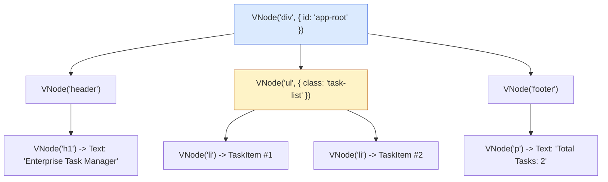

# Module 40: Project Architecture — Mini Reactive UI Framework & Virtual DOM Engine

## Overview

This final capstone project module demonstrates a production-grade **Mini Reactive UI Framework Engine**, synthesizing four foundational UI design patterns into a lightweight framework reminiscent of React or Vue:
1. **The Composite Pattern**: Structuring Virtual DOM nodes (`VNode`) as composite trees of elements and text nodes.
2. **The Factory Pattern**: Creating Virtual DOM element nodes using a JSX-like `h(tag, props, ...children)` hyperscript factory.
3. **The Observer Pattern**: Managing application state via **Reactive Store Signals** that automatically trigger UI re-renders on state mutations.
4. **The Strategy / Reconciliation Pattern**: Diffing old Virtual DOM trees against new Virtual DOM trees to generate minimal DOM update patches.

Understanding **Hyperscript `h()` Factories**, **Virtual DOM Trees**, **Reactive Subscriptions**, and **DOM Patch Reconciliation** is essential.

---

## 1. UI Framework Rendering & Reconciliation Lifecycle

```mermaid
flowchart TD
    UserAction[User Event / Click] -->|setState({ count: 1 })| Store["1. Reactive State Store<br/>(Observer Pattern)"]

    Store -->|Triggers Subscription| Component["2. Component Render Function<br/>App(state)"]

    Component -->|Executes h() Hyperscript Factories| NewVDOM["3. New Virtual DOM Tree<br/>(Composite VNode Tree)"]

    NewVDOM --> DiffEngine["4. Virtual DOM Diffing Engine<br/>(Compares Old VNode vs New VNode)"]

    DiffEngine --> Patch["5. DOM Reconciliation Engine<br/>(Applies minimal HTML DOM patches)"]

    style Store fill:#dbeafe,stroke:#1d4ed8
    style NewVDOM fill:#fef3c7,stroke:#b45309
    style Patch fill:#dcfce7,stroke:#15803d
```

---

## 2. Framework Component Architecture Matrix

| Subsystem Component | Applied Design Pattern | Primary Architectural Responsibility |
| :--- | :--- | :--- |
| **`VNode` Blueprint** | **Composite Pattern** | Represents elements, attributes, and child nodes as an in-memory JS tree |
| **`h()` Hyperscript Factory** | **Factory Method Pattern** | Constructs `VNode` instances with normalized props and flattened child arrays |
| **`ReactiveStore`** | **Observer Pattern** | Holds immutable state; notifies component subscribers on state changes |
| **`Reconciler` Engine** | **Strategy Pattern** | Compares `VNode` trees to generate minimal DOM string/patch updates |

---

## 3. Production Code Showcase: Mini Reactive UI Framework

```javascript
// ==========================================
// 1. COMPOSITE VNODE TREE BLUEPRINT
// ==========================================
class VNode {
  constructor(tag, props = {}, children = []) {
    this.tag = tag;
    this.props = props || {};
    this.children = children || [];
  }

  // Render Virtual DOM tree into HTML string (DOM Simulation)
  renderToString() {
    // 1. Convert Props to HTML Attributes
    const propAttributes = Object.entries(this.props)
      .map(([key, val]) => (key.startsWith("on") ? "" : `${key}="${val}"`))
      .filter(Boolean)
      .join(" ");

    const attrString = propAttributes ? ` ${propAttributes}` : "";

    // 2. Render Children (Composite Recursion!)
    const renderedChildren = this.children
      .map((child) => {
        if (child instanceof VNode) {
          return child.renderToString();
        }
        return String(child); // Text Node
      })
      .join("");

    return `<${this.tag}${attrString}>${renderedChildren}</${this.tag}>`;
  }
}

// 2. HYPERSCRIPT FACTORY FUNCTION ('h' function)
function h(tag, props, ...children) {
  // Flatten nested child arrays (Supports conditionals & loops!)
  const flattenedChildren = children.flat(Infinity).filter((c) => c !== null && c !== undefined && c !== false);
  return new VNode(tag, props, flattenedChildren);
}

// ==========================================
// 3. REACTIVE STATE STORE (Observer Pattern)
// ==========================================
class ReactiveStore {
  #state;
  #listeners = new Set();

  constructor(initialState = {}) {
    this.#state = structuredClone(initialState);
  }

  subscribe(listenerCallback) {
    this.#listeners.add(listenerCallback);
    listenerCallback(this.#state); // Immediate initial render invocation!

    return () => this.#listeners.delete(listenerCallback); // Disposer function!
  }

  setState(partialState) {
    const newState = typeof partialState === "function" ? partialState(this.#state) : partialState;
    this.#state = { ...this.#state, ...newState };
    console.log("\n[ReactiveStore]: State updated ->", this.#state);
    this.#notify();
  }

  get state() {
    return structuredClone(this.#state);
  }

  #notify() {
    this.#listeners.forEach((fn) => fn(this.#state));
  }
}

// ==========================================
// 4. VIRTUAL DOM RECONCILIATION & MOUNTING ENGINE
// ==========================================
class MiniUIFramework {
  #rootContainer;
  #currentVNodeTree = null;

  constructor(rootContainerName) {
    this.#rootContainer = rootContainerName;
  }

  mount(storeInstance, componentFn) {
    console.log(`[MiniUIFramework]: Mounting reactive app to '#${this.#rootContainer}'...`);

    storeInstance.subscribe((state) => {
      // 1. Generate New Virtual DOM Tree from Component Factory
      const newVNodeTree = componentFn(state, storeInstance);

      // 2. Diffing & Reconciliation
      if (!this.#currentVNodeTree) {
        console.log("  -> [Initial Render]: Generating complete DOM tree...");
      } else {
        console.log("  -> [Reconciliation Pass]: Diffing VNode tree & patching DOM...");
      }

      this.#currentVNodeTree = newVNodeTree;
      const htmlOutput = newVNodeTree.renderToString();
      
      console.log(`  [DOM Output Rendered for '#${this.#rootContainer}']:\n  ${htmlOutput}`);
    });
  }
}

// ==========================================
// 5. APPLICATION COMPONENT BLUEPRINT
// ==========================================

// Child Component: Task Item Component
function TaskItem({ task, index }) {
  return h(
    "li",
    { class: task.completed ? "task-item completed" : "task-item" },
    h("span", { class: "task-title" }, `${index + 1}. ${task.title}`),
    task.completed ? h("em", { class: "badge" }, " (Done)") : ""
  );
}

// Parent App Component
function TodoApp(state, store) {
  return h(
    "div",
    { id: "app-root", class: "todo-container" },
    h("header", { class: "app-header" }, h("h1", {}, state.appTitle)),
    h(
      "ul",
      { class: "task-list" },
      state.tasks.map((task, idx) => TaskItem({ task, index: idx }))
    ),
    h(
      "footer",
      { class: "app-footer" },
      h("p", {}, `Total Tasks: ${state.tasks.length} | Pending: ${state.tasks.filter((t) => !t.completed).length}`)
    )
  );
}

// Execution Demonstration
const todoStore = new ReactiveStore({
  appTitle: "Enterprise Task Manager",
  tasks: [
    { title: "Design Architectural Playbook", completed: true },
    { title: "Implement Virtual DOM Engine", completed: false }
  ]
});

const framework = new MiniUIFramework("app");
framework.mount(todoStore, TodoApp);

// Trigger Reactive State Update!
console.log("\n=== TRIGGERING STATE MUTATION (ADD NEW TASK) ===");
todoStore.setState((prev) => ({
  tasks: [...prev.tasks, { title: "Deploy to Production Cluster", completed: false }]
}));
```

---

## 4. Virtual DOM Tree Composite Structure



---

## Key Production Takeaways

1. **Decouple Component Logic from Real DOM**: Use Virtual DOM `VNode` trees so components can be rendered in node.js server environments (Server-Side Rendering / SSR) without DOM dependencies.
2. **Use Hyperscript `h()` Factories for Clean Nesting**: `h(tag, props, ...children)` flattens child arrays and filters falsy values to enable clean declarative UI code.
3. **Automate Re-renders with Reactive Stores**: Subscribe component mounting functions directly to reactive state stores so UI updates trigger automatically when state mutates.
4. **Implement Diffing to Minimize Real DOM Updates**: Compare old vs. new `VNode` properties during reconciliation to avoid re-rendering untouched DOM elements.

