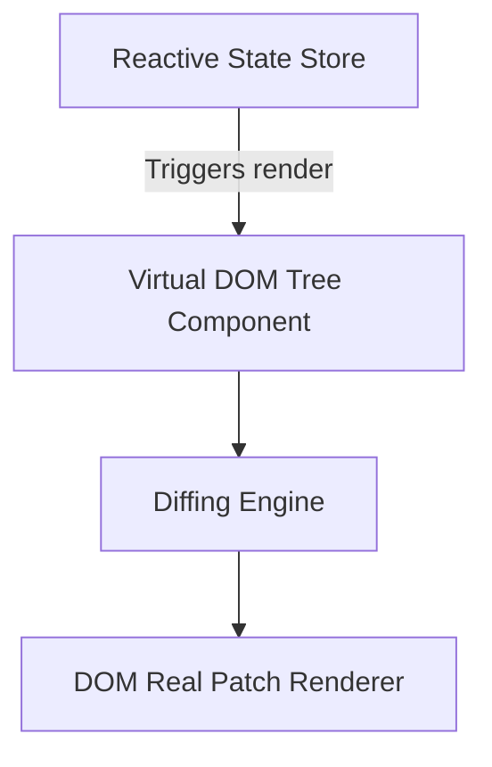

# File 40: End-to-End Project Architecture — UI Framework

## Overview
This file demonstrates a production-grade **Mini UI Framework Architecture**, integrating the **Component Tree**, **Virtual DOM Diffing**, **Reactive State Observer**, and **Factory** patterns.

---

## 1. UI Framework Rendering Lifecycle Architecture



---

## 2. Mini UI Framework Implementation

```javascript
// 1. Reactive State Store (Observer Pattern)
class ReactiveStore {
    constructor(initialState) {
        this.state = initialState;
        this.listeners = [];
    }

    subscribe(listener) {
        this.listeners.push(listener);
    }

    setState(newState) {
        this.state = { ...this.state, ...newState };
        this.listeners.forEach(fn => fn(this.state));
    }
}

// 2. Virtual DOM Component Blueprint (Composite Pattern)
class VNode {
    constructor(tag, props = {}, children = []) {
        this.tag = tag;
        this.props = props;
        this.children = children;
    }

    render() {
        const childRender = this.children
            .map(c => (typeof c === "string" ? c : c.render()))
            .join("");
        
        return `<${this.tag} class="${this.props.class || ''}">${childRender}</${this.tag}>`;
    }
}

// Helper JSX-like Factory Function
function h(tag, props, ...children) {
    return new VNode(tag, props, children.flat());
}

// 3. UI Component Construction
const store = new ReactiveStore({ count: 0 });

function App(state) {
    return h("div", { class: "app-container" },
        h("h1", {}, `Current Counter: ${state.count}`),
        h("button", { class: "btn-primary" }, "Increment")
    );
}

// Framework Engine Mounting
store.subscribe(state => {
    const vdom = App(state);
    console.log("=== RENDERED VIRTUAL HTML ===");
    console.log(vdom.render());
});

store.setState({ count: 1 });
store.setState({ count: 2 });
```

---

## Key Takeaways
1. Combines **Composite** (VNode Tree), **Observer** (Reactive Store), and **Factory** (`h()` helper).
2. Mirrors modern UI framework paradigms (React, Vue, Preact).
3. Decouples state mutations from HTML string rendering.
