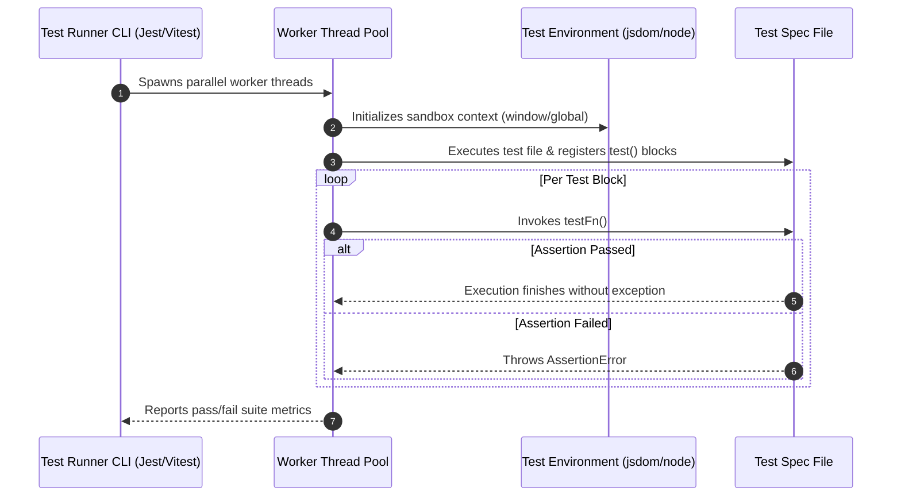

# Module 01: Testing Fundamentals — The Test Pyramid, Test Trophy, and Test Runner Architecture

## Overview

Automated software testing is the practice of executing code designed to verify that application software meets its functional, reliability, and security specifications.

A healthy testing strategy balances **Execution Velocity**, **Confidence**, and **Maintenance Cost**. Understanding the **Test Pyramid**, the **Testing Trophy**, and how test runners like **Jest** and **Vitest** execute assertion pipelines under the hood is essential for building resilient web applications.

---

## 1. Testing Architectures: Test Pyramid vs. Testing Trophy

```mermaid
flowchart TD
    subgraph Classic Test Pyramid (Martin Fowler)
        E2E1["E2E Tests (Few)<br/>High Cost & Confidence"]
        Integration1["Integration Tests (Moderate)"]
        Unit1["Unit Tests (Many)<br/>Low Cost, Blazing Fast"]
        
        E2E1 --> Integration1 --> Unit1
    end

    subgraph Testing Trophy Paradigm (Kent C. Dodds)
        E2E2["E2E (End-to-End)"]
        Integration2["Integration (Primary Focus & Maximum ROI!)"]
        Unit2["Unit Tests"]
        Static["Static Analysis (TypeScript, ESLint)"]

        E2E2 --> Integration2 --> Unit2 --> Static
    end

    style Integration2 fill:#dcfce7,stroke:#15803d
    style Unit1 fill:#dbeafe,stroke:#1d4ed8
```

---

## 2. Testing Levels & Trade-Off Matrix

| Dimension | Static Analysis | Unit Testing | Integration Testing | End-to-End (E2E) Testing |
| :--- | :--- | :--- | :--- | :--- |
| **Scope** | Syntax & Type safety | Isolated pure function / class | Multi-component API contracts / DB persistence | Full browser user journeys |
| **Execution Speed**| Blazing Fast ($\sim$ms) | Extremely Fast ($<10$ms) | Fast to Medium ($100$ms - $2$s) | Slow ($5$s - $60$s) |
| **Flakiness Risk** | $0\%$ (Deterministic) | Near $0\%$ | Low to Moderate | Moderate to High (Network/DOM delay) |
| **Confidence Level**| Low (Ensures type safety) | Low to Medium (Proves unit logic) | **High (Proves component cohesion)** | **Highest (Simulates real user)** |
| **Framework Examples**| TypeScript, ESLint | Vitest, Jest | React Testing Library, Supertest | Playwright, Cypress |

---

## 3. Code Showcase: Under the Hood of a Test Runner & Assertion Engine

To understand modern test runners, examine how assertion chaining and test collectors work internally without third-party libraries:

```javascript
// ==========================================
// 1. CUSTOM ASSERTION ENGINE POLYFILL
// ==========================================
function expect(actualValue) {
  return {
    toBe(expectedValue) {
      if (actualValue !== expectedValue) {
        throw new Error(`Assertion Error: Expected '${expectedValue}', but received '${actualValue}' (Strict Equality ===)`);
      }
    },
    toEqual(expectedValue) {
      const actualJson = JSON.stringify(actualValue);
      const expectedJson = JSON.stringify(expectedValue);
      if (actualJson !== expectedJson) {
        throw new Error(`Assertion Error: Structural mismatch.\nExpected: ${expectedJson}\nReceived: ${actualJson}`);
      }
    },
    toThrow(expectedErrorMessage) {
      if (typeof actualValue !== "function") {
        throw new Error("Assertion Error: toThrow() target must be a function wrapper.");
      }
      let thrownError = null;
      try {
        actualValue();
      } catch (err) {
        thrownError = err;
      }
      if (!thrownError) {
        throw new Error("Assertion Error: Expected function to throw an exception, but it executed successfully.");
      }
      if (expectedErrorMessage && !thrownError.message.includes(expectedErrorMessage)) {
        throw new Error(`Assertion Error: Expected error message to include '${expectedErrorMessage}', but got '${thrownError.message}'`);
      }
    }
  };
}

// ==========================================
// 2. MINI TEST SUITE RUNNER FRAMEWORK
// ==========================================
class MiniTestRunner {
  #testQueue = [];
  #passCount = 0;
  #failCount = 0;

  test(description, testFn) {
    this.#testQueue.push({ description, testFn });
  }

  async run() {
    console.log("=== EXECUTING CUSTOM TEST RUNNER ENGINE ===");
    const startTime = Date.now();

    for (const { description, testFn } of this.#testQueue) {
      try {
        await testFn();
        this.#passCount++;
        console.log(`  ✓ PASS: ${description}`);
      } catch (err) {
        this.#failCount++;
        console.error(`  ✗ FAIL: ${description}`);
        console.error(`    -> ${err.message}`);
      }
    }

    const duration = Date.now() - startTime;
    console.log(`\n=== SUITE SUMMARY: ${this.#passCount} Passed, ${this.#failCount} Failed (${duration} ms) ===`);
  }
}

// Client Execution Demonstration
const runner = new MiniTestRunner();

// Pure Business Function to Test
const calculateDiscount = (price, role) => {
  if (price <= 0) throw new RangeError("Price must be > 0");
  return role === "VIP" ? price * 0.8 : price;
};

// Register Tests
runner.test("calculateDiscount() applies 20% discount for VIP users", () => {
  expect(calculateDiscount(100, "VIP")).toBe(80);
});

runner.test("calculateDiscount() throws RangeError when price is non-positive", () => {
  expect(() => calculateDiscount(0, "VIP")).toThrow("Price must be > 0");
});

runner.run();
```

---

## 4. Test Runner Lifecycle & Execution Flow



---

## Key Production Takeaways

1. **Focus on Integration Tests for Maximum ROI**: Write integration tests to verify component interactions rather than testing implementation details of private functions.
2. **Avoid Ice-Cream Cone Testing Anti-Patterns**: Don't rely heavily on thousands of fragile E2E tests at the expense of fast, reliable unit/integration tests.
3. **Keep Tests Independent and Isolated**: Never let test $A$ rely on state left behind by test $B$; every test block must set up and tear down its own environment cleanly.
4. **Treat Tests as Executable Specifications**: Write test descriptions clearly so that a failing test output instantly explains what application contract broke.

