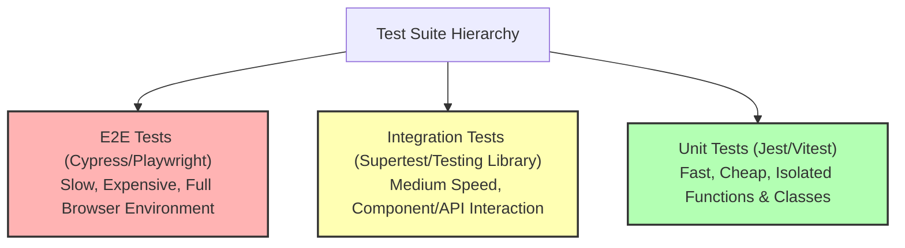

# File 01: Testing Fundamentals and Test Pyramid

## Overview
Automated software testing is the practice of writing code to verify that application software functions as expected. Understanding the **Test Pyramid**, testing principles, and test runner primitives lays the foundation for reliable, regression-free codebases.

---

## 1. The Test Pyramid Architecture



### Test Level Comparison

| Test Level | Scope | Execution Speed | Cost & Complexity | Primary Frameworks |
| :--- | :--- | :--- | :--- | :--- |
| **Unit Tests** | Individual functions / modules in isolation | Fast (<1ms) | Low | Vitest, Jest, Mocha |
| **Integration Tests** | Multi-component API contracts / DB persistence | Medium (100ms - 2s) | Medium | React Testing Library, Supertest |
| **E2E Tests** | Full end-to-end browser user flows | Slow (5s - 30s) | High | Playwright, Cypress |

---

## 2. Minimal Custom Test Runner Implementation
Under the hood, testing frameworks like Jest or Vitest are built around simple assertion helpers and test suite runner functions.

```javascript
// Minimal Custom Assertion Engine
function expect(actual) {
    return {
        toBe(expected) {
            if (actual !== expected) {
                throw new Error(`Expected '${expected}', but got '${actual}'`);
            }
        },
        toEqual(expected) {
            if (JSON.stringify(actual) !== JSON.stringify(expected)) {
                throw new Error(`Expected ${JSON.stringify(expected)}, got ${JSON.stringify(actual)}`);
            }
        }
    };
}

// Minimal Test Runner
function test(description, testFn) {
    try {
        testFn();
        console.log(`✓ PASS: ${description}`);
    } catch (err) {
        console.error(`✗ FAIL: ${description}`);
        console.error(`  ${err.message}`);
    }
}

// Example Unit Test
function add(a, b) {
    return a + b;
}

test("add() correctly sums two positive numbers", () => {
    expect(add(2, 3)).toBe(5);
});
```

---

## Key Takeaways
1. Structure test suites following the **Test Pyramid**: many fast unit tests, moderate integration tests, few E2E tests.
2. Automated tests prevent **regressions** and act as executable documentation for code contracts.
3. Test runners execute test functions and catch thrown assertion errors to report pass/fail results.
