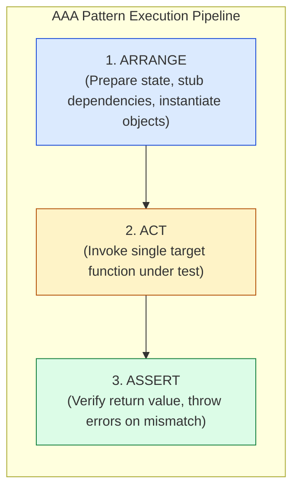
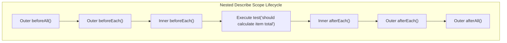

# Module 02: Anatomy of a Test — The AAA Pattern, Given-When-Then, and Lifecycle Hook Scopes

## Overview

A clean, maintainable test case communicates its intent clearly without clutter or ambiguous setup.

To achieve this, professional JavaScript testing relies on two fundamental concepts:
1. **The AAA (Arrange-Act-Assert) Pattern**: Structuring individual test functions into three distinct, non-overlapping phases.
2. **Test Lifecycle Hooks**: Utilizing `beforeAll`, `beforeEach`, `afterEach`, and `afterAll` hooks to manage environment fixtures, isolate test state, and prevent cross-test memory pollution.

Understanding **Given-When-Then BDD Mapping**, **Nested Describe Scopes**, and **State Teardown Safety** is essential.

---

## 1. The AAA Pattern & Nested Lifecycle Scope Topologies





---

## 2. Test Lifecycle Hooks Comparison Matrix

| Hook Name | Execution Timing | Shared State Scope | Primary Purpose | Teardown Safety Risk |
| :--- | :--- | :--- | :--- | :--- |
| **`beforeAll()`** | Runs **once** before all tests in block | Shared across all tests in file/block | Heavy setup (Database socket, Docker container spin-up) | **High** (Mutated shared state infects subsequent tests!) |
| **`beforeEach()`** | Runs **before every single test** | Re-instantiated fresh per test | Resetting state, creating fresh test fixtures | **None** (Guarantees test isolation) |
| **`afterEach()`** | Runs **after every single test** | Local cleanup per test | Clearing timers (`jest.clearAllMocks()`), resetting DOM | Low (Ensures zero side-effects leak) |
| **`afterAll()`** | Runs **once** after all tests finish | Final global suite cleanup | Closing DB connections, shutting off mock servers | Low (Fails if unhandled async promises remain) |

---

## 3. Code Showcase: Production AAA Pattern & Isolated Fixtures

```javascript
// Target Domain Class under Test
class ECommerceCart {
  #items = new Map();

  addItem(productId, price, quantity = 1) {
    if (price <= 0) throw new RangeError("Price must be greater than zero.");
    if (quantity <= 0) throw new RangeError("Quantity must be greater than zero.");

    if (this.#items.has(productId)) {
      const existing = this.#items.get(productId);
      existing.quantity += quantity;
    } else {
      this.#items.set(productId, { productId, price, quantity });
    }
  }

  calculateTotal(discountPercentage = 0) {
    let subtotal = 0;
    for (const item of this.#items.values()) {
      subtotal += item.price * item.quantity;
    }
    const discountAmount = subtotal * (discountPercentage / 100);
    return Math.max(0, subtotal - discountAmount);
  }

  clear() {
    this.#items.clear();
  }

  get itemLength() {
    return this.#items.size;
  }
}

// Test Runner Execution Polyfill
class TestEnvironmentSuite {
  static runSuite() {
    console.log("=== EXECUTING AAA TEST SUITE WITH ISOLATED FIXTURES ===");
    let cartFixture = null;

    // Per-Test Setup Hook (beforeEach)
    const beforeEachHook = () => {
      cartFixture = new ECommerceCart(); // Fresh isolated object per test!
    };

    // Helper Test Execution Wrapper
    const runTestCase = (testName, testFn) => {
      beforeEachHook(); // Ensures zero state pollution between tests!
      try {
        testFn(cartFixture);
        console.log(`  ✓ PASS: ${testName}`);
      } catch (err) {
        console.error(`  ✗ FAIL: ${testName}`);
        console.error(`    -> ${err.message}`);
      }
    };

    // Test 1: Standard AAA Flow
    runTestCase("ECommerceCart - should calculate subtotal correctly without discount", (cart) => {
      // 1. ARRANGE: Set up products in fresh cart fixture
      cart.addItem("PROD-101", 50, 2); // 100
      cart.addItem("PROD-102", 30, 1); // 30

      // 2. ACT: Invoke method under test
      const finalTotal = cart.calculateTotal(0);

      // 3. ASSERT: Verify expected output
      if (finalTotal !== 130) throw new Error(`Expected 130, but got ${finalTotal}`);
    });

    // Test 2: BDD Given-When-Then Mapping
    runTestCase("ECommerceCart - should apply percentage discount to total subtotal", (cart) => {
      // GIVEN: Cart contains items worth 200 total
      cart.addItem("PROD-201", 100, 2);

      // WHEN: 15% discount is applied
      const discountedTotal = cart.calculateTotal(15);

      // THEN: Expected total is 170
      if (discountedTotal !== 170) throw new Error(`Expected 170, but got ${discountedTotal}`);
    });
  }
}

TestEnvironmentSuite.runSuite();
```

---

## 4. Test State Isolation Architecture

```mermaid
flowchart TD
    subgraph Shared State (BAD: Mutates Same Cart Object)
        T1Bad["Test 1: addItem('Book')"] --> CartShared["Shared Cart Object<br/>[Book]"]
        T2Bad["Test 2: Expect length === 1"] --> CartShared
        CartShared --> Fail["FAIL: Length is 2 because Test 1 polluted state!"]
    end

    subgraph Isolated State (GOOD: Fresh beforeEach Instance)
        T1Good["Test 1"] -->|beforeEach()| Cart1["Cart Instance 1<br/>[Book]"]
        T2Good["Test 2"] -->|beforeEach()| Cart2["Cart Instance 2<br/>[]"]
        Cart2 --> Pass["PASS: Clean isolated state guaranteed!"]
    end

    style Pass fill:#dcfce7,stroke:#15803d
    style Fail fill:#fee2e2,stroke:#dc2626
```

---

## Key Production Takeaways

1. **Follow the Single Act Rule**: Each test case should execute only **one primary action** (`Act` phase) to ensure failures point directly to a single broken contract.
2. **Prefer `beforeEach()` Over `beforeAll()` for Object Fixtures**: Always instantiate fresh class instances inside `beforeEach()` to avoid tests mutating shared memory objects.
3. **Clean Up Global Side-Effects in `afterEach()`**: If a test modifies environment variables, global window objects, or local storage, restore the original values inside `afterEach()`.
4. **Use Nested `describe()` Blocks to Group Scenarios**: Group tests logically by method or capability (e.g. `describe('calculateTotal()', ...)`), using scoped `beforeEach` hooks for context-specific setups.

