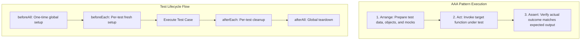

# File 02: Anatomy of a Test (AAA & Lifecycle Hooks)

## Overview
Every clean, maintainable test case follows the **AAA (Arrange-Act-Assert)** pattern. Test suites use lifecycle hooks (`beforeEach`, `afterEach`, `beforeAll`, `afterAll`) to set up fixture environments and clean up side-effects between test runs.

---

## 1. The AAA Pattern & Test Lifecycle



---

## 2. AAA Pattern & Lifecycle Hook Implementation

```javascript
class ShoppingCart {
    constructor() {
        this.items = [];
    }
    addItem(item, price, qty = 1) {
        const existing = this.items.find(i => i.item === item);
        if (existing) {
            existing.qty += qty;
        } else {
            this.items.push({ item, price, qty });
        }
    }
    getSubtotal() {
        return this.items.reduce((total, i) => total + i.price * i.qty, 0);
    }
}

describe("ShoppingCart Test Suite", () => {
    let cart;

    // Per-test setup fixture
    beforeEach(() => {
        cart = new ShoppingCart(); // Fresh isolated cart per test
    });

    test("should calculate subtotal correctly", () => {
        // 1. ARRANGE
        cart.addItem("Tea", 15, 2); // ₹30
        cart.addItem("Samosa", 20, 1); // ₹20

        // 2. ACT
        const subtotal = cart.getSubtotal();

        // 3. ASSERT
        expect(subtotal).toBe(50);
    });

    test("should merge duplicate items", () => {
        // ARRANGE & ACT
        cart.addItem("Tea", 15, 1);
        cart.addItem("Tea", 15, 2);

        // ASSERT
        expect(cart.items.length).toBe(1);
        expect(cart.items[0].qty).toBe(3);
    });
});
```

---

## Key Takeaways
1. Always structure tests into three distinct phases: **Arrange**, **Act**, **Assert**.
2. Use **`beforeEach`** to re-instantiate fresh state objects, ensuring strict **test isolation**.
3. Group related test scenarios using nested **`describe()`** blocks.
