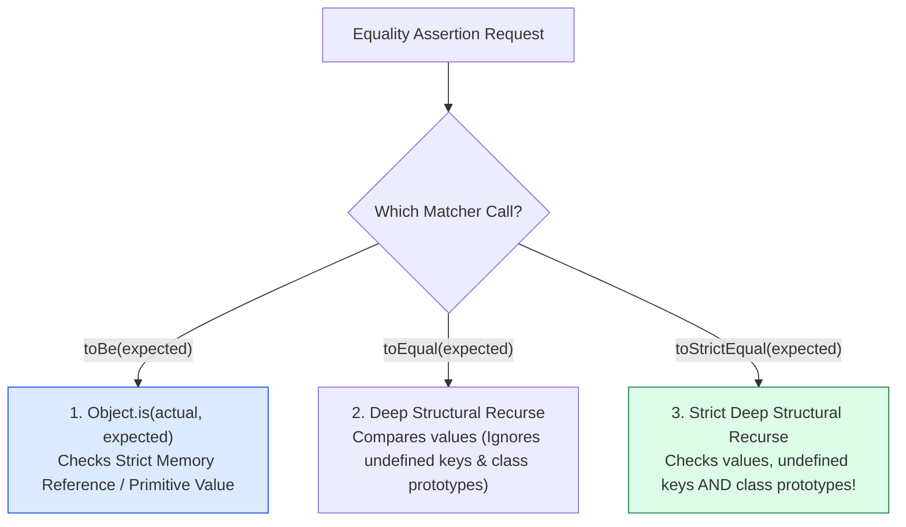
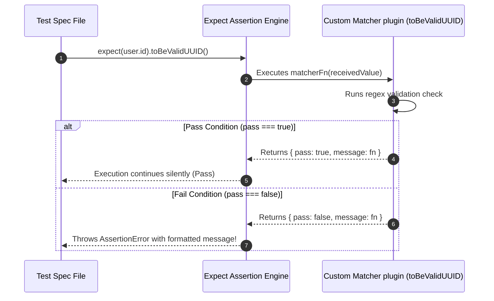

# Module 03: Matchers and Assertions — Deep Equality, Asymmetric Matching, and Custom Extensions

## Overview

Assertion **Matchers** are the building blocks of automated test verification in modern frameworks like **Jest** and **Vitest**.

Beyond simple truthiness checks, robust test suites leverage:
1. **Strict Reference vs. Deep Equality**: Distinguishing between `toBe()` (`Object.is`), `toEqual()` (structural equality), and `toStrictEqual()` (strict prototype & undefined property checks).
2. **Asymmetric Matchers**: Verifying partial object shapes (`expect.objectContaining()`, `expect.any(Number)`) when payloads contain dynamic fields like timestamps or random UUIDs.
3. **Custom Matcher Extensions (`expect.extend`)**: Building domain-specific assertion helpers for cleaner, self-documenting test suites.

---

## 1. Equality Matcher Resolution Mechanics



---

## 2. Assertion Matchers Comparison Matrix

| Matcher API | Equality Mechanism | Undefined Keys Checked? | Class Prototypes Checked? | Best Used For |
| :--- | :--- | :--- | :--- | :--- |
| **`toBe(val)`** | Primitive `Object.is()` reference check | N/A (Primitives) | N/A | Booleans, numbers, strings, exact memory references |
| **`toEqual(val)`** | Deep structural property comparison | **No** (Ignores `{ a: undefined }`) | **No** (Treats `ClassA` and `ClassB` objects as equal if keys match) | Standard API JSON response payloads |
| **`toStrictEqual(val)`** | Strict deep structural comparison | **Yes** (Fails if undefined keys differ) | **Yes** (Ensures constructor classes match) | Domain Entities, strict class instances |
| **`expect.objectContaining()`**| Asymmetric partial object match | Subset check | Subset check | Payloads with dynamic IDs or timestamps |
| **`toBeCloseTo(num, numDigits)`**| Floating point threshold check | N/A | N/A | Currency or math precision checks (`0.1 + 0.2`) |

---

## 3. Code Showcase: Asymmetric Matchers & Custom Matcher Engine Extension

```javascript
// ==========================================
// 1. CUSTOM MATCHER EXTENSION POLYFILL (expect.extend)
// ==========================================
class ExtendedAssertionEngine {
  static customMatchers = new Map();

  static extend(matcherObject) {
    for (const [name, fn] of Object.entries(matcherObject)) {
      this.customMatchers.set(name, fn);
    }
  }

  static expect(receivedValue) {
    const baseMatchers = {
      toBe(expected) {
        if (!Object.is(receivedValue, expected)) {
          throw new Error(`Expected '${expected}' but received '${receivedValue}'`);
        }
      },
      toEqual(expected) {
        if (JSON.stringify(receivedValue) !== JSON.stringify(expected)) {
          throw new Error(`Structural mismatch.\nExpected: ${JSON.stringify(expected)}\nReceived: ${JSON.stringify(receivedValue)}`);
        }
      },
      // Asymmetric Object Matching Support
      toMatchSchema(asymmetricShape) {
        for (const [key, expectedMatcher] of Object.entries(asymmetricShape)) {
          const actualVal = receivedValue[key];
          if (typeof expectedMatcher === "function" && expectedMatcher.isAsymmetric) {
            if (!expectedMatcher.test(actualVal)) {
              throw new Error(`Asymmetric Matcher Error on key '${key}': Received value '${actualVal}' failed type check.`);
            }
          } else if (actualVal !== expectedMatcher) {
            throw new Error(`Asymmetric Matcher Error on key '${key}': Expected '${expectedMatcher}', got '${actualVal}'`);
          }
        }
      }
    };

    // Attach custom registered matchers dynamically!
    for (const [matcherName, matcherFn] of ExtendedAssertionEngine.customMatchers.entries()) {
      baseMatchers[matcherName] = (...args) => {
        const result = matcherFn(receivedValue, ...args);
        if (!result.pass) {
          throw new Error(`Custom Matcher Failure (${matcherName}): ${result.message()}`);
        }
      };
    }

    return baseMatchers;
  }
}

// Register Asymmetric Type Guards
const expectAny = (targetType) => ({
  isAsymmetric: true,
  test: (val) => typeof val === targetType || (targetType === "array" && Array.isArray(val))
});

// Register Custom Matcher Plugin
ExtendedAssertionEngine.extend({
  toBeValidUUID(received) {
    const uuidRegex = /^[0-9a-f]{8}-[0-9a-f]{4}-[1-5][0-9a-f]{3}-[89ab][0-9a-f]{3}-[0-9a-f]{12}$/i;
    const pass = typeof received === "string" && uuidRegex.test(received);
    return {
      pass,
      message: () => `Expected '${received}' to be a valid UUID v4 string.`
    };
  }
});

// ==========================================
// 2. DEMONSTRATING ADVANCED MATCHERS
// ==========================================
console.log("=== EXECUTING ADVANCED MATCHERS DEMONSTRATION ===");

// Example API Response Payload with Dynamic Fields
const sampleApiResponse = {
  id: "123e4567-e89b-12d3-a456-426614174000",
  username: "Anita",
  age: 28,
  roles: ["ADMIN", "USER"],
  createdAt: Date.now()
};

// Test 1: Asymmetric Partial Verification
ExtendedAssertionEngine.expect(sampleApiResponse).toMatchSchema({
  username: "Anita",
  age: expectAny("number"),
  roles: expectAny("array")
});
console.log("  ✓ PASS: Asymmetric partial schema verification succeeded.");

// Test 2: Custom Matcher Verification
ExtendedAssertionEngine.expect(sampleApiResponse.id).toBeValidUUID();
console.log("  ✓ PASS: Custom toBeValidUUID() matcher verification succeeded.");
```

---

## 4. Custom Matcher Plugin Lifecycle Sequence



---

## Key Production Takeaways

1. **Use `toStrictEqual()` for Domain Objects**: Prefer `toStrictEqual()` over `toEqual()` when asserting class instances to guarantee that undefined properties and constructor types match.
2. **Use Asymmetric Matchers for Dynamic Data**: Use `expect.objectContaining()` or `expect.any(String)` when payloads include generated timestamps, database IDs, or random hashes.
3. **Use `toBeCloseTo()` for Currency and Floating Point Math**: Never test floating point math with `toBe()` (`0.1 + 0.2 !== 0.3` due to IEEE 754 precision); use `expect(0.1 + 0.2).toBeCloseTo(0.3, 5)`.
4. **Build Custom Matchers for Reusable Domain Validation**: Extend `expect` using `expect.extend()` to encapsulate complex assertions (e.g. `toBeValidJWT()`, `toBeValidEmail()`) into readable matcher calls.

