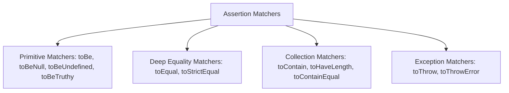

# File 03: Matchers and Assertions

## Overview
Modern test frameworks (Jest, Vitest, Expect) provide rich assertion **matchers** to inspect value types, deep object equality, array contents, numeric ranges, and thrown exceptions.

---

## 1. Matchers Taxonomy



---

## 2. Matcher Usage Showcase

```javascript
describe("Assertion Matchers Showcase", () => {
    // 1. Primitive vs Deep Equality
    test("toBe checks strict reference equality; toEqual checks deep value properties", () => {
        const obj1 = { name: "Priya", age: 28 };
        const obj2 = { name: "Priya", age: 28 };

        // expect(obj1).toBe(obj2); // FAILS! Different object memory pointers
        expect(obj1).toEqual(obj2);  // PASSES! Deep properties match
    });

    // 2. Truthiness & Nullability
    test("truthiness matchers", () => {
        expect(null).toBeNull();
        expect(undefined).toBeUndefined();
        expect("Hello").toBeTruthy();
        expect(0).toBeFalsy();
    });

    // 3. Array & String Containment
    test("array and string matchers", () => {
        const fruits = ["Apple", "Banana", "Orange"];
        expect(fruits).toContain("Banana");
        expect(fruits).toHaveLength(3);

        const email = "user@example.com";
        expect(email).toMatch(/^[a-zA-Z0-9._%+-]+@[a-zA-Z0-9.-]+\.[a-zA-Z]{2,}$/);
    });

    // 4. Exception Matchers
    test("exception testing", () => {
        function divide(a, b) {
            if (b === 0) throw new Error("Division by zero");
            return a / b;
        }

        // NOTE: Wrap call in arrow function so matcher can intercept thrown exception!
        expect(() => divide(10, 0)).toThrow("Division by zero");
    });
});
```

---

## Key Takeaways
1. Use **`toBe()`** for primitive value equality; use **`toEqual()`** for deep object/array comparisons.
2. Use **`toContain()`** for arrays and **`toMatch(regex)`** for string patterns.
3. Always wrap exception-throwing function calls inside an arrow function when testing with **`toThrow()`**.
