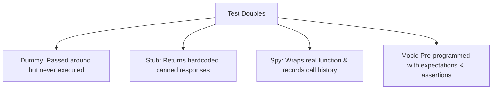

# File 04: Mocking Basics (Spies, Stubs, and Mocks)

## Overview
Test doubles allow isolating unit tests by replacing external dependencies (network requests, databases, file system calls) with controllable fake implementations. Test doubles are categorized into **Spies**, **Stubs**, and **Mocks**.

---

## 1. Test Doubles Taxonomy



---

## 2. Implementing a Custom Mock Engine (`fn()`)

```javascript
// Minimal Custom Mock Function Creator
function createMockFn(impl = () => {}) {
    const mockFn = (...args) => {
        mockFn.mock.calls.push(args);
        const result = impl(...args);
        mockFn.mock.results.push(result);
        return result;
    };

    mockFn.mock = {
        calls: [],
        results: []
    };

    mockFn.mockReturnValue = val => createMockFn(() => val);
    return mockFn;
}

// Example Usage of Mock Spy
describe("Mock Function Verification", () => {
    test("tracks invocation counts and arguments", () => {
        const callbackSpy = createMockFn(x => x * 2);

        // Act
        callbackSpy(10);
        callbackSpy(20);

        // Assert Call Verification
        expect(callbackSpy.mock.calls.length).toBe(2);
        expect(callbackSpy.mock.calls[0]).toEqual([10]);
        expect(callbackSpy.mock.calls[1]).toEqual([20]);
        expect(callbackSpy.mock.results[0]).toBe(20);
    });
});
```

---

## Key Takeaways
1. **Spies** record call count, arguments, and return values without necessarily altering behavior.
2. **Stubs** return fixed canned values to simulate external scenarios.
3. Use mocks to isolate unit tests from external I/O and non-deterministic behavior.
