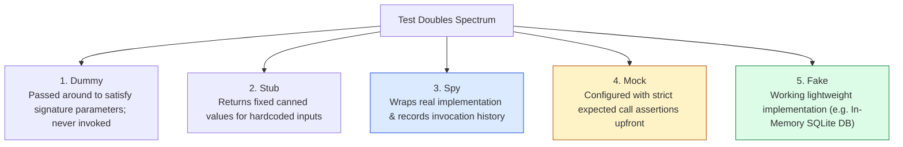
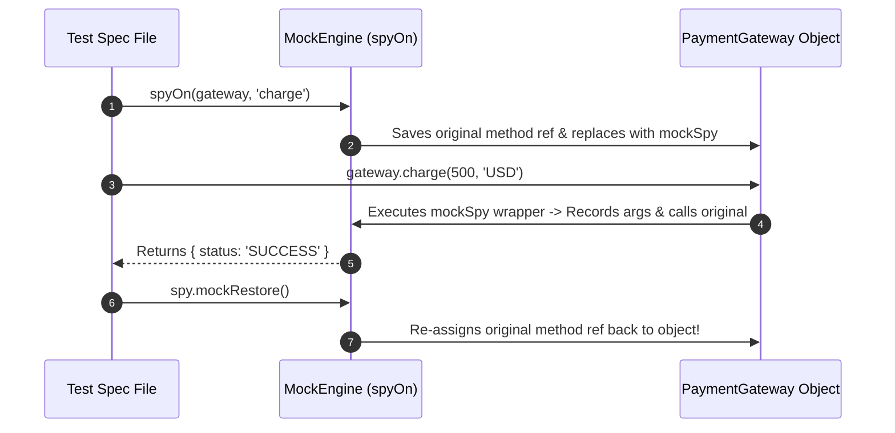

# Module 04: Mocking Basics — Test Double Taxonomy, Spies, Stubs, and Mock Restoration

## Overview

In unit testing, isolating a component under test requires replacing volatile or expensive external dependencies (such as network calls, database queries, disk operations, or system timers) with controlled alternatives known as **Test Doubles**.

Coined by Gerard Meszaros, **Test Doubles** are categorized into 5 distinct architectural types: **Dummy Objects**, **Stubs**, **Spies**, **Mocks**, and **Fakes**.

Understanding how `jest.fn()` and `jest.spyOn()` intercept function calls, record metadata, and how to safely clean up mocks using `mockClear()`, `mockReset()`, and `mockRestore()` is essential.

---

## 1. Test Double Taxonomy & Spying Architecture



---

## 2. Test Doubles Architectural Comparison Matrix

| Test Double Type | Internal Logic? | Records Invocations? | Pre-programmed Assertions? | Primary Use Case |
| :--- | :--- | :--- | :--- | :--- |
| **Dummy Object** | No | No | No | Filling mandatory function parameters (e.g. `logger` parameter in constructor) |
| **Stub** | Hardcoded return values | No | No | Simulating external states (e.g. `getUser() -> { id: 1 }`) |
| **Spy** | Wraps original method | **Yes** (Tracks `.calls`, `.results`) | No (Inspected post-execution) | Auditing if notification service was called with correct parameters |
| **Mock** | Hardcoded or dynamic | **Yes** | **Yes** (Strict assertion expectations) | Isolated unit testing of complex service workflows |
| **Fake** | Working simplified logic | Optional | No | In-memory database implementations, local state stores |

---

## 3. Code Showcase: Production Custom Mock & Spy Engine

```javascript
// ==========================================
// 1. CUSTOM MOCK & SPY ENGINE POLYFILL
// ==========================================
class MockEngine {
  // Create Mock Function (jest.fn analogue)
  static fn(implementationFn = () => {}) {
    const calls = [];
    const results = [];
    let currentImplementation = implementationFn;

    const mockFunction = function (...args) {
      calls.push(args);
      try {
        const val = currentImplementation.apply(this, args);
        results.push({ type: "return", value: val });
        return val;
      } catch (err) {
        results.push({ type: "throw", value: err });
        throw err;
      }
    };

    // Metadata Store
    mockFunction.mock = {
      calls,
      results
    };

    // Helper Configuration APIs
    mockFunction.mockReturnValue = (val) => {
      currentImplementation = () => val;
      return mockFunction;
    };

    mockFunction.mockImplementation = (fn) => {
      currentImplementation = fn;
      return mockFunction;
    };

    mockFunction.mockClear = () => {
      calls.length = 0;
      results.length = 0;
      return mockFunction;
    };

    return mockFunction;
  }

  // Method Spy Wrapper (jest.spyOn analogue)
  static spyOn(targetObject, methodName) {
    const originalMethod = targetObject[methodName];
    if (typeof originalMethod !== "function") {
      throw new TypeError(`Cannot spy on non-function property '${methodName}'`);
    }

    // Wrap original method inside Mock Function
    const mockSpy = MockEngine.fn((...args) => originalMethod.apply(targetObject, args));
    mockSpy.mockRestore = () => {
      targetObject[methodName] = originalMethod; // Restore original reference!
      console.log(`[MockEngine]: Restored original implementation for '${methodName}'`);
    };

    targetObject[methodName] = mockSpy; // Intercept property!
    return mockSpy;
  }
}

// ==========================================
// 2. DEMONSTRATING SPY & RESTORATION LIFECYCLE
// ==========================================
class PaymentGateway {
  charge(amount, currency) {
    console.log(`  --> Real Payment Processing: Charged ${amount} ${currency}`);
    return { status: "SUCCESS", transactionId: "TX-9901" };
  }
}

console.log("=== EXECUTING MOCK & SPY DEMONSTRATION ===");
const gateway = new PaymentGateway();

// 1. Attach Spy to real object method
const spy = MockEngine.spyOn(gateway, "charge");

// 2. Invoke method
const res1 = gateway.charge(500, "USD");
console.log("Call 1 Result:", res1);

// Verify Spy Metadata
console.log("Spy Invocation Count:", spy.mock.calls.length); // 1
console.log("Spy Argument Log:", spy.mock.calls[0]); // [500, "USD"]

// 3. Override implementation with Stub
spy.mockImplementation(() => ({ status: "STUBBED_MOCK_SUCCESS", transactionId: "TX-MOCK" }));
const res2 = gateway.charge(1000, "INR");
console.log("Call 2 Stubbed Result:", res2);

// 4. Restore original method reference
spy.mockRestore();
gateway.charge(250, "EUR"); // Executes real original implementation!
```

---

## 4. Method Spying & Restoration Lifecycle Sequence



---

## Key Production Takeaways

1. **Distinguish `mockClear`, `mockReset`, and `mockRestore`**:
   - **`mockClear()`**: Clears invocation history (`calls` and `results`), keeping the mock implementation intact.
   - **`mockReset()`**: Clears invocation history AND resets mock implementation to an empty function.
   - **`mockRestore()`**: Clears history, resets implementation, AND restores original un-spied method reference (crucial for `jest.spyOn()`).
2. **Use Spies Over Full Mocks When Verification is Secondary**: Use `jest.spyOn()` when you want to execute real code while verifying that methods were called with correct parameters.
3. **Always Restore Spied Globals in `afterEach()`**: Always call `mockRestore()` or set `restoreMocks: true` in your test runner config when spying on global methods (`Date.now`, `console.log`) to prevent state leaks.
4. **Avoid Over-Mocking Unit Tests**: Do not mock internal helper functions within the same module scope; mock only external boundary dependencies (network, database, file system).

