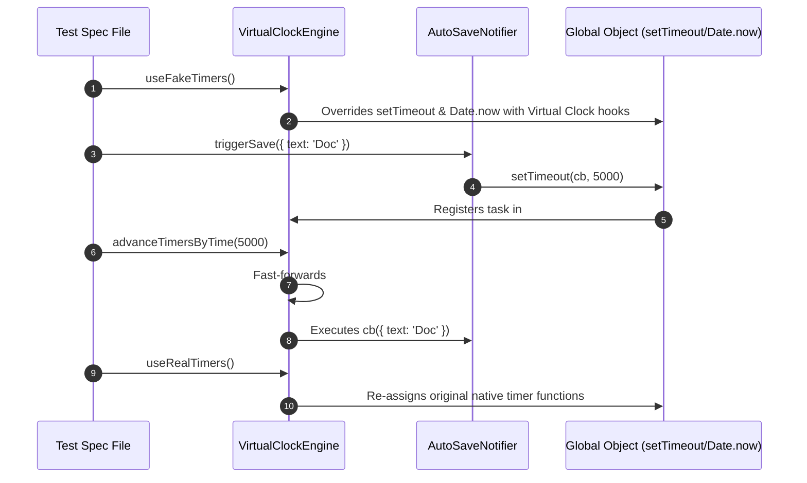

# Module 05: Advanced Mocking — Module Mocking, Mock Hoisting, Virtual Timers, and Global Overrides

## Overview

Advanced testing scenarios require extending test doubles beyond function spies to encompass **Module Mocking**, **Virtual Time Clock Control**, and **Global Runtime Overrides** (`window.fetch`, `localStorage`, `process.env`).

- **Module Mocking**: Intercepting `import` or `require()` statements to replace third-party npm packages or internal file imports with mock implementations.
- **Mock Hoisting**: How test runners (Jest / Vitest) automatically hoist `jest.mock()` / `vi.mock()` calls to the absolute top of module dependency trees before any import executes.
- **Virtual Time Clock Manipulation**: Replacing native asynchronous timers (`setTimeout`, `setInterval`, `Date.now()`) with a deterministic virtual clock to test time-based delays instantly without real-time waiting.

---

## 1. Mock Hoisting & Virtual Clock Architecture

```mermaid
flowchart TD
    subgraph Compiler Build Step (Mock Hoisting)
        RawCode["Source Code File<br/>import API from './api'<br/>jest.mock('./api')"] --> HoistPlugin["Babel / Vitest Compiler Plugin"]
        HoistPlugin --> HoistedOutput["Compiled Output<br/>jest.mock('./api') // HOISTED TO TOP!<br/>import API from './api'"]
    end

    subgraph Module Interception Registry
        HoistedOutput --> ModuleRegistry["Test Runner Module Registry<br/>(Stores Mock Module Factories)"]
        ModuleRegistry -->|Returns Mock Export| TestContext["Test Spec Context"]
    end
```

```mermaid
flowchart LR
    subgraph Virtual Time Clock (jest.useFakeTimers)
        AppCode["Application Code<br/>setTimeout(fn, 10000)"] --> VirtualClock["Virtual Clock Registry<br/>(Stores callback & scheduled Virtual Time: 10000ms)"]
        
        TestRunner["Test: advanceTimersByTime(10000)"] -->|Fast-forwards clock by 10s instantly!| VirtualClock
        VirtualClock -->|Executes callback synchronously| AppCode
    end
```

---

## 2. Advanced Mocking Comparison Matrix

| Mocking Technique | Interception Level | Execution Timing | Best Used For | Primary Teardown Safety API |
| :--- | :--- | :--- | :--- | :--- |
| **Module Mock (`jest.mock`)** | ES Module / CommonJS import | **Hoisted at compile-time** | Replacing Axios, AWS SDKs, database drivers | `jest.unmock()` or `jest.resetModules()` |
| **Partial Mock (`requireActual`)** | Single exported function of module | Hoisted at compile-time | Mocking 1 function while keeping rest real | Re-instantiating module |
| **Fake Timers (`useFakeTimers`)** | Global `setTimeout` / `Date` | Runtime interception | Testing debouncers, polling loops, countdown timers | `jest.useRealTimers()` |
| **Global Override** | `globalThis` / `process.env` | Runtime assignment | Mocking `localStorage`, `fetch`, environment flags | Restoring initial global value in `afterEach` |

---

## 3. Code Showcase: Virtual Time Clock & Module Registry Interceptor Engine

```javascript
// ==========================================
// 1. VIRTUAL TIME CLOCK ENGINE POLYFILL
// ==========================================
class VirtualClockEngine {
  #currentTime = 0;
  #scheduledTasks = [];
  #originalSetTimeout;
  #originalClearTimeout;
  #originalDateNow;

  useFakeTimers(initialTime = 1600000000000) {
    this.#currentTime = initialTime;
    this.#originalSetTimeout = globalThis.setTimeout;
    this.#originalClearTimeout = globalThis.clearTimeout;
    this.#originalDateNow = Date.now;

    // Overriding Global Native Clock Hooks!
    globalThis.Date.now = () => this.#currentTime;

    let taskId = 0;
    globalThis.setTimeout = (callbackFn, delayMs = 0, ...args) => {
      const id = ++taskId;
      const executeAt = this.#currentTime + delayMs;
      this.#scheduledTasks.push({ id, callbackFn, args, executeAt });
      this.#scheduledTasks.sort((a, b) => a.executeAt - b.executeAt);
      return id;
    };

    globalThis.clearTimeout = (id) => {
      this.#scheduledTasks = this.#scheduledTasks.filter((task) => task.id !== id);
    };

    console.log(`[VirtualClockEngine]: Fake timers activated. Initialized virtual time to ${this.#currentTime}`);
  }

  advanceTimersByTime(ms) {
    const targetTime = this.#currentTime + ms;
    console.log(`[VirtualClockEngine]: Advancing clock by ${ms} ms -> Target Time: ${targetTime}`);

    while (this.#scheduledTasks.length > 0 && this.#scheduledTasks[0].executeAt <= targetTime) {
      const task = this.#scheduledTasks.shift();
      this.#currentTime = task.executeAt;
      task.callbackFn(...task.args); // Execute scheduled callback synchronously!
    }

    this.#currentTime = targetTime;
  }

  useRealTimers() {
    globalThis.setTimeout = this.#originalSetTimeout;
    globalThis.clearTimeout = this.#originalClearTimeout;
    globalThis.Date.now = this.#originalDateNow;
    this.#scheduledTasks = [];
    console.log("[VirtualClockEngine]: Native system timers restored.");
  }

  get currentTime() { return this.#currentTime; }
}

// ==========================================
// 2. DEMONSTRATING VIRTUAL CLOCK DEBOUNCER TEST
// ==========================================

// Application Debouncer Code
class AutoSaveNotifier {
  #timerId = null;
  #saveFn;
  #delayMs;

  constructor(saveFn, delayMs = 5000) {
    this.#saveFn = saveFn;
    this.#delayMs = delayMs;
  }

  triggerSave(documentData) {
    if (this.#timerId) clearTimeout(this.#timerId);
    this.#timerId = setTimeout(() => {
      this.#saveFn(documentData);
    }, this.#delayMs);
  }
}

// Execution Demonstration
const clock = new VirtualClockEngine();

console.log("=== EXECUTING VIRTUAL TIMER DEBOUNCE TEST ===");
clock.useFakeTimers();

let saveExecutedCount = 0;
let savedPayload = null;

const notifier = new AutoSaveNotifier((data) => {
  saveExecutedCount++;
  savedPayload = data;
}, 5000);

// Act 1: Trigger auto-save (Timer set for 5,000 ms)
notifier.triggerSave({ title: "Draft 1" });

// Fast-forward virtual clock by 2,000 ms (Timer should NOT have fired yet!)
clock.advanceTimersByTime(2000);
console.log("  -> After 2,000ms: Executed Count =", saveExecutedCount); // 0

// Act 2: Trigger auto-save again before timer finishes (Debounces / resets timer!)
notifier.triggerSave({ title: "Draft 2 (Final)" });

// Fast-forward virtual clock by 3,000 ms (Original timer would have fired, but reset timer needs 5,000 ms!)
clock.advanceTimersByTime(3000);
console.log("  -> After additional 3,000ms: Executed Count =", saveExecutedCount); // 0

// Fast-forward remaining 2,000 ms (Total 5,000 ms since reset -> Timer fires!)
clock.advanceTimersByTime(2000);
console.log("  -> After final 2,000ms: Executed Count =", saveExecutedCount); // 1
console.log("  -> Saved Payload:", savedPayload); // { title: 'Draft 2 (Final)' }

clock.useRealTimers();
```

---

## 4. Virtual Time Clock Interception Sequence



---

## Key Production Takeaways

1. **Understand Mock Hoisting**: Remember that `jest.mock('./api')` is hoisted above imports at compile-time. If you need variables inside factory mocks, prefix them with `mock` (e.g. `const mockUser = ...`).
2. **Use `jest.requireActual()` for Partial Module Mocks**: When you only want to mock one function from a utility library while preserving the rest, use `jest.requireActual()` inside the mock factory.
3. **Always Restore Fake Timers**: Always call `jest.useRealTimers()` inside `afterEach()` or `afterAll()` to prevent fake timer clocks from leaking into other test files.
4. **Use `advanceTimersByTime()` over `runAllTimers()`**: Prefer explicit time advances (`advanceTimersByTime(1000)`) over `runAllTimers()` to avoid accidentally triggering infinite `setInterval` loops.

