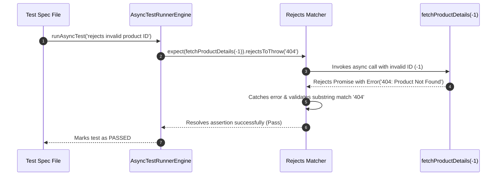

# Module 06: Testing Asynchronous Code — Promises, `async/await`, `expect.assertions`, and False-Positive Prevention

## Overview

Asynchronous JavaScript operations (Promises, `async/await`, Callbacks, RxJS Observables) present unique testing challenges.

If a test runner does not explicitly pause execution to await an asynchronous Promise resolution or rejection, the test function will exit early with a **false-positive PASS**, completely ignoring any assertion failures that occur after the test completes.

Understanding **Async Event Loop Mechanics**, **Unawaited Promise Hazards**, **`expect.assertions(N)` Rejection Guards**, and **`resolves` / `rejects` Matchers** is essential.

---

## 1. Async Test Execution & False-Positive Hazard Topology

```mermaid
flowchart TD
    subgraph False-Positive Hazard (BAD: Unawaited Promise)
        Test1["test('fetches user')"] -->|Fires Promise without await!| Call1["fetchUser() (Async Network Call)"]
        Test1 -->|Test completes immediately!| Pass1["✓ PASS (False Positive!)"]
        Call1 -.->|500ms later: Throws Error!| Crash1["Unhandled Promise Rejection (Crashes Process)"]
    end

    subgraph Proper Awaited Test (GOOD)
        Test2["async test('fetches user')"] -->|await fetchUser()| Call2["fetchUser() (Async Call)"]
        Call2 -->|Awaits Microtask Resolution| Assert2["expect(user.id).toBe(101)"]
        Assert2 --> Pass2["✓ PASS (True Positive Verification)"]
    end

    style Pass1 fill:#fee2e2,stroke:#dc2626
    style Pass2 fill:#dcfce7,stroke:#15803d
```

---

## 2. Asynchronous Testing Patterns Comparison Matrix

| Pattern Strategy | Syntax | Exception Handling | Silent Failure Risk | Best Used For |
| :--- | :--- | :--- | :--- | :--- |
| **`async / await`** | `const data = await fn()` | Native `try...catch` | Extremely Low | **Standard default for 99% of async tests** |
| **`resolves` / `rejects`** | `await expect(p).resolves...` | Fluent matcher interception | Low | Concise inline promise state assertions |
| **Return Promise** | `return fn().then(data => ...)`| Chains `.catch()` | Moderate (If `return` is omitted!) | Legacy ES6 codebases without async/await |
| **`expect.assertions(N)`** | `expect.assertions(1)` | Guards caught `try...catch` | **Zero** | Verifying async catch blocks actually executed |
| **`done()` Callback** | `test('name', (done) => ...)` | Manual `done(err)` passing | High (Leaks memory if `done` times out) | Legacy node callback streams / event emitters |

---

## 3. Code Showcase: Production Async Test Runner & Rejection Guards

```javascript
// ==========================================
// 1. CUSTOM ASYNC TEST RUNNER POLYFILL
// ==========================================
class AsyncTestRunnerEngine {
  static async runAsyncTest(testName, asyncTestFn) {
    let expectedAssertionCount = null;
    let actualAssertionCount = 0;

    // Async Assertion Context
    const asyncExpect = (actual) => ({
      toBe(expected) {
        actualAssertionCount++;
        if (actual !== expected) throw new Error(`Expected '${expected}', got '${actual}'`);
      },
      // Rejection Helper Matcher
      async rejectsToThrow(expectedErrorSubstring) {
        actualAssertionCount++;
        if (!(actual instanceof Promise)) {
          throw new Error("rejectsToThrow() target must be a Promise.");
        }
        let thrownError = null;
        try {
          await actual;
        } catch (err) {
          thrownError = err;
        }
        if (!thrownError) {
          throw new Error("Expected Promise to reject, but it resolved successfully.");
        }
        if (expectedErrorSubstring && !thrownError.message.includes(expectedErrorSubstring)) {
          throw new Error(`Expected rejection message to contain '${expectedErrorSubstring}', got '${thrownError.message}'`);
        }
      }
    });

    // Guard API: expect.assertions(N)
    asyncExpect.assertions = (count) => {
      expectedAssertionCount = count;
    };

    console.log(`[AsyncRunner]: Executing '${testName}'...`);
    const startTime = Date.now();

    try {
      // Execute Async Test Function & Await Completion!
      await asyncTestFn(asyncExpect);

      // Verify expect.assertions(N) count match if specified
      if (expectedAssertionCount !== null && actualAssertionCount !== expectedAssertionCount) {
        throw new Error(`Assertion Count Mismatch: Expected ${expectedAssertionCount} assertion(s) to be called, but received ${actualAssertionCount}.`);
      }

      console.log(`  ✓ PASS: '${testName}' (${Date.now() - startTime} ms)`);
    } catch (err) {
      console.error(`  ✗ FAIL: '${testName}'`);
      console.error(`    -> ${err.message}`);
    }
  }
}

// ==========================================
// 2. DEMONSTRATING ASYNC TESTING SCENARIOS
// ==========================================

// Async Target Services
const fetchProductDetails = async (productId) => {
  await new Promise((resolve) => setTimeout(resolve, 50));
  if (productId <= 0) throw new Error("404: Product Not Found");
  return { id: productId, name: "Wireless Headphones", price: 150 };
};

// Execution Benchmarks
(async () => {
  // Test 1: Standard async/await Resolution
  await AsyncTestRunnerEngine.runAsyncTest("fetchProductDetails() resolves valid product payload", async (expect) => {
    const product = await fetchProductDetails(42);
    expect(product.name).toBe("Wireless Headphones");
  });

  // Test 2: Rejection Assertion with expect.assertions(1) Guard
  await AsyncTestRunnerEngine.runAsyncTest("fetchProductDetails() rejects invalid product ID", async (expect) => {
    expect.assertions(1); // Guarantees catch block runs!
    try {
      await fetchProductDetails(-1);
    } catch (err) {
      expect(err.message).toBe("404: Product Not Found");
    }
  });

  // Test 3: Fluent rejectsToThrow Matcher
  await AsyncTestRunnerEngine.runAsyncTest("fetchProductDetails() fluent rejects matcher verification", async (expect) => {
    await expect(fetchProductDetails(-99)).rejectsToThrow("404");
  });
})();
```

---

## 4. Async Promise Rejection Sequence Diagram



---

## Key Production Takeaways

1. **Always Await Async Operations**: Mark test functions as `async () => { ... }` and prefix all promise-returning functions with `await`.
2. **Use `expect.assertions(N)` in `try...catch` Rejection Tests**: Always specify `expect.assertions(1)` when testing rejections in a `try...catch` block to ensure the test fails if the promise unexpectedly resolves without throwing.
3. **Prefer `await expect(promise).rejects.toThrow()`**: Use fluent `.rejects.toThrow()` matchers instead of verbose `try...catch` blocks for cleaner async error assertions.
4. **Never Mix `done()` Callbacks with Promises**: Avoid using `done()` callbacks inside `async () => {}` test functions, as mixing the two can cause unpredictable timeouts and unhandled promise crashes.

