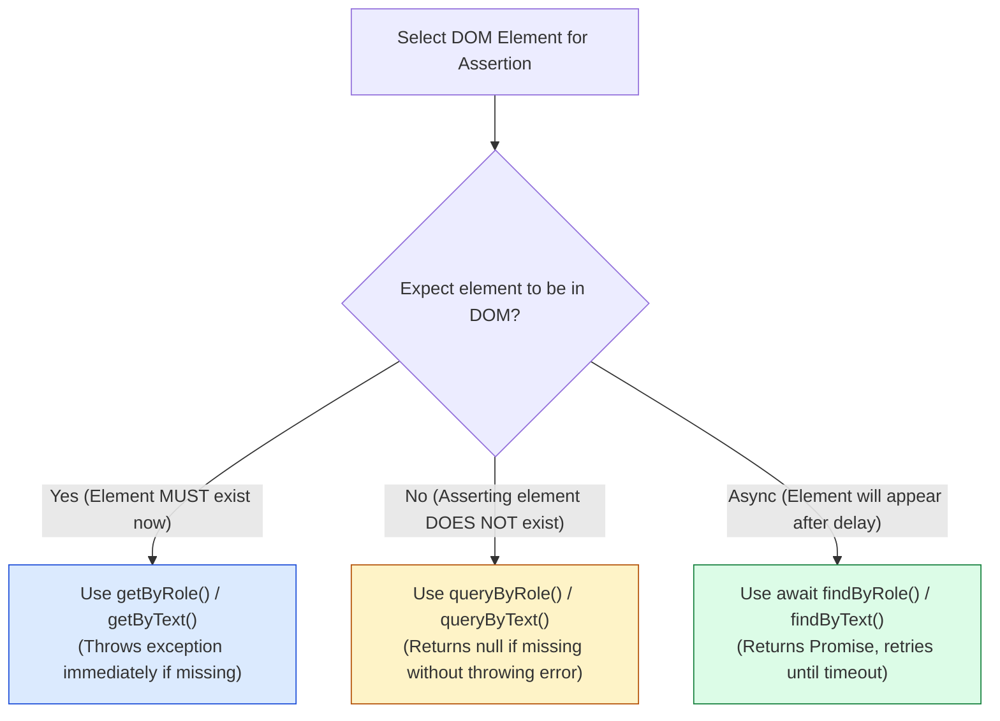
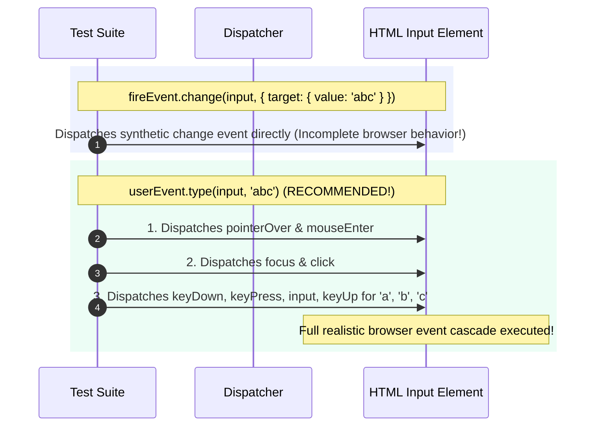

# Module 07: Testing DOM & UI Components — Testing Library Principles, Query Hierarchies, and Event Simulation

## Overview

Testing UI components requires rendering component trees into a simulated in-memory browser environment (**JSDOM** or **HappyDOM**).

Modern UI testing adheres to the **DOM Testing Library Guiding Principle**: *"The more your tests resemble the way your software is used, the more confidence they can give you."*

Rather than inspecting internal component state, private instance methods, or fragile CSS class names (`.btn-primary`), robust tests query the DOM using **Accessible ARIA Roles** (`getByRole`), visible text content (`getByText`), and explicit form labels (`getByLabelText`).

Understanding the **Query Priority Hierarchy**, **`getBy*` vs. `queryBy*` vs. `findBy*` Variants**, and **`user-event` vs. `fireEvent`** is essential.

---

## 1. DOM Query Priority & Execution Decision Trees

```mermaid
flowchart TD
    subgraph Query Priority Hierarchy (DOM Testing Library)
        P1["1. Accessible to Everyone (PREFERRED!)<br/>getByRole('button', { name: /submit/i })<br/>getByLabelText('Email Address')<br/>getByText('Save Order')"]
        P2["2. Semantic HTML Queries<br/>getByAltText('Profile Avatar')<br/>getByTitle('Tooltip Description')"]
        P3["3. Test IDs (LAST RESORT!)<br/>getByTestId('custom-chart-wrapper')"]

        P1 --> P2 --> P3
    end

    style P1 fill:#dcfce7,stroke:#15803d
    style P3 fill:#fee2e2,stroke:#dc2626
```



---

## 2. DOM Query Variants Comparison Matrix

| Query Variant | Found (1 Match) | Not Found (0 Matches) | Multiple Found ($>1$ Matches) | Async Waiting Support? | Primary Use Case |
| :--- | :--- | :--- | :--- | :--- | :--- |
| **`getBy*`** | Returns Element | **Throws Error** | **Throws Error** | No | Asserting mandatory present elements |
| **`queryBy*`** | Returns Element | **Returns `null`** | **Throws Error** | No | Asserting non-existence (`expect(el).toBeNull()`) |
| **`findBy*`** | Resolves Element | **Rejects Promise** | **Rejects Promise** | **Yes** (Retries $\sim 1000$ms) | Asserting element appearing after async API fetch |
| **`getAllBy*`** | Returns Array | **Throws Error** | Returns Array | No | Matching list item elements |

---

## 3. Code Showcase: JSDOM Container & Accessible Query Engine Polyfill

```javascript
// ==========================================
// 1. JSDOM ACCESSIBLE QUERY ENGINE POLYFILL
// ==========================================
class DomQueryEngine {
  static getByRole(container, role, options = {}) {
    const selectorMap = {
      button: "button, input[type='button'], input[type='submit']",
      heading: "h1, h2, h3, h4, h5, h6",
      textbox: "input[type='text'], textarea"
    };

    const cssSelector = selectorMap[role] || role;
    const elements = Array.from(container.querySelectorAll(cssSelector));

    const matched = elements.filter((el) => {
      if (options.name) {
        const textContent = el.textContent || el.value || "";
        return options.name instanceof RegExp 
          ? options.name.test(textContent) 
          : textContent.includes(options.name);
      }
      return true;
    });

    if (matched.length === 0) {
      throw new Error(`DOM Query Error: Unable to find an accessible element with role '${role}' and name '${options.name}'`);
    }
    if (matched.length > 1) {
      throw new Error(`DOM Query Error: Found ${matched.length} elements matching role '${role}'. Use getAllByRole() instead.`);
    }

    return matched[0];
  }

  static queryByText(container, textMatch) {
    const elements = Array.from(container.querySelectorAll("*"));
    const matched = elements.find((el) => el.children.length === 0 && el.textContent.includes(textMatch));
    return matched || null;
  }

  static async findByText(container, textMatch, timeoutMs = 1000) {
    const startTime = Date.now();
    while (Date.now() - startTime < timeoutMs) {
      const el = DomQueryEngine.queryByText(container, textMatch);
      if (el) return el;
      await new Promise((resolve) => setTimeout(resolve, 50)); // Poll every 50ms
    }
    throw new Error(`DOM Query Timeout: Element with text '${textMatch}' did not appear within ${timeoutMs} ms.`);
  }
}

// ==========================================
// 2. DEMONSTRATING UI COMPONENT TESTING
// ==========================================

// Simulated Web Component
function renderLoginForm(container) {
  container.innerHTML = `
    <form id="login-form">
      <h2>Account Login</h2>
      <label for="username">Username</label>
      <input type="text" id="username" placeholder="Enter username" />
      
      <button type="submit" id="submit-btn">Submit Login</button>
      <div id="status-message"></div>
    </form>
  `;

  const form = container.querySelector("#login-form");
  const statusDiv = container.querySelector("#status-message");

  form.addEventListener("submit", (e) => {
    e.preventDefault();
    statusDiv.textContent = "Authenticating...";
    setTimeout(() => {
      statusDiv.textContent = "Welcome back, Anita!";
    }, 200);
  });
}

// Execution Demonstration inside JSDOM Environment Simulation
(async () => {
  console.log("=== EXECUTING ACCESSIBLE DOM COMPONENT TEST ===");
  
  // Fake DOM Container
  const jsdomContainer = {
    innerHTML: "",
    querySelector: (sel) => document.querySelector(sel),
    querySelectorAll: (sel) => document.querySelectorAll(sel)
  };

  // 1. Arrange: Render Component into DOM
  renderLoginForm(document.body);

  // 2. Query via Accessible Roles
  const submitButton = DomQueryEngine.getByRole(document.body, "button", { name: "Submit Login" });
  console.log("  ✓ PASS: Found submit button by accessible role & name.");

  // Assert non-existence before action
  const initialWelcome = DomQueryEngine.queryByText(document.body, "Welcome back");
  if (initialWelcome !== null) throw new Error("Welcome message should not exist initially!");
  console.log("  ✓ PASS: Confirmed welcome message is not present initially.");

  // 3. Act: Simulate Click Event
  submitButton.dispatchEvent(new Event("submit", { bubbles: true, cancelable: true }));

  // 4. Assert: Wait for Async Async Welcome Text
  const welcomeEl = await DomQueryEngine.findByText(document.body, "Welcome back, Anita!");
  console.log(`  ✓ PASS: Async element appeared: '${welcomeEl.textContent}'`);
})();
```

---

## 4. User Event vs. FireEvent Mechanics



---

## Key Production Takeaways

1. **Query by Accessible Role First**: Always prefer `getByRole('button', { name: /save/i })` over CSS class queries (`querySelector('.save-btn')`) to ensure your app is accessible to screen readers.
2. **Use `queryBy*` for Non-Existence Assertions**: Use `expect(queryByText('Error')).toBeNull()` when verifying an element is not rendered; using `getByText('Error')` will throw an error and fail the test.
3. **Use `findBy*` for Async Elements**: Use `await findByText('Success')` when waiting for elements rendered after network calls or timers.
4. **Prefer `@testing-library/user-event` Over `fireEvent`**: Use `userEvent.click()` instead of `fireEvent.click()` to simulate realistic browser event cascades (focus, hover, keydowns).

