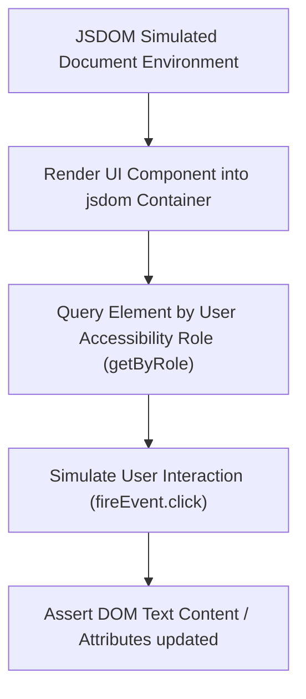

# File 07: Testing DOM and UI Components

## Overview
UI Component testing relies on virtual DOM simulation environments (JSDOM / HappyDOM). Testing frameworks interact with elements using **Testing Library queries** (`getByText`, `getByRole`) focusing on user accessibility rather than implementation details.

---

## 1. DOM Interaction Flow



---

## 2. JSDOM & Component Interaction Implementation

```javascript
// Virtual DOM Component Builder (Vanilla JS DOM)
function renderCounterComponent(container) {
    container.innerHTML = `
        <div class="counter-card">
            <h2 id="counter-val">0</h2>
            <button id="inc-btn">+ Increment</button>
        </div>
    `;

    const countEl = container.querySelector("#counter-val");
    const btn = container.querySelector("#inc-btn");
    let count = 0;

    btn.addEventListener("click", () => {
        count++;
        countEl.textContent = String(count);
    });
}

// JSDOM Test Suite Simulation
describe("DOM Component Tests", () => {
    let container;

    beforeEach(() => {
        container = document.createElement("div");
        document.body.appendChild(container);
    });

    afterEach(() => {
        document.body.removeChild(container);
        container.innerHTML = "";
    });

    test("increments count when button is clicked", () => {
        // Arrange
        renderCounterComponent(container);
        const btn = container.querySelector("#inc-btn");
        const countEl = container.querySelector("#counter-val");

        expect(countEl.textContent).toBe("0");

        // Act (Dispatch DOM Click Event)
        btn.dispatchEvent(new MouseEvent("click", { bubbles: true }));

        // Assert
        expect(countEl.textContent).toBe("1");
    });
});
```

---

## Key Takeaways
1. Use **JSDOM** or **HappyDOM** to simulate browser DOM in Node.js test environments.
2. Query elements by **user-visible text or ARIA roles** (`getByRole`) rather than fragile CSS class selectors.
3. Clean up DOM containers inside **`afterEach`** hooks to prevent state leakage between tests.
