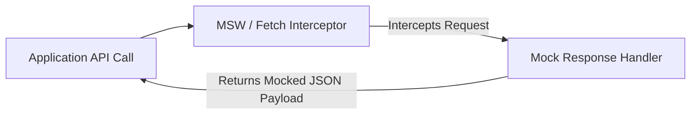

# File 08: Testing API Calls and Network Requests

## Overview
Unit and integration tests should not hit live production APIs over the network. Network requests are intercepted or mocked using tools like **MSW (Mock Service Worker)** or `global.fetch` mocks.

---

## 1. Network Mocking Architecture (MSW / Fetch Mock)



---

## 2. API Call Testing Implementation

```javascript
// Service Module making HTTP Fetch
async function getUserProfile(userId, fetchImpl = globalThis.fetch) {
    const res = await fetchImpl(`https://api.example.com/users/${userId}`);
    if (!res.ok) {
        throw new Error(`API Error: ${res.status}`);
    }
    return await res.json();
}

describe("API Request Mocking", () => {
    test("fetches user profile payload successfully via mock fetch", async () => {
        // Mock fetch implementation
        const mockFetch = async (url) => {
            return {
                ok: true,
                status: 200,
                json: async () => ({ id: 101, username: "Priya", role: "Developer" })
            };
        };

        const profile = await getUserProfile(101, mockFetch);
        expect(profile.username).toBe("Priya");
        expect(profile.role).toBe("Developer");
    });

    test("handles API 404 HTTP error response gracefully", async () => {
        const mockFetch404 = async () => ({
            ok: false,
            status: 404,
            json: async () => ({ error: "Not Found" })
        });

        await expect(getUserProfile(999, mockFetch404)).rejects.toThrow("API Error: 404");
    });
});
```

---

## Key Takeaways
1. Never hit real production APIs during unit test execution.
2. Use **MSW (Mock Service Worker)** for network-level request interception in browser and Node.js environments.
3. Verify both **happy paths** (200 OK) and **error responses** (404, 500 Server Errors).
