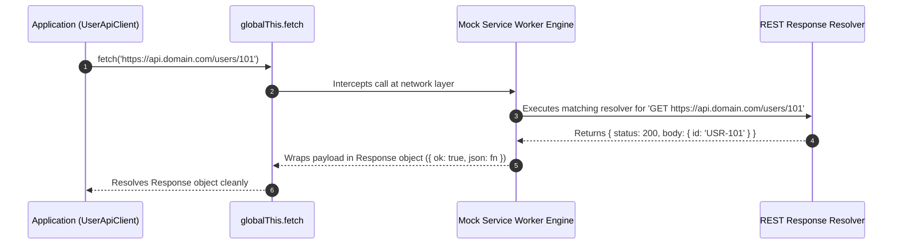

# Module 08: Testing API Calls & Network Requests — MSW (Mock Service Worker), Fetch Spies, and Network Resilience

## Overview

Automated unit and integration test suites should **never issue real HTTP network requests** to remote backend services or third-party APIs. Hitting live endpoints introduces non-deterministic test flakiness, rate-limiting HTTP 429 errors, slow test execution, and dependency on external server availability.

To achieve reliable API testing, JavaScript applications use:
1. **Fetch / Axios Spies**: Mocking `globalThis.fetch` or `axios.get` functions directly in memory.
2. **Mock Service Worker (MSW)**: The industry standard for network-level request interception. MSW intercepts requests at the network layer using **Service Workers in browsers** and **Node `http/https` request interception** in Node.js environments without altering application source code.

Understanding **Network Interception**, **MSW Rest Handlers**, and **Error Scenario Verification (404, 500, Timeout)** is essential.

---

## 1. Network Interception Architecture: Traditional Mocking vs. MSW

```mermaid
flowchart TD
    subgraph Traditional Fetch Mocking (Fragile Application Coupling)
        App1[Application Code] -->|Overwritten Method| GlobalFetch["globalThis.fetch = jest.fn()"]
        GlobalFetch -->|Returns Hardcoded Promise| App1
    end

    subgraph Mock Service Worker MSW (Production-Grade Network Interception)
        App2[Application Code] -->|Standard fetch() Call| NetLayer[Native Network Layer]
        NetLayer -->|Intercepted at Network Boundary| MSW["MSW Interceptor / Service Worker"]
        MSW -->|Matches Route /api/users/101| Handler["MSW Rest Handler (http.get)"]
        Handler -- Returns Mocked Response --> App2
    end

    style MSW fill:#dcfce7,stroke:#15803d
    style GlobalFetch fill:#fee2e2,stroke:#dc2626
```

---

## 2. API Testing Strategies Comparison Matrix

| Strategy | Interception Layer | Source Code Impact | Supports GraphQL & REST? | Confidence Level |
| :--- | :--- | :--- | :--- | :--- |
| **Dependency Injection (`fetchImpl`)** | Function Parameter | High (Requires passing fetch instance around) | Yes | Medium |
| **Global Fetch Spy (`spyOn(global, 'fetch')`)** | Runtime `globalThis` Object | Low | Yes | Medium (Requires manual response mock setup) |
| **Mock Service Worker (MSW)** | **Native Network Boundary** | **Zero (Completely transparent to application code!)** | **Yes (Native REST & GraphQL support)** | **Highest (Simulates real HTTP responses)** |

---

## 3. Code Showcase: MSW-Style Network Interceptor Polyfill & API Suite

```javascript
// ==========================================
// 1. MSW-STYLE NETWORK INTERCEPTOR POLYFILL
// ==========================================
class MockServiceWorkerEngine {
  #handlers = new Map();
  #originalFetch;

  constructor() {
    this.#originalFetch = globalThis.fetch;
  }

  // Register REST API Handler (http.get / http.post analogue)
  registerHandler(method, urlPattern, responseResolverFn) {
    const key = `${method.toUpperCase()} ${urlPattern}`;
    this.#handlers.set(key, responseResolverFn);
    console.log(`[MSW Engine]: Registered network interceptor handler for '${key}'`);
  }

  // Activate Network Interception
  listen() {
    globalThis.fetch = async (input, init = {}) => {
      const url = typeof input === "string" ? input : input.url;
      const method = (init.method || "GET").toUpperCase();
      const key = `${method} ${url}`;

      console.log(`  -> [MSW Interceptor]: Intercepted ${method} request to '${url}'`);

      if (this.#handlers.has(key)) {
        const resolver = this.#handlers.get(key);
        const mockResponseData = await resolver({ url, method, headers: init.headers });

        return {
          ok: mockResponseData.status >= 200 && mockResponseData.status < 300,
          status: mockResponseData.status,
          statusText: mockResponseData.status === 200 ? "OK" : "Error",
          json: async () => mockResponseData.body,
          text: async () => JSON.stringify(mockResponseData.body)
        };
      }

      console.warn(`  !! [MSW Unhandled Request]: No handler for '${key}'. Falling back to original fetch.`);
      return this.#originalFetch(input, init);
    };
  }

  close() {
    globalThis.fetch = this.#originalFetch;
    this.#handlers.clear();
    console.log("[MSW Engine]: Network interceptor stopped. Native fetch restored.");
  }
}

// ==========================================
// 2. DEMONSTRATING APPLICATION API TESTING
// ==========================================

// Production API Service Layer
class UserApiClient {
  async fetchUserProfile(userId) {
    const response = await fetch(`https://api.domain.com/users/${userId}`);
    if (!response.ok) {
      if (response.status === 404) throw new Error("User Account Not Found");
      if (response.status === 500) throw new Error("Internal Server Error");
      throw new Error(`HTTP Error Status: ${response.status}`);
    }
    return await response.json();
  }
}

// Execution Demonstration
const msw = new MockServiceWorkerEngine();

// Setup Handlers
msw.registerHandler("GET", "https://api.domain.com/users/101", async () => ({
  status: 200,
  body: { id: "USR-101", username: "Anita Sharma", role: "ADMIN" }
}));

msw.registerHandler("GET", "https://api.domain.com/users/999", async () => ({
  status: 404,
  body: { error: "Not Found" }
}));

(async () => {
  console.log("\n=== EXECUTING API NETWORK TESTING DEMONSTRATION ===");
  msw.listen(); // Start Network Interception

  const client = new UserApiClient();

  // Test 1: Successful 200 OK Response
  const profile = await client.fetchUserProfile(101);
  console.log("  ✓ PASS: Fetched Profile Payload:", profile);

  // Test 2: 404 Error Handling Verification
  try {
    await client.fetchUserProfile(999);
  } catch (err) {
    console.log(`  ✓ PASS: Successfully caught expected API 404 error: '${err.message}'`);
  }

  msw.close(); // Clean up network interceptor
})();
```

---

## 4. MSW Request Interception Sequence Diagram



---

## Key Production Takeaways

1. **Adopt Mock Service Worker (MSW) as Default**: Prefer MSW over patching `globalThis.fetch` or `axios.get` spies; MSW tests real application HTTP client code at the network layer without modifying production source code.
2. **Test Edge Cases (404, 500, Network Failures)**: Write test scenarios verifying how your application UI handles non-200 HTTP statuses, slow response latency, and complete network outages.
3. **Share MSW Handlers Between Unit and E2E Tests**: Reuse the same MSW request handler definitions in Vitest/Jest unit tests, Storybook component previews, and browser development environments.
4. **Clean Up Interceptors in `afterEach()`**: Always call `server.resetHandlers()` or `msw.close()` in your test lifecycle hooks to prevent mock handlers from leaking into subsequent test files.

