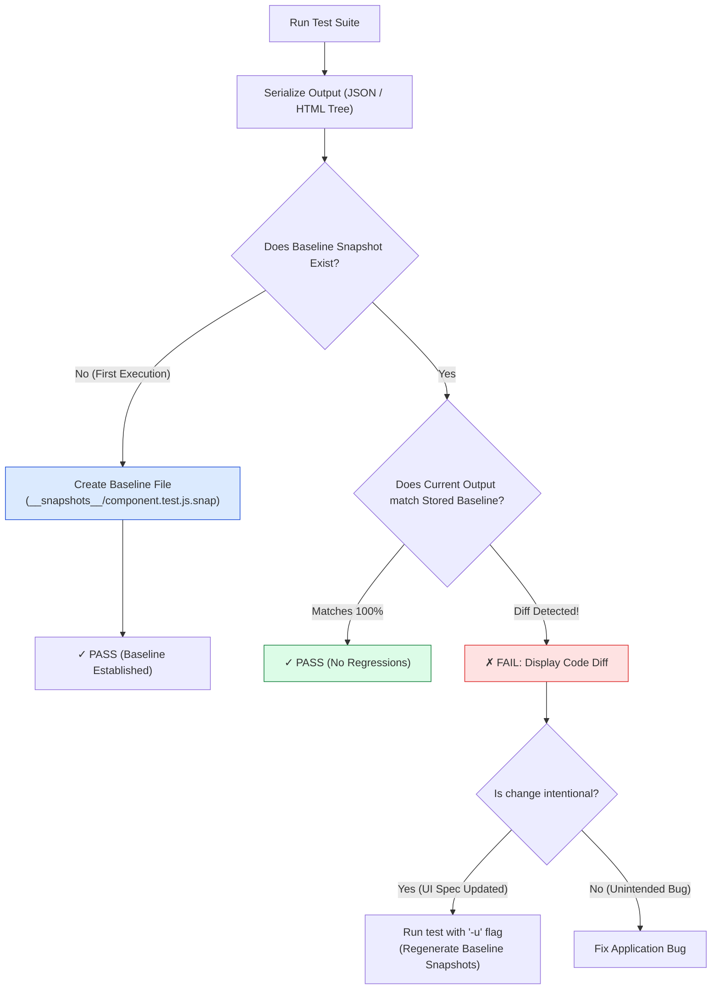
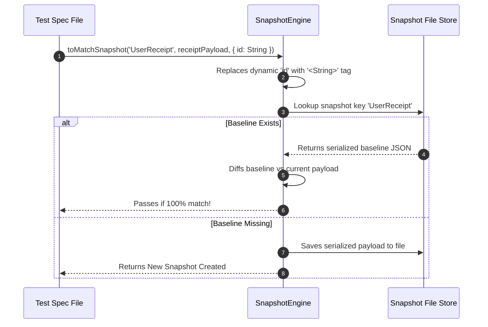

# Module 09: Snapshot Testing — Baseline Comparisons, Inline Snapshots, Property Matchers, and Anti-Pattern Defense

## Overview

**Snapshot Testing** is a testing technique that captures a serialized representation of a component or data structure (e.g. rendered HTML trees, JSON API payloads, generated SQL queries) and compares it against a stored baseline file.

When a test runs:
- If no baseline exists, the test framework serializes the output and **saves a new baseline file** (`__snapshots__/spec.snap`).
- If a baseline exists, the test framework compares the current output against the baseline, failing if a **diff** is detected.

Understanding **File Snapshots (`toMatchSnapshot`)**, **Inline Snapshots (`toMatchInlineSnapshot`)**, **Property Matchers**, and **Snapshot Anti-Patterns** is essential.

---

## 1. Snapshot Lifecycle & Diff Resolution Pipeline



---

## 2. Snapshot Testing Strategies Comparison Matrix

| Strategy | Storage Location | Readability | Best Used For | Over-reliance Risk |
| :--- | :--- | :--- | :--- | :--- |
| **File Snapshot (`toMatchSnapshot()`)** | Separate `__snapshots__/*.snap` file | Low (Hidden in separate directory) | Large component markup, multi-line AST output | **High** (Developers blind-update with `-u`) |
| **Inline Snapshot (`toMatchInlineSnapshot()`)** | Written directly into test source code file | **High** (Visible directly alongside test code) | Small JSON objects, concise HTML strings | Low |
| **Property Matchers (`expect.any(...)`)** | Property override inside `toMatchSnapshot()` | High | Payloads with random UUIDs or timestamps | Low |

---

## 3. Code Showcase: Production Snapshot Engine Polyfill & Property Matcher Verification

```javascript
// ==========================================
// 1. CUSTOM SNAPSHOT COMPARISON ENGINE
// ==========================================
class SnapshotTestingEngine {
  static #snapshotStore = new Map();

  static toMatchSnapshot(testName, actualPayload, propertyMatchers = {}) {
    // 1. Apply Property Matchers for Dynamic Fields (Timestamps, UUIDs)
    const sanitizedPayload = structuredClone(actualPayload);
    for (const [key, typeMatcher] of Object.entries(propertyMatchers)) {
      if (key in sanitizedPayload) {
        sanitizedPayload[key] = `<${typeMatcher.name || "DynamicValue"}>`;
      }
    }

    const serializedCurrent = JSON.stringify(sanitizedPayload, null, 2);

    // 2. Check if baseline snapshot exists in store
    if (!this.#snapshotStore.has(testName)) {
      this.#snapshotStore.set(testName, serializedCurrent);
      console.log(`[SnapshotEngine]: Created new baseline snapshot for '${testName}'`);
      return { pass: true, isNew: true };
    }

    // 3. Compare against stored baseline
    const storedBaseline = this.#snapshotStore.get(testName);
    if (storedBaseline !== serializedCurrent) {
      const diffMsg = `Snapshot Mismatch Error for '${testName}':\n--- STORED BASELINE ---\n${storedBaseline}\n--- RECEIVED OUTPUT ---\n${serializedCurrent}`;
      throw new Error(diffMsg);
    }

    return { pass: true, isNew: false };
  }

  static updateSnapshot(testName, newPayload) {
    const serialized = JSON.stringify(newPayload, null, 2);
    this.#snapshotStore.set(testName, serialized);
    console.log(`[SnapshotEngine]: Updated snapshot for '${testName}' (-u flag execution)`);
  }
}

// ==========================================
// 2. DEMONSTRATING SNAPSHOT VERIFICATION
// ==========================================

// Function Generating Dynamic Payload
function createOrderReceipt(user, amount) {
  return {
    orderId: `ORD-${Math.floor(Math.random() * 100000)}`, // Dynamic ID!
    customer: user.name,
    amount,
    timestamp: Date.now(), // Dynamic Timestamp!
    status: "PROCESSING"
  };
}

(async () => {
  console.log("=== EXECUTING SNAPSHOT TESTING DEMONSTRATION ===");

  const user = { name: "Anita Sharma" };
  const orderReceipt = createOrderReceipt(user, 2500);

  // Test 1: First Run - Baseline Creation with Property Matchers for Dynamic Fields
  console.log("-> Run 1: Creating Baseline...");
  SnapshotTestingEngine.toMatchSnapshot("createOrderReceipt() matching baseline", orderReceipt, {
    orderId: String,
    timestamp: Number
  });
  console.log("  ✓ PASS: Baseline snapshot created successfully.");

  // Test 2: Second Run with Different Random ID/Timestamp - Matches Baseline via Property Matcher!
  console.log("\n-> Run 2: Executing again with new random ID/timestamp...");
  const newReceiptSameData = createOrderReceipt(user, 2500);
  
  try {
    SnapshotTestingEngine.toMatchSnapshot("createOrderReceipt() matching baseline", newReceiptSameData, {
      orderId: String,
      timestamp: Number
    });
    console.log("  ✓ PASS: Successfully matched snapshot baseline!");
  } catch (err) {
    console.error("  ✗ FAIL:", err.message);
  }
})();
```

---

## 4. Snapshot Serialization & Property Interception Sequence



---

## Key Production Takeaways

1. **Prefer `toMatchInlineSnapshot()` for Small Data Structures**: Use inline snapshots so developers can review snapshot expectations directly inside the test file without opening external `.snap` files.
2. **Use Property Matchers for Dynamic Fields**: Always pass property matchers (`expect.objectContaining({ id: expect.any(String) })`) when snapshotting payloads containing random IDs, dates, or non-deterministic data.
3. **Avoid Mindless Snapshot Updating (`jest -u`)**: Never run `jest -u` to fix failing tests without inspecting every single line of the snapshot diff to prevent committing unintended bugs.
4. **Avoid Indiscriminate Huge Snapshots**: Do not snapshot massive 10,000-line DOM structures; snapshot focused components to keep snapshot diffs readable during code reviews.

