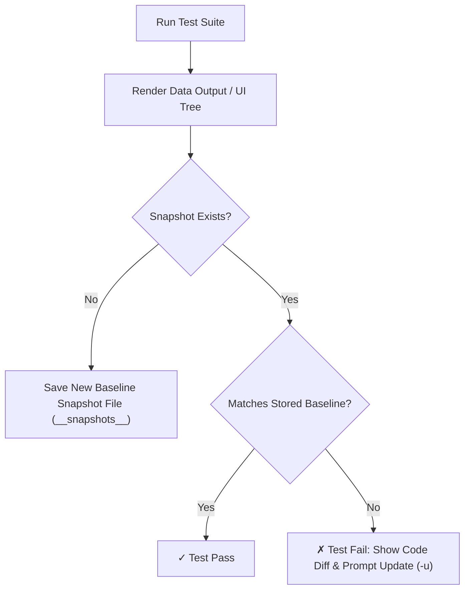

# File 09: Snapshot Testing

## Overview
**Snapshot Testing** compares serializable data structures (UI component render trees, JSON objects, generated SQL strings) against a stored baseline snapshot file. If the output changes unexpectedly, the test fails, highlighting the diff.

---

## 1. Snapshot Testing Workflow



---

## 2. Inline & File Snapshot Testing Implementation

```javascript
function generateInvoiceHtml(user, amount) {
    return `
<div class="invoice-card">
    <h2>Invoice for ${user.name}</h2>
    <p>Amount Due: ₹${amount}</p>
    <span class="status">PENDING</span>
</div>
    `.trim();
}

describe("Snapshot Testing", () => {
    test("matches generated invoice HTML snapshot structure", () => {
        const user = { name: "Priya", email: "priya@example.com" };
        const htmlOutput = generateInvoiceHtml(user, 1500);

        // Inline Snapshot Matching
        const expectedSnapshot = `<div class="invoice-card">
    <h2>Invoice for Priya</h2>
    <p>Amount Due: ₹1500</p>
    <span class="status">PENDING</span>
</div>`;

        expect(htmlOutput).toBe(expectedSnapshot);
    });
});
```

---

## Key Takeaways
1. Snapshots guard against **unintended regressions** in complex HTML/JSON string outputs.
2. Use **`-u` flag in Jest/Vitest** to explicitly update snapshots when intentionally changing UI design specs.
3. Keep snapshot files small and readable; avoid snapshotting huge indiscriminate blobs.
