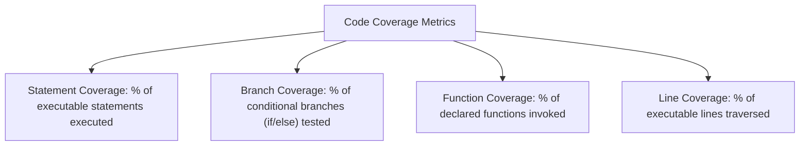

# File 10: Code Coverage Analysis

## Overview
**Code Coverage** measures the percentage of source code executed while running tests. Coverage engines track four primary metrics: **Statement**, **Branch**, **Function**, and **Line** coverage.

---

## 1. Code Coverage Metrics Taxonomy



---

## 2. Branch Coverage Analysis Example

```javascript
// Function under test
function calculateDiscount(userType, amount) {
    if (amount <= 0) {
        return 0; // Branch 1
    }

    if (userType === "VIP") {
        return amount * 0.20; // Branch 2
    } else if (userType === "REGULAR") {
        return amount * 0.05; // Branch 3
    }

    return 0; // Branch 4
}

// 100% Branch Coverage Test Suite
describe("100% Branch Coverage Suite", () => {
    test("handles zero/negative amount branch", () => {
        expect(calculateDiscount("VIP", 0)).toBe(0);
    });

    test("handles VIP user discount branch", () => {
        expect(calculateDiscount("VIP", 1000)).toBe(200);
    });

    test("handles REGULAR user discount branch", () => {
        expect(calculateDiscount("REGULAR", 1000)).toBe(50);
    });

    test("handles unknown user type fallback branch", () => {
        expect(calculateDiscount("GUEST", 1000)).toBe(0);
    });
});
```

---

## Key Takeaways
1. Aim for **high branch coverage** rather than just statement coverage.
2. 100% coverage does not guarantee bug-free code—quality of assertions matters more than line count.
3. Configure **coverage thresholds in CI/CD pipelines** to enforce code quality standards.
