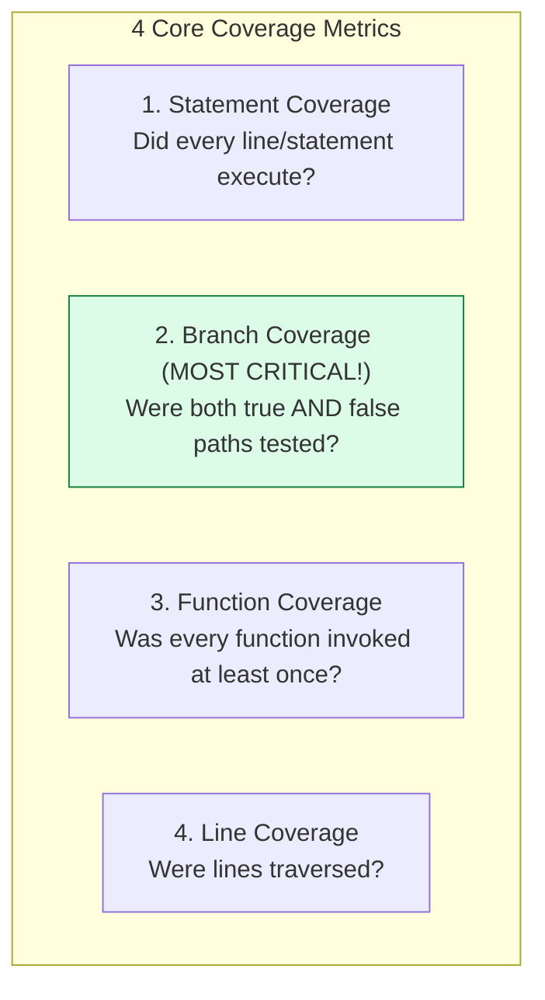
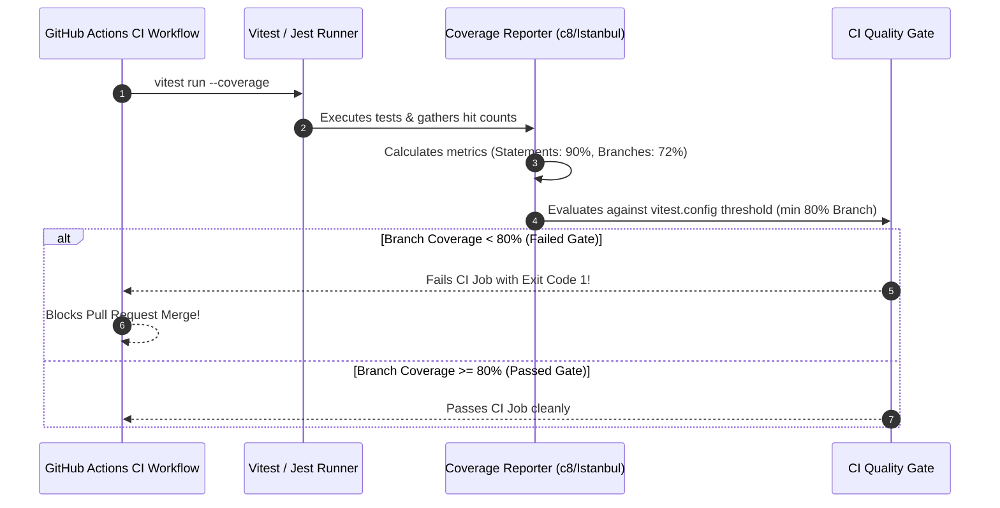

# Module 10: Code Coverage Analysis — Metrics, AST Instrumentation, V8 Coverage Engines, and CI Thresholds

## Overview

**Code Coverage Analysis** is a software metric used to measure the percentage of source code executed while running automated test suites.

Coverage tools evaluate four distinct metric dimensions:
1. **Statement Coverage**: Percentage of total executable JS statements executed.
2. **Branch Coverage**: Percentage of conditional decision paths (`if / else`, `switch`, `ternary`, `??`, `||`) evaluated in both `true` and `false` directions.
3. **Function Coverage**: Percentage of declared functions or class methods invoked during testing.
4. **Line Coverage**: Percentage of executable source lines traversed.

Understanding **AST (Abstract Syntax Tree) Code Instrumentation (Istanbul / NYC)**, **Native V8 Profiler Coverage (`c8` / Vitest)**, **CI Coverage Gates**, and **The 100% Coverage Myth** is essential.

---

## 1. Code Coverage Metrics & AST Instrumentation Architecture

```mermaid
flowchart TD
    subgraph AST Code Instrumentation (Istanbul Engine)
        Source["Original JS Code<br/>if (user.isAdmin) return true;"] --> AST["Abstract Syntax Tree Parser"]
        AST --> Inject["Inject Counter Statements<br/>cov_store[0]++; if (user.isAdmin) { cov_store[1]++; return true; }"]
        Inject --> Exec["Execute Instrumented Code under Test"]
        Exec --> Report["Generate Coverage Report (HTML / LCOV)"]
    end
```



---

## 2. Coverage Metrics Architectural Comparison Matrix

| Metric Dimension | Definition | Why It Matters | Failure Hazard |
| :--- | :--- | :--- | :--- |
| **Statement Coverage** | % of statements executed | Basic sanity check | Misses unexecuted `else` branches in ternary operators |
| **Branch Coverage** | **% of conditional branches evaluated** | **Highest value metric! Identifies missing edge case branches** | Omitting nullish coalescing defaults (`val ?? fallback`) |
| **Function Coverage** | % of declared functions called | Ensures unused dead code is identified | Ignores whether logic inside functions is thoroughly tested |
| **Line Coverage** | % of code lines hit | High-level summary metric | Minified single-line JS code inflates metric falsely |

---

## 3. Code Showcase: Custom Branch Coverage Instrumenter Engine

```javascript
// ==========================================
// 1. CUSTOM BRANCH COVERAGE TRACKER POLYFILL
// ==========================================
class CoverageTrackerEngine {
  static #branches = new Map();

  // Register Branch ID
  static registerBranch(branchId, description) {
    this.#branches.set(branchId, { description, hitCount: 0 });
  }

  // Instrument Branch Hit
  static hitBranch(branchId) {
    if (this.#branches.has(branchId)) {
      this.#branches.get(branchId).hitCount++;
    }
  }

  // Generate Report
  static generateReport() {
    console.log("\n=== CODE COVERAGE METRICS REPORT ===");
    let totalBranches = 0;
    let coveredBranches = 0;

    for (const [id, data] of this.#branches.entries()) {
      totalBranches++;
      const isCovered = data.hitCount > 0;
      if (isCovered) coveredBranches++;

      const statusSymbol = isCovered ? "✓ COVERED" : "✗ UNCOVERED";
      console.log(`  [Branch ${id}]: ${statusSymbol} | Calls: ${data.hitCount} -> (${data.description})`);
    }

    const percentage = totalBranches === 0 ? 100 : ((coveredBranches / totalBranches) * 100).toFixed(2);
    console.log(`\nTOTAL BRANCH COVERAGE: ${percentage}% (${coveredBranches}/${totalBranches} branches executed)`);

    return percentage;
  }

  static reset() {
    this.#branches.clear();
  }
}

// ==========================================
// 2. INSTRUMENTED APPLICATION CODE
// ==========================================

// Register Expected Branch IDs upfront
CoverageTrackerEngine.registerBranch("B1_TRUE", "evaluateAccess: User is Admin (True)");
CoverageTrackerEngine.registerBranch("B1_FALSE", "evaluateAccess: User is not Admin (False)");
CoverageTrackerEngine.registerBranch("B2_TRUE", "evaluateAccess: Active Subscription (True)");
CoverageTrackerEngine.registerBranch("B2_FALSE", "evaluateAccess: Inactive Subscription (False)");

// Instrumented Function (Simulates Istanbul AST Compiler Output)
function evaluateAccess(user) {
  if (user.role === "ADMIN") {
    CoverageTrackerEngine.hitBranch("B1_TRUE");
    return "FULL_ACCESS";
  } else {
    CoverageTrackerEngine.hitBranch("B1_FALSE");
  }

  if (user.isSubscribed === true) {
    CoverageTrackerEngine.hitBranch("B2_TRUE");
    return "MEMBER_ACCESS";
  } else {
    CoverageTrackerEngine.hitBranch("B2_FALSE");
  }

  return "DENIED";
}

// ==========================================
// 3. EXECUTING INCOMPLETE TEST SUITE DEMONSTRATION
// ==========================================
console.log("=== EXECUTING TEST SUITE FOR COVERAGE ANALYSIS ===");

// Test 1: Admin User
const res1 = evaluateAccess({ role: "ADMIN", isSubscribed: false });
console.log("Test 1 Result:", res1);

// Test 2: Subscribed Non-Admin User
const res2 = evaluateAccess({ role: "USER", isSubscribed: true });
console.log("Test 2 Result:", res2);

// Generate Coverage Summary (Notice B2_FALSE is UNCOVERED because no test passed unsubscribed non-admin!)
const coveragePct = CoverageTrackerEngine.generateReport();

if (parseFloat(coveragePct) < 100) {
  console.warn("  !! Coverage Threshold Warning: Branch coverage is below 100% gate threshold!");
}
```

---

## 4. CI/CD Quality Gate Threshold Sequence



---

## Key Production Takeaways

1. **Prioritize Branch Coverage Over Statement Coverage**: High statement coverage can be misleading; focus on branch coverage to ensure all conditional edge cases (`if / else`, ternary, error handlers) are tested.
2. **Beware the 100% Coverage Myth**: 100% code coverage does not guarantee bug-free software; it only proves code lines ran, not that the assertions verified correct behavior.
3. **Configure CI Coverage Thresholds**: Set minimum coverage thresholds in `vitest.config.js` or `jest.config.js` (`branches: 80, functions: 85, lines: 85`) to block PR merges when coverage regressions occur.
4. **Use Ignore Comments Sparingly**: Use `/* istanbul ignore next */` or `/* v8 ignore next */` only for unreachable defensive code (e.g. default switch cases in exhaustive TypeScript checks).

