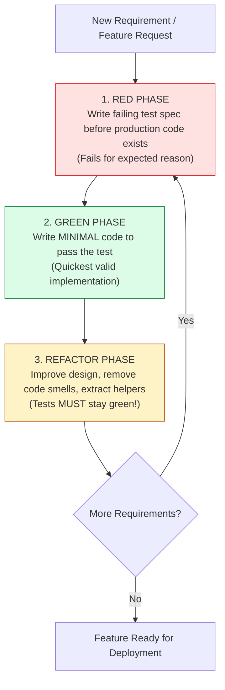
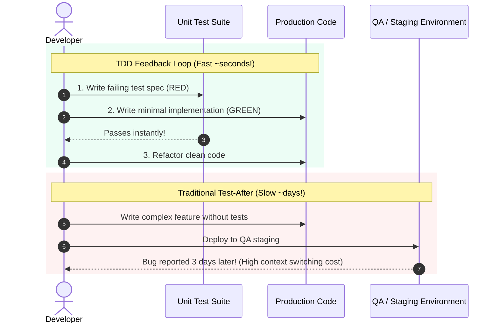

# Module 11: Test-Driven Development (TDD) — The Red-Green-Refactor Cycle, BDD, and Testable Architecture

## Overview

**Test-Driven Development (TDD)** is an agile software engineering methodology popularized by Kent Beck. In TDD, developers write automated test specifications **before** writing production code.

TDD operates strictly through the **Red-Green-Refactor** micro-cycle:
1. **Red**: Write a small, failing unit test for a single requirement before any feature code exists.
2. **Green**: Write the **simplest, minimal production code** required to make the failing test pass.
3. **Refactor**: Clean up and optimize the implementation, remove duplication, and improve variable names while ensuring all tests remain green.

Understanding **TDD vs. BDD (Behavior-Driven Development)**, **Feedback Loop Acceleration**, and **Designing for Testability** is essential.

---

## 1. The Red-Green-Refactor Lifecycle Architecture



---

## 2. Development Methodologies Comparison Matrix

| Dimension | Test-Driven Development (TDD) | Behavior-Driven Development (BDD) | Traditional Test-After Development |
| :--- | :--- | :--- | :--- |
| **Test Timing** | **Written BEFORE production code** | Written BEFORE production code | Written AFTER production code |
| **Primary Focus** | Unit isolation & API interface design | User behavior & domain acceptance criteria | Verification & regression safety |
| **Language & Framing** | `describe()`, `it('should...')` | `Given / When / Then` Gherkin DSL | Post-hoc assertion testing |
| **Architecture Quality**| **Extremely High** (Forces decoupled modularity) | High | Variable (Risk of tightly coupled untestable code) |
| **Feedback Loop** | Instant ($\sim$seconds) | Fast | Slow (Discovered late in QA cycle) |

---

## 3. Code Showcase: Step-by-Step TDD Evolution of a Enterprise Password Validator

```javascript
// ==========================================
// TDD CYCLE DEMONSTRATION ENGINE
// ==========================================

// Simple Test Runner Assertion Polyfill
function expect(actual) {
  return {
    toBe(expected) {
      if (actual !== expected) throw new Error(`Expected '${expected}', got '${actual}'`);
    },
    toEqual(expected) {
      if (JSON.stringify(actual) !== JSON.stringify(expected)) throw new Error("Object mismatch");
    }
  };
}

// ------------------------------------------
// PHASE 1: RED PHASE (Define Spec & Assert Fail)
// Requirement 1: Password must be at least 8 characters long.
// Requirement 2: Password must contain at least one digit.
// Requirement 3: Password must contain at least one special character (!@#$%^&*).
// ------------------------------------------

// Target Component (Initial empty skeleton)
class PasswordPolicyValidator {
  validate(password) {
    // Initial unimplemented stub returns dummy value
    return { isValid: true, errors: [] };
  }
}

console.log("=== EXECUTING TDD RED-GREEN-REFACTOR EVOLUTION ===");

// ------------------------------------------
// PHASE 2: GREEN PHASE (Write Minimal Passing Code)
// ------------------------------------------

class PasswordPolicyValidatorGreen {
  validate(password) {
    const errors = [];
    if (!password || password.length < 8) {
      errors.push("Password must be at least 8 characters long.");
    }
    if (!/\d/.test(password)) {
      errors.push("Password must contain at least one digit.");
    }
    if (!/[!@#$%^&*]/.test(password)) {
      errors.push("Password must contain at least one special character.");
    }

    return {
      isValid: errors.length === 0,
      errors
    };
  }
}

// Test Spec Execution (Verifying Green State)
const validator = new PasswordPolicyValidatorGreen();

// Test 1: Short Password
const res1 = validator.validate("Short1!");
expect(res1.isValid).toBe(false);
console.log("  ✓ PASS (Green Phase): Rejected short password.");

// Test 2: Missing Digit
const res2 = validator.validate("LongPassword!");
expect(res2.isValid).toBe(false);
console.log("  ✓ PASS (Green Phase): Rejected missing digit.");

// Test 3: Valid Enterprise Password
const res3 = validator.validate("SecurePass123!");
expect(res3.isValid).toBe(true);
expect(res3.errors.length).toBe(0);
console.log("  ✓ PASS (Green Phase): Accepted valid password.");

// ------------------------------------------
// PHASE 3: REFACTOR PHASE (Clean Architecture & Modular Rules Engine)
// Refactored to Strategy Pattern for easy extension without breaking tests!
// ------------------------------------------

class PasswordPolicyValidatorRefactored {
  #rules = [
    {
      check: (p) => p && p.length >= 8,
      message: "Password must be at least 8 characters long."
    },
    {
      check: (p) => /\d/.test(p),
      message: "Password must contain at least one digit."
    },
    {
      check: (p) => /[!@#$%^&*]/.test(p),
      message: "Password must contain at least one special character."
    }
  ];

  validate(password) {
    const errors = this.#rules
      .filter((rule) => !rule.check(password))
      .map((rule) => rule.message);

    return {
      isValid: errors.length === 0,
      errors
    };
  }
}

// Re-run ALL tests against Refactored class to guarantee zero regressions!
const refactoredValidator = new PasswordPolicyValidatorRefactored();
expect(refactoredValidator.validate("SecurePass123!").isValid).toBe(true);
console.log("  ✓ PASS (Refactor Phase): All tests remain green after refactoring!");
```

---

## 4. TDD Feedback Loop vs. Traditional Waterfall



---

## Key Production Takeaways

1. **Write Tests Before Code**: Always write your test assertions first; seeing the test fail for expected reasons confirms that the test is valid and not a false-positive.
2. **Write Minimal Code for Green**: In the Green phase, write only the minimum code needed to pass the current test. Avoid over-engineering prematurely.
3. **Refactor Only When Green**: Never refactor production code while tests are failing; achieve a green test suite first before making structural improvements.
4. **TDD Drives Modular Architecture**: Writing tests first forces you to build decoupled, loosely bound classes and functions with clear interfaces.

