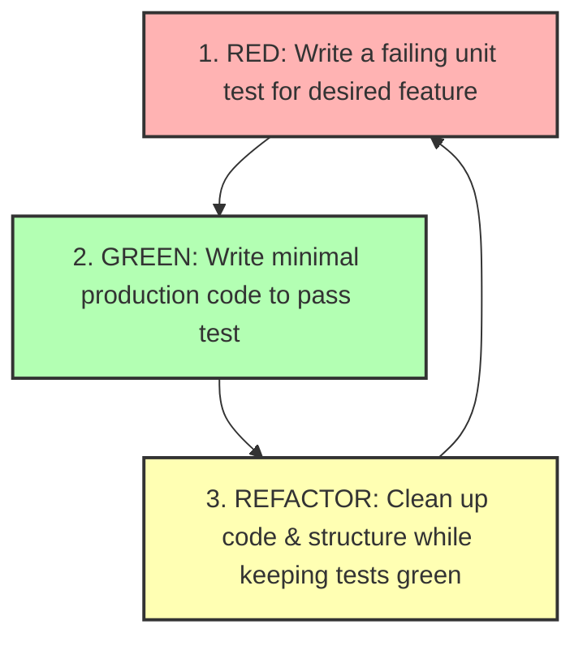

# File 11: Test-Driven Development (TDD) Workflow

## Overview
**Test-Driven Development (TDD)** is a software development workflow where you write failing tests *before* writing the minimal production code needed to make those tests pass. TDD follows the **Red-Green-Refactor** cycle.

---

## 1. The Red-Green-Refactor Cycle



---

## 2. TDD Step-by-Step Implementation

### Step 1: Write Failing Test (Red Phase)
```javascript
// PasswordValidator.test.js
describe("PasswordValidator (TDD Cycle)", () => {
    test("should fail if password is shorter than 8 characters", () => {
        expect(validatePassword("Short1!")).toBe(false);
    });
});
```

### Step 2: Minimal Production Implementation (Green Phase)
```javascript
function validatePassword(password) {
    if (!password || password.length < 8) return false; // Minimal code to pass test!
    return true;
}
```

### Step 3: Refactor Phase
Clean up production code logic, improve variable names, or optimize performance while running tests continuously to ensure no regressions occur.

---

## Key Takeaways
1. Follow **Red -> Green -> Refactor**.
2. Write **minimal production code** required to turn failing tests green.
3. TDD leads to **modular, highly testable software architectures**.
