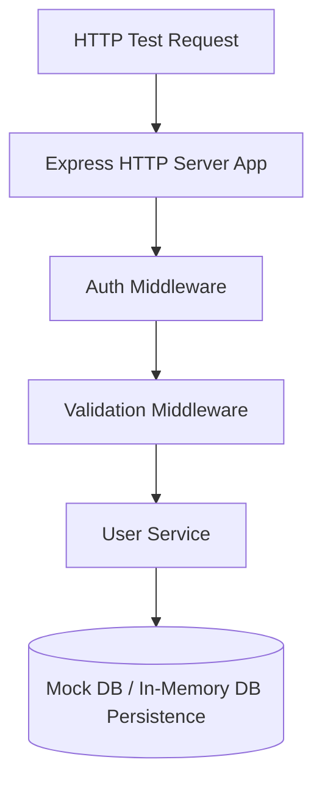

# File 12: Integration Testing

## Overview
**Integration Testing** verifies that multiple units or components work together correctly in combination (e.g. API endpoints communicating with database layers or middleware chains).

---

## 1. Integration Testing Architecture



---

## 2. Express Middleware Integration Test Implementation

```javascript
// Middleware Pipeline Runner
function runMiddlewareChain(middlewares, req) {
    const res = { statusCode: 200, body: null };
    let index = 0;

    const next = err => {
        if (err) {
            res.statusCode = 400;
            res.body = { error: err.message };
            return;
        }
        if (index < middlewares.length) {
            const mw = middlewares[index++];
            mw(req, res, next);
        }
    };

    next();
    return res;
}

// Integration Test Suite
describe("Middleware Integration Pipeline", () => {
    const authMw = (req, res, next) => {
        if (!req.headers.authorization) return next(new Error("Missing auth header"));
        req.user = { id: 101 };
        next();
    };

    const handlerMw = (req, res, next) => {
        res.body = { status: "SUCCESS", userId: req.user.id };
    };

    const pipeline = [authMw, handlerMw];

    test("returns 400 error when authorization header is missing", () => {
        const result = runMiddlewareChain(pipeline, { headers: {} });
        expect(result.statusCode).toBe(400);
        expect(result.body.error).toBe("Missing auth header");
    });

    test("executes end-to-end pipeline successfully for valid request", () => {
        const result = runMiddlewareChain(pipeline, { headers: { authorization: "Bearer TOKEN" } });
        expect(result.statusCode).toBe(200);
        expect(result.body.status).toBe("SUCCESS");
        expect(result.body.userId).toBe(101);
    });
});
```

---

## Key Takeaways
1. Integration tests verify **interactions between integrated components**.
2. Test real middleware chains, database persistence queries, and API response contracts.
3. Provides higher confidence than isolated unit tests alone.
