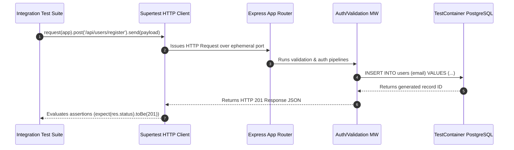

# Module 12: Integration Testing — Seams, Middleware Pipelines, Database Fixtures, and Supertest

## Overview

While Unit Testing verifies pure functions and isolated classes in memory, **Integration Testing** verifies the interactions across component boundaries and interaction seams.

Typical integration boundaries in web applications include:
1. **HTTP Router & Middleware Pipelines**: Testing request parsing, authentication guards, and validation middlewares end-to-end.
2. **Persistence Seams**: Verifying ORM/SQL queries against real database engines (or lightweight Test Containers) rather than mocking database queries.
3. **External Boundary Seams**: Mocking external third-party APIs (Stripe, Twilio) via MSW while testing local controllers, services, and databases together.

Understanding **Integration Seams**, **Supertest HTTP Assertions**, and **TestContainer DB Isolation** is essential.

---

## 1. N-Tier Integration Seam Architecture

```mermaid
flowchart TD
    subgraph Unit Testing Scope (Isolated)
        ServiceUnit["Service Class Unit Test<br/>(Repository mocked out)"]
    end

    subgraph Integration Testing Scope (Real Interaction Seams)
        HTTPClient["Supertest / HTTP Request"] --> Router["Express Router"]
        Router --> AuthMW["Auth & Validation Middleware"]
        AuthMW --> Controller["Order Controller"]
        Controller --> Service["Order Service"]
        Service --> Repo["Repository Layer"]
        Repo --> DB[("Test Container DB<br/>(PostgreSQL / In-Memory SQLite)")]

        Service -.->|Mocked at Outer Boundary| StripeMock["Stripe Payment API<br/>(Mocked via MSW)"]
    end

    style Integration Testing Scope (Real Interaction Seams) fill:#dcfce7,stroke:#15803d
```

---

## 2. Testing Levels Architecture Comparison Matrix

| Feature Dimension | Unit Testing | Integration Testing | End-to-End (E2E) Testing |
| :--- | :--- | :--- | :--- |
| **System Seam Scope** | 1 isolated function / class | Multi-layer subsystem (Route + DB + Middleware) | Complete application stack + UI Browser |
| **Database Connection**| Mocked out / Stubbed | **Real Database (TestContainer / SQLite)** | Production-like Staging DB |
| **Execution Velocity**| Extremely Fast ($<5$ms) | Fast ($50$ms - $500$ms) | Slow ($5$s - $30$s) |
| **Confidence Level**| Medium (Function correctness) | **High (Proves component cohesion)** | Highest (Full browser journey) |
| **Primary Tools** | Vitest, Jest | Supertest, TestContainers, MSW | Playwright, Cypress |

---

## 3. Code Showcase: Production Express Middleware & Persistence Integration Engine

```javascript
// ==========================================
// 1. IN-MEMORY DATABASE & REPOSITORY SEAM
// ==========================================
class InMemoryUserDatabase {
  #users = new Map();
  #currentId = 100;

  async createUser(userData) {
    const id = `USR-${++this.#currentId}`;
    const record = { id, ...userData, createdAt: new Date() };
    this.#users.set(id, record);
    return record;
  }

  async findByEmail(email) {
    for (const user of this.#users.values()) {
      if (user.email === email) return user;
    }
    return null;
  }

  async reset() {
    this.#users.clear();
  }
}

// ==========================================
// 2. HTTP MIDDLEWARE & ROUTER PIPELINE (Target App)
// ==========================================
class UserRegistrationServerApp {
  #db;

  constructor(databaseInstance) {
    this.#db = databaseInstance;
  }

  // Handle Request (Simulates Express Middleware Pipeline)
  async handleRequest(req) {
    const res = { statusCode: 200, headers: {}, body: null };

    // 1. Middleware Step: Authentication Check for Protected Routes
    if (req.path === "/api/users/register" && req.method === "POST") {
      // 2. Middleware Step: Input Validation
      const { email, username } = req.body || {};
      if (!email || !email.includes("@")) {
        res.statusCode = 400;
        res.body = { error: "ValidationError: Invalid or missing email address" };
        return res;
      }

      // 3. Controller + Service + DB Integration Step
      const existingUser = await this.#db.findByEmail(email);
      if (existingUser) {
        res.statusCode = 409; // Conflict
        res.body = { error: "UserAlreadyExists: Email registered" };
        return res;
      }

      const newUser = await this.#db.createUser({ email, username });
      res.statusCode = 201; // Created
      res.body = { status: "SUCCESS", user: newUser };
      return res;
    }

    res.statusCode = 404;
    res.body = { error: "Route Not Found" };
    return res;
  }
}

// ==========================================
// 3. INTEGRATION TEST SUITE RUNNER
// ==========================================
(async () => {
  console.log("=== EXECUTING INTEGRATION TEST SUITE ===");

  const db = new InMemoryUserDatabase();
  const app = new UserRegistrationServerApp(db);

  // Helper Integration Request Dispatcher (Supertest Analogue)
  const request = (path, options = {}) => {
    return app.handleRequest({ path, method: options.method || "GET", body: options.body });
  };

  // Test 1: Validation Failure Seam (400 Bad Request)
  console.log("-> Test 1: Testing Input Validation Middleware Seam...");
  const res1 = await request("/api/users/register", {
    method: "POST",
    body: { email: "invalid-email", username: "Anita" }
  });
  if (res1.statusCode !== 400) throw new Error(`Expected 400, got ${res1.statusCode}`);
  console.log("  ✓ PASS: Validation middleware caught invalid email (400 Bad Request).");

  // Test 2: Full End-to-End Registration & Database Persistence Seam
  console.log("\n-> Test 2: Testing User Creation & DB Persistence Seam...");
  const res2 = await request("/api/users/register", {
    method: "POST",
    body: { email: "anita@example.com", username: "Anita Sharma" }
  });
  if (res2.statusCode !== 201) throw new Error(`Expected 201, got ${res2.statusCode}`);
  if (res2.body.user.id !== "USR-101") throw new Error("Database persistence failed to generate ID!");
  console.log("  ✓ PASS: Successfully registered user & persisted in database (201 Created).");

  // Test 3: Conflict Check Database Integration Seam (409 Conflict)
  console.log("\n-> Test 3: Testing Duplicate User Conflict Seam...");
  const res3 = await request("/api/users/register", {
    method: "POST",
    body: { email: "anita@example.com", username: "Anita Duplicate" }
  });
  if (res3.statusCode !== 409) throw new Error(`Expected 409, got ${res3.statusCode}`);
  console.log("  ✓ PASS: Successfully rejected duplicate registration via DB lookup (409 Conflict).");
})();
```

---

## 4. Supertest HTTP Integration Lifecycle Sequence



---

## Key Production Takeaways

1. **Test Across Layer Boundaries**: Do not mock internal repository classes in integration tests; test the real connection between HTTP controllers, services, and database layers.
2. **Use Supertest for HTTP API Testing**: Use Supertest (`request(app).get('/api/users')`) to test Express/Fastify apps over ephemeral HTTP ports without manually spinning up dedicated servers.
3. **Use Disposable Test Databases**: Utilize TestContainers (Docker containerized databases) or in-memory SQLite instances to ensure database integration tests execute in clean environments.
4. **Isolate External Network Boundaries**: Use Mock Service Worker (MSW) to mock third-party external APIs (payment gateways, OAuth providers) while keeping internal app databases and services real.

