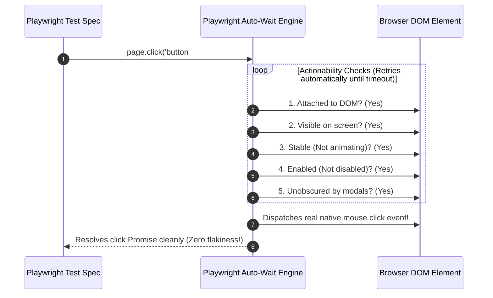

# Module 13: End-to-End (E2E) Testing — Playwright, Cypress, Page Object Model (POM), and Flakiness Mitigation

## Overview

**End-to-End (E2E) Testing** simulates real human interactions in actual browser engines (Chromium, Firefox, WebKit/Safari) to validate critical user journeys from login to checkout.

Modern E2E testing relies on frameworks like **Playwright** and **Cypress**.

Understanding **Out-of-Process CDP Browser Control**, **The Page Object Model (POM)**, **Auto-Waiting Engine Mechanics**, and **Mitigating Test Flakiness** is essential for maintaining enterprise E2E test suites.

---

## 1. Browser Automation Architecture & Page Object Model (POM)

```mermaid
flowchart TD
    subgraph Playwright Architecture (Out-of-Process Control)
        TestRunner["Playwright Test Runner Node Process"] -->|Chrome DevTools Protocol CDP / BiDi| BrowserServer["Browser Context (Chromium / WebKit)"]
        BrowserServer --> Context1["Incognito Browser Context 1"]
        BrowserServer --> Context2["Incognito Browser Context 2"]
        Context1 --> Page1["Page Tab (App Under Test)"]
    end
```

```mermaid
flowchart TD
    subgraph Page Object Model (POM) Design Pattern
        E2ESpec["LoginPage.spec.js (Test Spec)"] -->|Invokes high-level methods| POM["LoginPage.js (Page Object)"]
        POM -->|Encapsulates locators| Locators["Page Locators & Selectors<br/>page.getByRole('button')"]
        POM -->|Encapsulates actions| Actions["User Action Flows<br/>login(user, pass)"]
    end

    style POM fill:#dcfce7,stroke:#15803d
```

---

## 2. E2E Frameworks Architectural Comparison Matrix

| Dimension | Playwright (Microsoft) | Cypress | Selenium WebDriver |
| :--- | :--- | :--- | :--- |
| **Control Architecture**| Out-of-process via WebSocket CDP / BiDi | Runs directly inside browser DOM window | Out-of-process via HTTP JSON Wire Protocol |
| **Browser Engines** | Chromium, WebKit (Safari), Firefox | Chromium, Firefox (Limited WebKit) | All Browsers |
| **Multi-Tab / Multi-Origin?**| **Full native support** | Limited / Restrictive | Supported |
| **Auto-Waiting** | Built-in smart actionability checks | Built-in auto-retry assertions | Manual explicit waits required |
| **Execution Velocity**| **Blazing Fast** | Fast | Slow |

---

## 3. Code Showcase: Production Page Object Model (POM) & Playwright Engine Polyfill

```javascript
// ==========================================
// 1. PLAYWRIGHT PAGE OBJECT MODEL (POM) BLUEPRINT
// ==========================================

// Base Page Object
class BasePage {
  constructor(pageContext) {
    this.page = pageContext;
  }

  async navigateTo(path) {
    console.log(`[PageObject]: Navigating browser to '${path}'...`);
    await this.page.goto(path);
  }
}

// Login Page Object (Encapsulates Selectors & User Flows)
class LoginPagePOM extends BasePage {
  // Encapsulated Locators
  get #usernameInput() { return "input[name='username']"; }
  get #passwordInput() { return "input[name='password']"; }
  get #submitButton() { return "button[type='submit']"; }
  get #errorMessage() { return ".error-alert"; }

  // High-Level Domain Action
  async login(username, password) {
    console.log(`[LoginPagePOM]: Performing login for user '${username}'...`);
    await this.page.fill(this.#usernameInput, username);
    await this.page.fill(this.#passwordInput, password);
    await this.page.click(this.#submitButton);
  }

  async getErrorMessageText() {
    return await this.page.textContent(this.#errorMessage);
  }
}

// Dashboard Page Object
class DashboardPagePOM extends BasePage {
  get #welcomeHeading() { return "h1.welcome-title"; }

  async getWelcomeText() {
    return await this.page.textContent(this.#welcomeHeading);
  }
}

// ==========================================
// 2. DEMONSTRATING E2E TEST EXECUTION
// ==========================================
(async () => {
  console.log("=== EXECUTING E2E PLAYWRIGHT POM TEST ===");

  // Simulated Playwright Browser Page Context
  const fakePlaywrightPage = {
    url: "",
    elements: new Map(),
    goto: async (url) => { fakePlaywrightPage.url = url; },
    fill: async (selector, val) => { fakePlaywrightPage.elements.set(selector, val); },
    click: async (selector) => {
      console.log(`  -> Clicked '${selector}'. Triggering page transition...`);
      if (selector === "button[type='submit']") {
        const user = fakePlaywrightPage.elements.get("input[name='username']");
        if (user === "anita@example.com") {
          fakePlaywrightPage.elements.set("h1.welcome-title", "Welcome back, Anita!");
        } else {
          fakePlaywrightPage.elements.set(".error-alert", "Invalid Credentials");
        }
      }
    },
    textContent: async (selector) => fakePlaywrightPage.elements.get(selector) || ""
  };

  // Instantiating Page Objects
  const loginPage = new LoginPagePOM(fakePlaywrightPage);
  const dashboardPage = new DashboardPagePOM(fakePlaywrightPage);

  // E2E Test 1: Successful Login Journey
  console.log("-> Test 1: Valid Login Journey...");
  await loginPage.navigateTo("https://app.domain.com/login");
  await loginPage.login("anita@example.com", "SecretPass123!");
  
  const welcomeText = await dashboardPage.getWelcomeText();
  if (welcomeText !== "Welcome back, Anita!") throw new Error("E2E Assertion Failed: Welcome text mismatch.");
  console.log(`  ✓ PASS: E2E journey completed successfully! Header: '${welcomeText}'`);

  // E2E Test 2: Invalid Login Journey
  console.log("\n-> Test 2: Invalid Login Journey...");
  await loginPage.navigateTo("https://app.domain.com/login");
  await loginPage.login("wrong@example.com", "WrongPass");

  const errorText = await loginPage.getErrorMessageText();
  if (errorText !== "Invalid Credentials") throw new Error("E2E Assertion Failed: Error message missing.");
  console.log(`  ✓ PASS: E2E error journey verified cleanly! Alert: '${errorText}'`);
})();
```

---

## 4. Playwright Auto-Waiting Actionability Sequence



---

## Key Production Takeaways

1. **Implement Page Object Model (POM)**: Structure E2E code into POM classes (`LoginPage`, `CheckoutPage`) to prevent duplicating CSS/Role selectors across hundreds of test spec files.
2. **Never Use Hardcoded Sleep Timers (`page.waitForTimeout(5000)`)**: Avoid artificial sleep calls; rely on Playwright's native auto-waiting actionability checks (`toBeVisible()`, `page.waitForSelector()`).
3. **Limit E2E Test Counts (Pyramid Compliance)**: Cover only critical core user flows (Login, Checkout, Payment) in E2E; test lower-level edge cases in fast unit and integration tests.
4. **Isolate Test State via Browser Contexts**: Use fresh `browser.newContext()` instances per test file to guarantee clean cookies, local storage, and session isolation.

