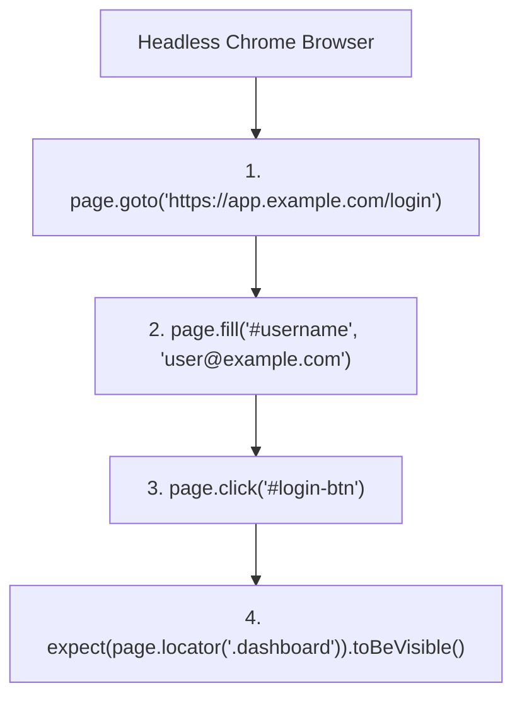

# File 13: End-to-End (E2E) Testing

## Overview
**End-to-End (E2E) Testing** validates complete user workflows from start to finish in a real browser environment (or headless browser execution), using frameworks like **Playwright** or **Cypress**.

---

## 1. E2E Testing Workflow



---

## 2. Playwright E2E Test Syntax Example

```javascript
// Playwright E2E Test Suite Example
describe("User Authentication & Checkout E2E Flow", () => {
    test("user can log in, add item to cart, and checkout", async () => {
        // Simulated Playwright API calls
        const page = {
            goto: async url => console.log(`Navigating to ${url}`),
            fill: async (selector, text) => console.log(`Filled ${selector} with ${text}`),
            click: async selector => console.log(`Clicked ${selector}`),
            isVisible: async selector => true
        };

        // 1. Navigate to Login Page
        await page.goto("https://shop.example.com/login");
        await page.fill("#email", "priya@example.com");
        await page.fill("#password", "Secret123!");
        await page.click("#submit-btn");

        // 2. Add product to cart
        await page.goto("https://shop.example.com/products/laptop");
        await page.click("#add-to-cart");

        // 3. Verify Checkout Page
        await page.goto("https://shop.example.com/checkout");
        const isCartVisible = await page.isVisible("#cart-summary");

        expect(isCartVisible).toBe(true);
    });
});
```

---

## Key Takeaways
1. E2E tests test **complete real-world user journeys** in browser engines.
2. Focus on critical user journeys (Login, Registration, Checkout, Payments).
3. Keep E2E test counts minimal compared to unit tests due to higher execution time and maintenance overhead.
