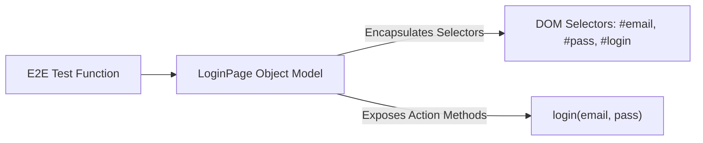

# File 14: Testing Patterns and Best Practices

## Overview
Applying design patterns specifically in test code improves test suite readability, maintainability, and reusability. Key test design patterns include the **Page Object Model (POM)**, **Test Object Factories**, and **Custom Matcher extensions**.

---

## 1. Page Object Model (POM) Architecture



---

## 2. Page Object Model (POM) & Test Factory Implementation

```javascript
// 1. Page Object Model (POM) Pattern
class LoginPage {
    constructor(page) {
        this.page = page;
        this.emailInput = "#email";
        this.passwordInput = "#password";
        this.submitButton = "#login-btn";
    }

    async login(email, password) {
        await this.page.fill(this.emailInput, email);
        await this.page.fill(this.passwordInput, password);
        await this.page.click(this.submitButton);
    }
}

// 2. Test Data Object Factory Pattern
class UserFactory {
    static createUser(overrides = {}) {
        return {
            id: Math.floor(Math.random() * 1000),
            name: "Default User",
            email: `user_${Date.now()}@example.com`,
            role: "USER",
            ...overrides
        };
    }
}

describe("Design Patterns in Testing", () => {
    test("creates custom admin user fixture using factory", () => {
        const adminUser = UserFactory.createUser({ role: "ADMIN", name: "Priya Admin" });
        expect(adminUser.role).toBe("ADMIN");
        expect(adminUser.name).toBe("Priya Admin");
    });
});
```

---

## Key Takeaways
1. Use **Page Object Model (POM)** in E2E tests to decouple UI DOM selectors from test assertions.
2. Use **Test Data Factories** to generate clean, dynamic mock data objects.
3. Keep test utility helpers modular and shared across test files.
