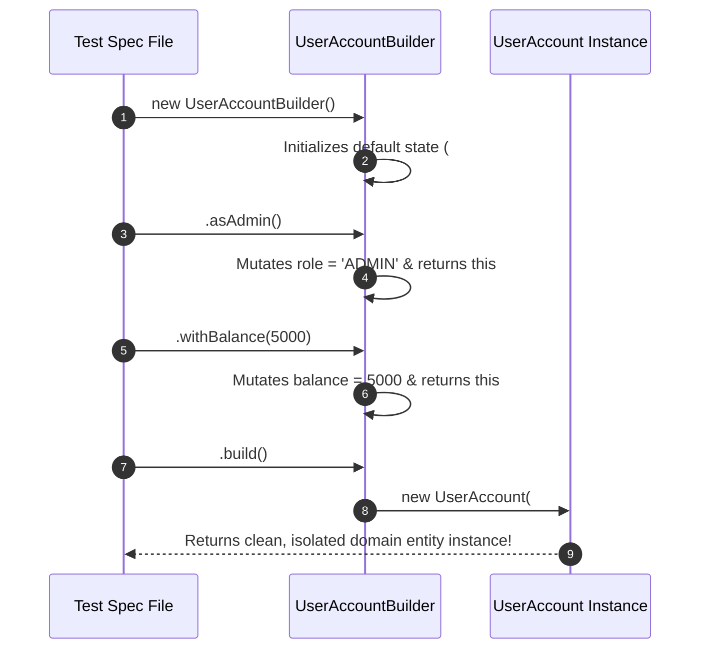

# Module 14: Testing Patterns — Object Mother, Test Data Builder, Page Object Model, and Custom Matcher Factories

## Overview

Applying software design patterns directly within test code bases dramatically improves test readability, maintainability, and reusability while reducing setup boilerplate code.

Four foundational testing design patterns stand out in enterprise JavaScript codebases:
1. **The Object Mother Pattern**: A factory class providing named methods that return pre-configured domain entity fixtures (e.g. `UserMother.createActiveVIPUser()`).
2. **The Test Data Builder Pattern**: A fluent interface pattern allowing developers to construct complex, nested test fixtures with defaults while explicitly overriding specific fields needed for a test.
3. **The Page Object Model (POM)**: Encapsulating browser locators and interaction flows for E2E and UI testing.
4. **Custom Matcher Factories**: Encapsulating domain-specific assertions (`expect(order).toBePaidAndFulfilled()`).

Understanding **Object Mother vs. Test Data Builder**, **Test Fixture Hygiene**, and **Domain Assertions** is essential.

---

## 1. Test Pattern Topologies & Builder Mechanics

```mermaid
flowchart TD
    subgraph Test Data Builder Pattern (Fluent Setup)
        Builder["new UserBuilder()"] --> WithEmail[".withEmail('anita@domain.com')"]
        WithEmail --> WithRole[".withRole('ADMIN')"]
        WithRole --> WithBalance[".withBalance(5000)"]
        WithBalance --> Build[".build() -> Fully Populated Object"]
    end

    style Builder fill:#dbeafe,stroke:#1d4ed8
    style Build fill:#dcfce7,stroke:#15803d
```

```mermaid
flowchart TD
    subgraph Object Mother Pattern (Named Fixtures)
        Mother["UserMother Factory"] --> Admin["UserMother.createAdmin()"]
        Mother --> Guest["UserMother.createGuestUser()"]
        Mother --> Suspended["UserMother.createSuspendedAccount()"]
    end

    style Mother fill:#fef3c7,stroke:#b45309
```

---

## 2. Test Fixture Creation Patterns Comparison Matrix

| Pattern | Setup Verbosity | Readability in Test | Flexibility | Best Used For |
| :--- | :--- | :--- | :--- | :--- |
| **Object Literals (`{ ... }`)** | Low (Duplicated across tests) | Poor (Cluttered with irrelevant default keys) | High | Simple 2-property primitive objects |
| **Object Mother Pattern** | Zero in test spec | **Highest (Self-documenting domain intent)** | Fixed | Standard canonical domain entities (e.g. `ActiveUser`) |
| **Test Data Builder Pattern**| Low in test spec | **Highest (Fluent method chaining)** | **Highest** | Complex nested objects with 10+ properties |
| **JSON Fixture Files** | Zero | Low (Requires reading external files) | Low | Static static mock payloads |

---

## 3. Code Showcase: Object Mother & Test Data Builder Implementation

```javascript
// Target Domain Model
class UserAccount {
  constructor({ id, username, email, role = "USER", balance = 0, isVerified = false, tags = [] }) {
    this.id = id;
    this.username = username;
    this.email = email;
    this.role = role;
    this.balance = balance;
    this.isVerified = isVerified;
    this.tags = tags;
  }
}

// ==========================================
// 1. TEST DATA BUILDER PATTERN
// ==========================================
class UserAccountBuilder {
  #userData;

  constructor() {
    // Sensible Default Values for 90% of Test Cases
    this.#userData = {
      id: `USR-${Math.floor(Math.random() * 10000)}`,
      username: "DefaultTestUser",
      email: "default@test.com",
      role: "USER",
      balance: 100,
      isVerified: true,
      tags: ["TEST_USER"]
    };
  }

  withUsername(username) {
    this.#userData.username = username;
    return this; // Fluent method chaining!
  }

  withEmail(email) {
    this.#userData.email = email;
    return this;
  }

  asAdmin() {
    this.#userData.role = "ADMIN";
    return this;
  }

  withBalance(amount) {
    this.#userData.balance = amount;
    return this;
  }

  unverified() {
    this.#userData.isVerified = false;
    return this;
  }

  build() {
    return new UserAccount(this.#userData);
  }
}

// ==========================================
// 2. OBJECT MOTHER PATTERN (Static Preset Fixtures)
// ==========================================
class UserAccountMother {
  static createStandardUser() {
    return new UserAccountBuilder().build();
  }

  static createAdminUser() {
    return new UserAccountBuilder()
      .withUsername("AdminAnita")
      .withEmail("anita.admin@domain.com")
      .asAdmin()
      .withBalance(10000)
      .build();
  }

  static createUnverifiedGuest() {
    return new UserAccountBuilder()
      .withUsername("GuestUser")
      .unverified()
      .withBalance(0)
      .build();
  }
}

// ==========================================
// 3. DEMONSTRATING TEST PATTERNS IN SUITE
// ==========================================
(async () => {
  console.log("=== EXECUTING TEST DESIGN PATTERNS DEMONSTRATION ===");

  // Business Function under test
  const canAccessVIPDashboard = (user) => {
    return user.isVerified && (user.role === "ADMIN" || user.balance >= 5000);
  };

  // Test 1: Using Object Mother for Standard Preset Fixtures
  console.log("-> Test 1: Admin Access via Object Mother...");
  const adminFixture = UserAccountMother.createAdminUser();
  if (!canAccessVIPDashboard(adminFixture)) throw new Error("Admin should have VIP access!");
  console.log(`  ✓ PASS: Object Mother created Admin: ${adminFixture.username} (${adminFixture.role})`);

  // Test 2: Using Test Data Builder for Specific Edge Case Overrides
  console.log("\n-> Test 2: High Balance User Access via Test Data Builder...");
  const highBalanceUser = new UserAccountBuilder()
    .withUsername("RichUser")
    .withBalance(7500) // Explicit override!
    .build();

  if (!canAccessVIPDashboard(highBalanceUser)) throw new Error("High balance user should have VIP access!");
  console.log(`  ✓ PASS: Test Data Builder created custom user with balance $${highBalanceUser.balance}`);
})();
```

---

## 4. Test Data Builder Construction Sequence



---

## Key Production Takeaways

1. **Use Test Data Builders to Reduce Noise**: Instead of cluttering tests with massive object literals containing irrelevant fields, use `new UserBuilder().withBalance(500).build()` to highlight only the data relevant to that specific test.
2. **Use Object Mother for Standard Canonical Fixtures**: Create an `ObjectMother` helper for frequently used static personas (`UserMother.createAdmin()`, `UserMother.createBannedUser()`).
3. **Keep Default Fixtures Valid**: Ensure `Builder` default constructor values represent a fully valid entity so tests don't fail due to missing unrelated fields.
4. **Encapsulate Custom Matchers**: Build custom matchers (`expect(user).toBeAuthorizedFor(resource)`) to turn multiline assertion checks into expressive single-line domain assertions.

