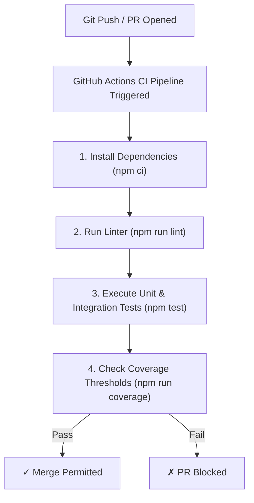

# File 15: Continuous Integration (CI) and Testing Best Practices

## Overview
Automated test suites must run automatically inside **Continuous Integration (CI)** pipelines (such as GitHub Actions) on every Pull Request to block broken code from reaching production environments.

---

## 1. Continuous Integration Pipeline Workflow



---

## 2. GitHub Actions CI Configuration Example

```yaml
# .github/workflows/test.yml
name: Continuous Integration Test Pipeline

on:
  push:
    branches: [ main, develop ]
  pull_request:
    branches: [ main ]

jobs:
  test:
    runs-on: ubuntu-latest

    steps:
      - name: Checkout Code Repository
        uses: actions/checkout@v3

      - name: Setup Node.js Environment
        uses: actions/setup-node@v3
        with:
          node-version: '20'
          cache: 'npm'

      - name: Install Dependencies
        run: npm ci

      - name: Run Test Suite with Coverage
        run: npm test -- --coverage

      - name: Enforce Code Coverage Thresholds
        run: npm run check-coverage
```

---

## Key Takeaways
1. Run automated test suites on **every Git push / Pull Request** in CI pipelines.
2. Enforce minimum **code coverage thresholds** (e.g. 80% minimum branch coverage).
3. Ensure tests are **deterministic and fast** to keep developer feedback loops tight.
