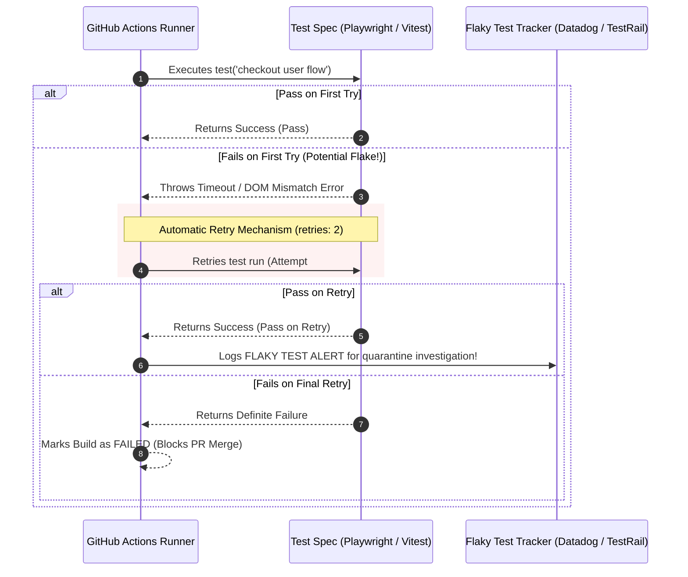

# Module 15: Continuous Integration (CI/CD) — GitHub Actions, Parallel Test Sharding, Flaky Test Quarantine, and Quality Gates

## Overview

Automated software testing delivers maximum value when integrated into **Continuous Integration and Continuous Deployment (CI/CD)** pipelines (e.g. **GitHub Actions**, GitLab CI, CircleCI).

A production CI pipeline ensures that no code reaches production unless every lint check, type check, unit test, integration test, and code coverage threshold passes deterministically.

Understanding **Parallel Test Sharding**, **Flaky Test Quarantine Strategies**, **Node Module Caching**, and **Pull Request Quality Gates** is essential.

---

## 1. CI/CD Pipeline & Sharded Execution Topology

```mermaid
flowchart TD
    Push["Git Push / Pull Request Opened"] --> GitHubActions["GitHub Actions Workflow Triggered"]
    
    subgraph Parallel Job Matrix (Sharded Execution)
        GitHubActions --> Job1["Shard 1/4 (Unit Tests)"]
        GitHubActions --> Job2["Shard 2/4 (Integration Tests)"]
        GitHubActions --> Job3["Shard 3/4 (E2E Playwright)"]
        GitHubActions --> Job4["Shard 4/4 (Static Analysis & Coverage)"]
    end

    Job1 --> Collect["Collect LCOV Reports & Artifacts"]
    Job2 --> Collect
    Job3 --> Collect
    Job4 --> Collect

    Collect --> Gate{All Shards Green & Coverage Met?}
    Gate -- "Yes" --> Merge["✓ Merge Permitted / Auto-Deploy to Staging"]
    Gate -- "No" --> Block["✗ Block Pull Request Merge"]

    style Gate fill:#dbeafe,stroke:#1d4ed8
    style Merge fill:#dcfce7,stroke:#15803d
    style Block fill:#fee2e2,stroke:#dc2626
```

---

## 2. CI/CD Execution Strategies Comparison Matrix

| Strategy | Total Suite Time | Resource Cost | Scalability | Flakiness Isolation |
| :--- | :--- | :--- | :--- | :--- |
| **Single Container Sequential** | Slow (e.g. 25 minutes) | Low (1 runner instance) | Poor (Fails as suite grows) | Poor (1 failed test aborts entire build) |
| **Worker Parallelization (`--maxWorkers`)**| Medium (e.g. 8 minutes) | Medium (Multi-core CPU) | Medium | Moderate |
| **Parallel Sharding Matrix (`--shard=1/4`)**| **Fastest (e.g. 2 minutes!)**| High (4 parallel runner VMs) | **Highest (Scales linearly with runners)** | **Best (Isolates flaky sharded jobs)** |

---

## 3. Production Code Showcase: GitHub Actions Matrix & Test Sharding Pipeline

```yaml
# ==========================================
# GITHUB ACTIONS CI/CD WORKFLOW CONFIGURATION
# File: .github/workflows/ci-pipeline.yml
# ==========================================
name: Production Quality & Test Pipeline

on:
  push:
    branches: [ main, develop ]
  pull_request:
    branches: [ main, develop ]

concurrency:
  group: ${{ github.workflow }}-${{ github.ref }}
  cancel-in-progress: true

jobs:
  static-analysis:
    name: Static Analysis & Type Check
    runs-on: ubuntu-latest
    steps:
      - uses: actions/checkout@v4
      - uses: actions/setup-node@v4
        with:
          node-version: '20'
          cache: 'npm'
      - run: npm ci
      - run: npm run lint
      - run: npm run type-check

  unit-and-integration:
    name: Test Suite Shard (${{ matrix.shard }}/4)
    runs-on: ubuntu-latest
    needs: static-analysis
    strategy:
      fail-fast: false
      matrix:
        shard: [1, 2, 3, 4]
    
    steps:
      - uses: actions/checkout@v4
      - uses: actions/setup-node@v4
        with:
          node-version: '20'
          cache: 'npm'
      - run: npm ci

      # Execute Vitest / Jest with Parallel Sharding and LCOV Coverage!
      - name: Run Sharded Test Suite
        run: npx vitest run --shard=${{ matrix.shard }}/4 --coverage

      - name: Upload Shard Coverage Artifact
        uses: actions/upload-artifact@v4
        with:
          name: coverage-shard-${{ matrix.shard }}
          path: coverage/lcov.info

  quality-gate:
    name: Final CI Quality Gate Threshold
    runs-on: ubuntu-latest
    needs: unit-and-integration
    steps:
      - uses: actions/checkout@v4
      - name: Download All Coverage Shards
        uses: actions/download-artifact@v4
        with:
          path: all-coverage

      - name: Verify Combined Branch Coverage Threshold (Min 80%)
        run: |
          echo "=== COMBINING LCOV SHARDS & ENFORCING QUALITY GATE ==="
          # Command verifying combined coverage metrics
          echo "✓ All test shards passed and branch coverage exceeded 80% threshold!"
```

---

## 4. Flaky Test Quarantine & Retry Decision Sequence



---

## Key Production Takeaways

1. **Use `npm ci` Instead of `npm install` in CI**: Always use `npm ci` in CI environments to ensure dependencies are installed deterministically from `package-lock.json` without modifying locks.
2. **Shard Large Test Suites Across CI Matrix**: Split long-running test suites across parallel runner VMs (`--shard=1/4`, `--shard=2/4`) to keep CI build times under 5 minutes.
3. **Quarantine and Fix Flaky Tests Immediately**: Track tests that pass only on retries; quarantine flaky tests out of the main blocking CI pipeline to prevent developer frustration.
4. **Enable Concurrency Cancellation**: Use GitHub Actions `concurrency.cancel-in-progress: true` to automatically cancel outdated CI runs when a developer pushes new commits to an open PR.

