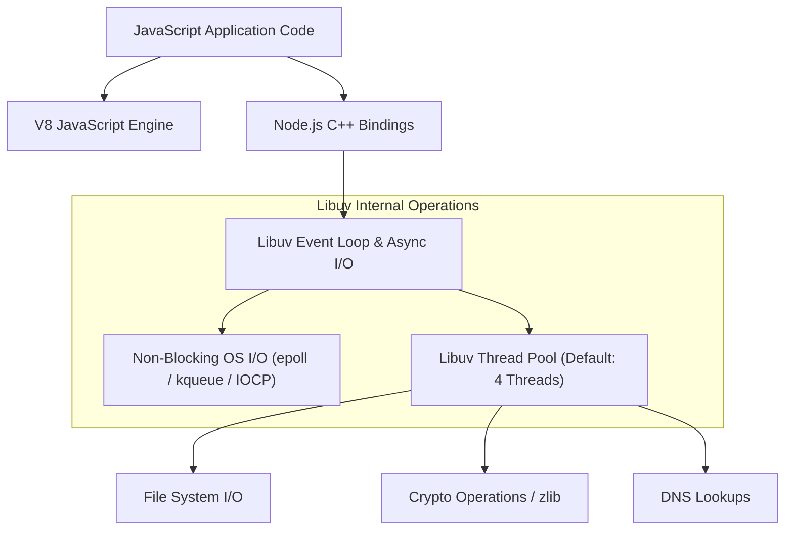
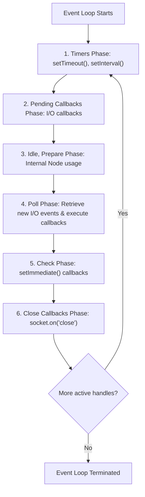

# File 01: Node.js Internal Architecture (V8 Engine, Libuv, Event Loop)

## Overview
**Node.js** is an open-source, cross-platform JavaScript runtime environment built on Chrome's **V8 JavaScript Engine** and **Libuv** C library. Node.js processes single-threaded, asynchronous non-blocking I/O workloads efficiently using an event-driven architecture.

---

## 1. Node.js System Architecture & Libuv Thread Pool



### Event Loop Phase Order Execution



---

## 2. Event Loop Non-Blocking Code Example

```javascript
const fs = require("fs");

console.log("1. Synchronous Code Start");

// Timers Phase
setTimeout(() => console.log("4. setTimeout Callback (Timers Phase)"), 0);

// Check Phase
setImmediate(() => console.log("3. setImmediate Callback (Check Phase)"));

// Microtask Queue (Executes IMMEDIATELY after current operation, before next phase!)
process.nextTick(() => console.log("2. process.nextTick Microtask"));

console.log("1b. Synchronous Code End");
```

---

## Key Takeaways
1. Node.js executes JavaScript on a **single main thread**, delegating heavy I/O tasks to **Libuv**.
2. **Libuv Thread Pool** (default 4 threads) handles blocking file I/O, DNS lookups, and crypto hashing off the main thread.
3. `process.nextTick()` microtasks run **immediately after current operation**, taking priority over `setTimeout` and `setImmediate`.
