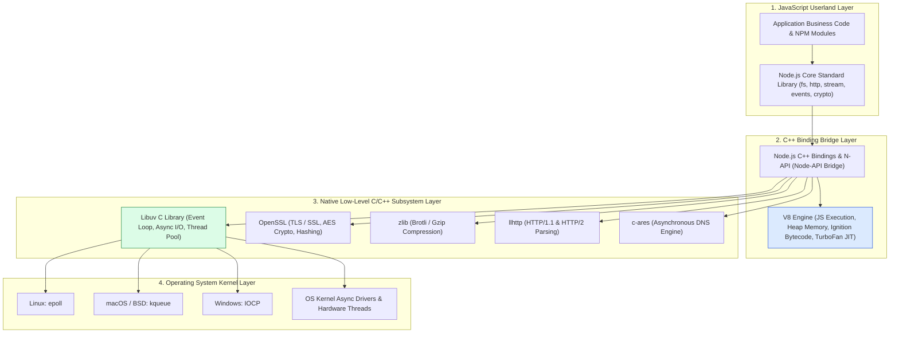
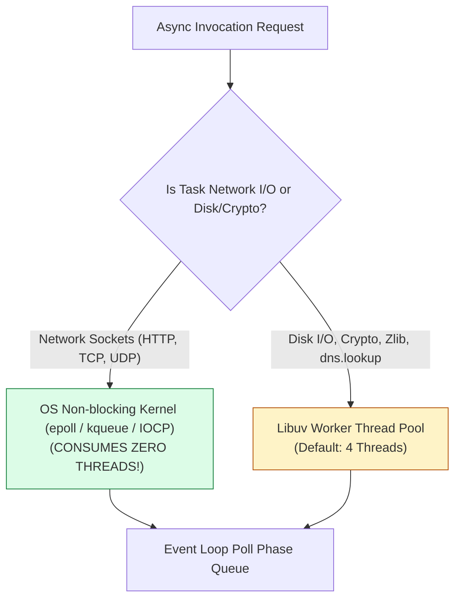
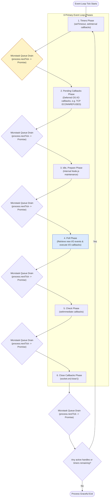
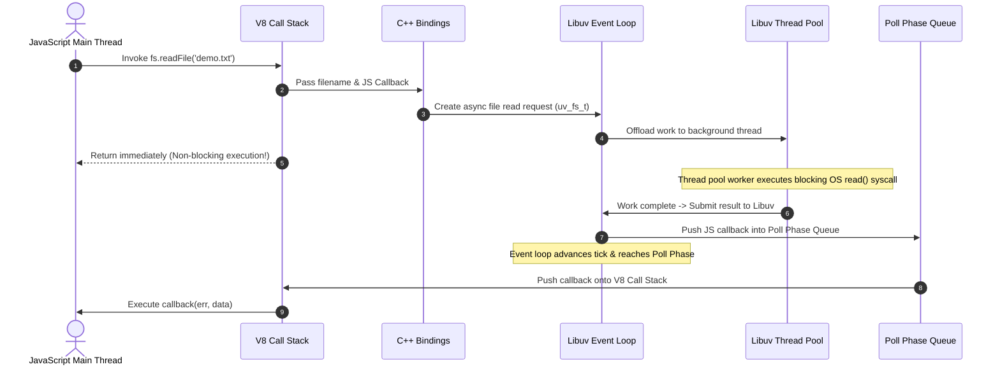

# Module 01: Node.js Core Architecture — V8 Engine, Libuv, Event Loop, C++ Bindings, and Memory Management

## Overview

**Node.js** is an enterprise-grade, open-source, cross-platform JavaScript runtime environment engineered on top of Google's **V8 JavaScript Engine** and the **Libuv** C library.

Unlike traditional multi-threaded server paradigms (e.g. Apache HTTP Server or Java Servlet containers) that allocate a dedicated operating system thread per client connection, Node.js implements a **single-threaded event-driven, non-blocking I/O architecture**. This design empowers a single Node.js instance to handle tens of thousands of concurrent network connections with minimal memory footprint and zero thread context-switching overhead.

Understanding **V8 JIT Compilation (Ignition & TurboFan)**, **Libuv OS Kernel Demultiplexing (`epoll`, `kqueue`, `IOCP`)**, **The 6-Phase Event Loop**, and **V8 Garbage Collection (Scavenger vs. Mark-Sweep-Compact)** is essential.

---

## 1. Core System Architecture & Layering

Node.js is not a framework or a browser wrapper; it is an integrated composite system of low-level C/C++ libraries bound together via C++ bindings and exposed through a JavaScript API layer.



---

## 2. Core Subsystems Architectural Matrix

| Component | Language | Architectural Responsibility | Performance Characteristics |
| :--- | :--- | :--- | :--- |
| **V8 Engine** | C++ | Compiles JavaScript into native machine code via **Ignition (Interpreter)** and **TurboFan (JIT Compiler)**. Manages Memory Heap and Garbage Collection. | High-speed JIT execution; optimizes hot code functions based on inline type feedback |
| **Libuv** | C | Implements the **Event Loop**, manages the background **Thread Pool**, and abstracts platform-specific OS non-blocking I/O interfaces. | Zero-allocation C event loop; cross-platform OS demultiplexing |
| **C++ Bindings / N-API** | C++ / C | Bridges JS API function calls (e.g. `fs.readFile`) to low-level native C/C++ routines inside Libuv and OpenSSL. | Zero-copy memory buffer transfers between V8 Heap and native C++ memory |
| **c-ares** | C | Performs asynchronous non-blocking DNS hostname resolution queries without blocking the main event loop thread. | Bypasses blocking system `getaddrinfo` calls for direct network socket resolution |
| **OpenSSL** | C | Provides cryptographic algorithms (RSA, AES-GCM, SHA-256) and TLS/SSL secure communication channel primitives. | Hardware-accelerated AES-NI CPU instruction execution |

---

## 3. Libuv Demultiplexing & Thread Pool Mechanics

### Single-Threaded Execution vs. Background Execution

JavaScript code inside Node.js executes strictly on a **single main thread** (the V8 Call Stack). However, Node.js delegates asynchronous tasks using two distinct mechanisms:

1. **Non-Blocking OS Kernel I/O (Network Operations)**: Network operations (TCP/UDP sockets, HTTP requests, IPC channels) use OS-level asynchronous event notification interfaces (`epoll` on Linux, `kqueue` on macOS, `IOCP` on Windows). The OS kernel manages hardware sockets and notifies Libuv when network data arrives. **No threads are consumed** while waiting for network network I/O.
2. **Libuv Background Thread Pool (File System & Crypto Operations)**: Operating systems do not provide non-blocking asynchronous APIs for file system access across all platforms. Libuv offloads file system I/O (`fs.*`), CPU-heavy crypto operations (`pbkdf2`, `scrypt`), compression (`zlib`), and DNS lookup operations (`dns.lookup`) to a background thread pool (default size: `4`).



### Thread Pool Resource Allocation Matrix

| Operation Category | Execution Target Mechanism | Consumes Libuv Worker Thread? | Tuning Recommendation |
| :--- | :--- | :--- | :--- |
| **Network Sockets (HTTP, TCP, TLS)** | OS Kernel Non-blocking Multiplexer | **No** (Kernel Event Demultiplexer) | Scale via Cluster or Worker Threads |
| **File System (`fs.readFile`, `fs.writeFile`)** | Libuv Thread Pool | **Yes** | Increase `UV_THREADPOOL_SIZE` for high disk I/O |
| **Crypto Operations (`pbkdf2`, `scrypt`, `hash`)** | Libuv Thread Pool | **Yes** | Offload to Worker Threads or external microservices |
| **Compression (`zlib.gzip`, `zlib.brotli`)** | Libuv Thread Pool | **Yes** | Stream data to avoid pool congestion |
| **DNS Lookup (`dns.lookup`)** | Libuv Thread Pool (`getaddrinfo`) | **Yes** | Use `dns.resolve()` for non-blocking DNS queries |

> [!TIP]
> You can increase the Libuv thread pool size by configuring the environment variable **`UV_THREADPOOL_SIZE`** up to a maximum of `128` before starting your application:
> ```bash
> export UV_THREADPOOL_SIZE=16
> node server.js
> ```

---

## 4. Event Loop Phases & Microtask Resolution Order

The Event Loop continuously executes through **6 primary phases** in a deterministic tick loop. **Between every phase transition**, Node.js immediately drains the **Microtask Queues** (`process.nextTick` queue followed by the Promise microtask queue).



---

## 5. Microtask Queue Resolution Hierarchy

Node.js features **two distinct Microtask Queues**:
1. **`process.nextTick` Queue**: Executes **first** with highest priority immediately after the current operation completes, before any other microtask or event loop phase.
2. **Promise Microtask Queue**: Executes **second** (handles `Promise.resolve`, `async/await` continuations, `queueMicrotask`).

> [!WARNING]
> Recursive or infinite `process.nextTick()` calls will **starve the Event Loop**, preventing Node.js from ever advancing to the Poll phase or executing I/O callbacks!

---

## 6. Code Showcase: Microtask & Event Loop Execution Order Demonstration

```javascript
const fs = require("fs");
const path = require("path");

const tempFilePath = path.join(__dirname, "temp_demo.txt");
fs.writeFileSync(tempFilePath, "Enterprise Node.js Architecture Data");

console.log("1. [MAIN THREAD] Synchronous Start");

// 1. Timers Phase
setTimeout(() => {
  console.log("7. [TIMERS PHASE] setTimeout() Callback Executed (0ms)");
}, 0);

// 2. Check Phase
setImmediate(() => {
  console.log("6. [CHECK PHASE] setImmediate() Callback Executed");
});

// 3. Promise Microtask
Promise.resolve().then(() => {
  console.log("4. [PROMISE MICROTASK] Promise.resolve() Resolved");
});

// 4. process.nextTick Microtask (Highest Priority!)
process.nextTick(() => {
  console.log("2. [NEXT TICK] process.nextTick() Microtask Executed");
  
  process.nextTick(() => {
    console.log("3. [NEXT TICK NESTED] Nested process.nextTick() Drained");
  });
});

// 5. Async I/O (Offloaded to Libuv Thread Pool)
fs.readFile(tempFilePath, "utf-8", (err, data) => {
  if (err) throw err;
  console.log("8. [POLL PHASE] fs.readFile() Callback Executed");

  // Inside I/O Callback: setImmediate ALWAYS runs before setTimeout!
  setImmediate(() => {
    console.log("9. [INSIDE I/O -> CHECK PHASE] setImmediate Executed First inside Poll Phase!");
  });

  setTimeout(() => {
    console.log("10. [INSIDE I/O -> TIMERS PHASE] setTimeout Executed After Check Phase!");
  }, 0);

  // Clean up demo file
  fs.unlinkSync(tempFilePath);
});

console.log("1b. [MAIN THREAD] Synchronous End");
```

---

## 7. Async I/O Execution Sequence Diagram



---

## Key Production Takeaways

1. **Never Block the Main Thread**: Avoid long CPU-bound synchronous loops, synchronous file I/O (`readFileSync`), or synchronous crypto algorithms in server request handlers.
2. **Tune Thread Pool for File/Crypto Workloads**: If your app processes heavy cryptographic hashes or large file uploads, configure `UV_THREADPOOL_SIZE=16` before launching Node.js.
3. **Prefer `setImmediate()` Over `process.nextTick()`**: `setImmediate()` yields cleanly to the Check phase, whereas `process.nextTick()` can starve the I/O poll phase if recursive.
4. **Use Asynchronous non-blocking Streams**: Streams process data chunk-by-chunk in memory, minimizing V8 heap memory usage during large file transfers.


