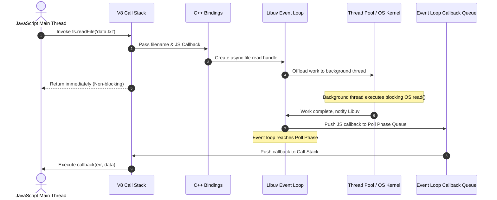

# Module 01: Node.js Internal Architecture (V8 Engine, Libuv, & Event Loop Internals)

## Overview

**Node.js** is a high-performance, open-source, cross-platform JavaScript runtime environment built on top of Google's **V8 JavaScript Engine** and the **Libuv** C library. 

Unlike traditional multi-threaded server architectures (such as Apache HTTP Server) that allocate a dedicated operating system thread per client connection, Node.js uses a **single-threaded, event-driven, non-blocking I/O model**. This architecture enables a single Node.js process to handle tens of thousands of concurrent connections with minimal memory overhead.

---

## 1. Core Architectural Pillars

Node.js is not a framework or a standard programming language runtime; it is a composite system of multiple low-level C/C++ libraries wrapped by a JavaScript execution layer.

```mermaid
graph TD
    subgraph JavaScript Layer
        JSApp["Application Code / Packages"]
        NodeLib["Node.js Core Modules (fs, http, stream, events)"]
    end

    subgraph C++ Binding Layer
        Bindings["C++ Bindings & Node API (N-API)"]
        V8["V8 Engine (JS Execution, JIT Compiler, Memory Heap)"]
    end

    subgraph Low-Level System Layer (Libuv & Native Dependencies)
        Libuv["Libuv C Library (Event Loop, Async I/O, Thread Pool)"]
        OpenSSL["OpenSSL (Crypto, TLS/SSL)"]
        Zlib["zlib (Compression)"]
        HttpParser["llhttp / HTTP Parser"]
        C-Ares["c-ares (Asynchronous DNS)"]
    end

    subgraph Operating System Kernel
        Epoll["Linux: epoll"]
        Kqueue["macOS/BSD: kqueue"]
        IOCP["Windows: IOCP"]
        OSThreadPool["OS Kernel Socket Handles & Device Drivers"]
    end

    JSApp --> NodeLib
    NodeLib --> Bindings
    Bindings --> V8
    Bindings --> Libuv
    Bindings --> OpenSSL
    Bindings --> Zlib
    Bindings --> HttpParser
    Bindings --> C-Ares

    Libuv --> Epoll
    Libuv --> Kqueue
    Libuv --> IOCP
    Libuv --> OSThreadPool
```

### Key Components Breakdown

| Component | Language | Primary Responsibilities |
| :--- | :--- | :--- |
| **V8 Engine** | C++ | Compiles JavaScript to native machine code (Just-In-Time JIT compilation), allocates call stack and heap memory, manages Garbage Collection (GC). |
| **Libuv** | C | Implements the **Event Loop**, manages background **Thread Pool**, abstracts platform-specific non-blocking OS I/O primitives (`epoll`, `kqueue`, `IOCP`). |
| **C++ Bindings** | C++ | Serves as the bridge connecting JavaScript methods (e.g., `fs.readFile`) to low-level C/C++ implementations inside Libuv and OpenSSL. |
| **c-ares** | C | Provides asynchronous, non-blocking DNS requests without blocking the main event loop thread. |
| **OpenSSL** | C | Provides cryptographic primitives (RSA, AES, SHA, HMAC) and SSL/TLS secure network socket abstractions. |

---

## 2. The Libuv Event Loop & Thread Pool Mechanics

### Single-Threaded JS Engine vs. Background Execution

JavaScript code inside Node.js executes on a **single main thread** (the Call Stack). However, Node.js offloads asynchronous tasks to either the **Operating System Kernel** or the **Libuv Thread Pool**.

1. **Non-Blocking OS I/O (Network Sockets)**: Network operations (TCP/UDP sockets, HTTP requests) use OS-level asynchronous notification interfaces (`epoll` on Linux, `kqueue` on macOS, `IOCP` on Windows). The OS notifies Libuv when data is ready. **No threads are consumed** while waiting for network I/O.
2. **Libuv Thread Pool (File System & CPU-bound)**: File system I/O, DNS `lookup` (via `getaddrinfo`), and `crypto` operations lack universal non-blocking OS APIs across operating systems. Libuv delegates these operations to a background thread pool (default size: `4`).

### Libuv Thread Pool Allocation

| Operation Category | Execution Mechanism | Consumes Libuv Thread? |
| :--- | :--- | :--- |
| **Network Sockets (HTTP, TCP, UDP)** | OS Non-blocking Kernel Handles | **No** (Kernel Event Demultiplexer) |
| **File System (`fs.readFile`, `fs.writeFile`)** | Libuv Thread Pool | **Yes** |
| **Cryptographic Operations (`pbkdf2`, `scrypt`, `randomBytes`)** | Libuv Thread Pool | **Yes** |
| **Compression (`zlib.gzip`, `zlib.deflate`)** | Libuv Thread Pool | **Yes** |
| **DNS Resolution (`dns.lookup`)** | Libuv Thread Pool (`getaddrinfo`) | **Yes** |
| **DNS Resolution (`dns.resolve`)** | `c-ares` library (Network socket) | **No** |

> [!TIP]
> You can increase the Libuv thread pool size by configuring the environment variable **`UV_THREADPOOL_SIZE`** up to a maximum of `128`:
> ```bash
> export UV_THREADPOOL_SIZE=16
> node server.js
> ```

---

## 3. Event Loop Phase Execution Order

The Event Loop continuously executes through **6 primary phases** in a deterministic loop tick. Between every phase transition, Node.js immediately drains the **Microtask Queues**.

```mermaid
flowchart TD
    Start([Event Loop Starts]) --> Timers Phase

    subgraph Loop Core Phases
        Timers["1. Timers Phase<br/>(setTimeout, setInterval)"]
        Pending["2. Pending Callbacks Phase<br/>(Deferred I/O callbacks, e.g., ECONNREFUSED)"]
        Idle["3. Idle, Prepare Phase<br/>(Internal Node.js maintenance)"]
        Poll["4. Poll Phase<br/>(Retrieve new I/O events & execute I/O callbacks)"]
        Check["5. Check Phase<br/>(setImmediate callbacks)"]
        Close["6. Close Callbacks Phase<br/>(socket.on('close'))"]
    end

    Timers --> Micro1{"Microtask Queue Drain<br/>(process.nextTick -> Promise)"}
    Micro1 --> Pending
    Pending --> Micro2{"Microtask Queue Drain<br/>(process.nextTick -> Promise)"}
    Micro2 --> Idle
    Idle --> Micro3{"Microtask Queue Drain<br/>(process.nextTick -> Promise)"}
    Micro3 --> Poll
    Poll --> Micro4{"Microtask Queue Drain<br/>(process.nextTick -> Promise)"}
    Micro4 --> Check
    Check --> Micro5{"Microtask Queue Drain<br/>(process.nextTick -> Promise)"}
    Micro5 --> Close
    Close --> Micro6{"Microtask Queue Drain<br/>(process.nextTick -> Promise)"}

    Micro6 --> ActiveCheck{Any active handles<br/>or requests?}
    ActiveCheck -- Yes --> Timers
    ActiveCheck -- No --> Terminate([Process Exit])
```

### Detailed Phase Explanations

1. **Timers Phase**: Executes callbacks scheduled by `setTimeout()` and `setInterval()` whose threshold timers have elapsed.
2. **Pending Callbacks Phase**: Executes I/O callbacks deferred from the previous loop tick (e.g., specific OS-level error reporting like TCP socket `ECONNREFUSED`).
3. **Idle, Prepare Phase**: Used exclusively by internal Node.js runtime operations.
4. **Poll Phase**: 
   - Calculates how long to block and wait for new I/O events.
   - Processes events in the poll queue. If the queue is empty:
     - If `setImmediate()` scripts are scheduled, the Poll phase ends and moves directly to the Check phase.
     - If no `setImmediate()` scripts exist, it waits for incoming I/O callbacks until timer thresholds are met.
5. **Check Phase**: Executes callbacks scheduled via `setImmediate()`.
6. **Close Callbacks Phase**: Executes cleanup callbacks for closed sockets or handles (e.g., `socket.on('close', ...)`).

### Microtask Queue Priorities

Node.js features **two distinct Microtask Queues**:
1. **`process.nextTick` Queue**: Executes **first** immediately after the current operation finishes, before moving to the next microtask or event loop phase.
2. **Promise Microtask Queue**: Executes **second** (handles `Promise.resolve`, `async/await` continuations).

> [!WARNING]
> Recursive or infinite `process.nextTick()` calls will **starve the Event Loop**, preventing Node.js from ever reaching the Poll phase or executing I/O callbacks!

---

## 4. Async I/O Lifecycle Sequence



---

## 5. Non-Blocking vs. Blocking Code Example

```javascript
const fs = require("fs");
const path = require("path");

const filePath = path.join(__dirname, "demo.txt");
fs.writeFileSync(filePath, "Node.js High-Performance Architecture");

console.log("1. [MAIN THREAD] Synchronous Execution Start");

// Timers Phase Callback
setTimeout(() => {
  console.log("5. [TIMERS PHASE] setTimeout Callback Executed");
}, 0);

// Check Phase Callback
setImmediate(() => {
  console.log("4. [CHECK PHASE] setImmediate Callback Executed");
});

// Promise Microtask
Promise.resolve().then(() => {
  console.log("3. [PROMISE MICROTASK] Promise Resolved");
});

// NextTick Microtask (Highest Priority)
process.nextTick(() => {
  console.log("2. [NEXT TICK] process.nextTick Microtask Executed");
});

// Async I/O (Offloaded to Libuv)
fs.readFile(filePath, "utf-8", (err, data) => {
  if (err) throw err;
  console.log("6. [POLL PHASE] fs.readFile Async Callback Executed");
  fs.unlinkSync(filePath); // Cleanup
});

console.log("1b. [MAIN THREAD] Synchronous Execution End");
```

### Execution Log Output

```text
1. [MAIN THREAD] Synchronous Execution Start
1b. [MAIN THREAD] Synchronous Execution End
2. [NEXT TICK] process.nextTick Microtask Executed
3. [PROMISE MICROTASK] Promise Resolved
4. [CHECK PHASE] setImmediate Callback Executed
5. [TIMERS PHASE] setTimeout Callback Executed
6. [POLL PHASE] fs.readFile Async Callback Executed
```

---

## Key Production Takeaways

1. **Keep the Main Thread Clean**: Never run CPU-heavy computational loops (e.g., synchronous JSON parsing of massive payloads, complex cryptography, image manipulation) on the main thread.
2. **Tune Thread Pool for Heavy File/Crypto Workloads**: If your app does heavy cryptographic processing or file parsing, set `UV_THREADPOOL_SIZE` appropriately prior to starting the process.
3. **Prefer `setImmediate()` over `process.nextTick()`**: `setImmediate()` yields cleanly to the Event Loop Check phase, whereas `process.nextTick()` risks event loop starvation if misused.
4. **Use Asynchronous non-blocking APIs**: Avoid `fs.readFileSync()`, `fs.writeFileSync()`, or `crypto.pbkdf2Sync()` in server request handlers.

