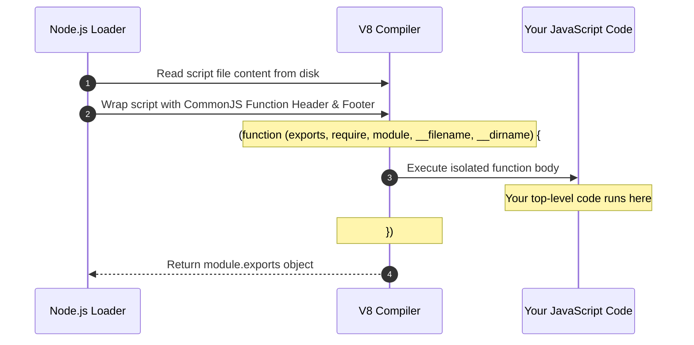
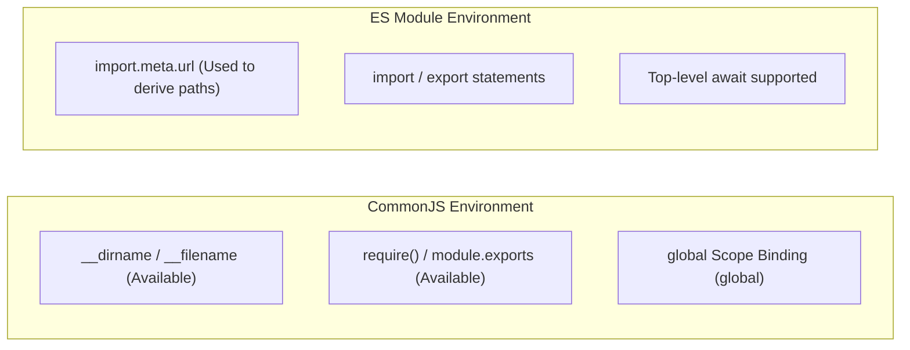

# Module 02: Node.js Globals, Scope Hierarchy, and Module Wrapping

## Overview

In Node.js, **Global Objects** are built-in values, constructors, and functions that are available in all modules without requiring an explicit `require()` or `import` statement.

However, a fundamental source of confusion in Node.js is distinguishing between **True Global Variables** (properties attached to the global object namespace) and **Module-Scoped Pseudo-Globals** (variables like `__dirname` and `module` injected by the CommonJS module wrapper).

---

## 1. Global Scope Architecture

Unlike web browsers where top-level script variables automatically attach to the `window` object, Node.js encapsulates every file inside its own module boundary.

```mermaid
graph TD
    subgraph Root Namespace: globalThis / global
        ProcessObj["process (Process State & Environment)"]
        BufferAPI["Buffer / ArrayBuffer (Binary Data Handling)"]
        TimersAPI["Timers (setTimeout, setInterval, setImmediate, clearImmediate)"]
        ConsoleAPI["console (Logging & Performance Profiling)"]
        WebAPIs["Web Standards (fetch, Headers, Request, Response, URL, structuredClone)"]
        MicrotaskAPI["queueMicrotask() / clearInterval()"]
    end

    subgraph CommonJS Module Scope (Injected per-file)
        DirName["__dirname (Directory Path of Current Module)"]
        FileName["__filename (Absolute File Path of Current Module)"]
        ExportsObj["exports / module.exports (Module Interface)"]
        RequireFn["require() (Module Dependency Loader)"]
        ModuleObj["module (Module Metadata Object)"]
    end

    subgraph Local Function Scope
        LocalVars["var / let / const declarations"]
        TopLevelVar["Top-level var declarations (Isolated to Module, NOT global!)"]
    end

    RootNamespace --> CommonJS Module Scope
    CommonJS Module Scope --> Local Function Scope
```

---

## 2. CommonJS Module Wrapper Mechanics

When Node.js executes a CommonJS file, it does **not** execute your JavaScript directly. Instead, the V8 engine compiles the script by wrapping its contents inside an anonymous C++ wrapper function:



### The Wrapper Function Structure

```javascript
// Node.js wraps your code into this function before execution:
(function (exports, require, module, __filename, __dirname) {
    
    // YOUR CODE WRITTEN IN THE FILE STARTS HERE
    const path = require("path");
    var appVersion = "1.0.0"; // Isolated inside this wrapper function!
    
    module.exports = { appVersion };
    // YOUR CODE ENDS HERE

});
```

### Key Consequences of the Module Wrapper

1. **Top-Level Variable Isolation**: Declaring `var x = 100` at the top level of a Node.js file does **NOT** attach `x` to `global`. It remains local to the wrapper function scope.
2. **Pseudo-Globals Existence**: `__dirname`, `__filename`, `require`, `module`, and `exports` are parameters passed into this wrapper function during execution—they are **not** global variables!

---

## 3. Comprehensive Global APIs Breakdown

### Standard Global Namespace Objects (`global` & `globalThis`)

Node.js 12+ introduced **`globalThis`** as the ECMAScript standard universal global accessor across browsers, Node.js, and web workers. In Node.js, `globalThis === global` evaluates to `true`.

| Global API | Category | Primary Functionality |
| :--- | :--- | :--- |
| **`process`** | Runtime Control | Provides process statistics, environment variables (`process.env`), signals (`SIGINT`), CLI args, and memory usage. |
| **`Buffer`** | Data Allocation | Fixed-allocation raw binary memory buffer wrapper. |
| **`console`** | Diagnostic I/O | Standard output (`stdout`) and error (`stderr`) formatting utilities. |
| **`structuredClone()`** | Memory Cloning | Built-in algorithm for deep-cloning complex objects and typed arrays without serialization libraries. |
| **`queueMicrotask()`** | Async Scheduling | Enqueues a microtask on the Promise microtask queue. |
| **`fetch()` / `Headers`** | Web Standards | Standard WHATWG Promise-based HTTP request client native to Node.js 18+. |
| **`URL` / `URLSearchParams`** | Web Standards | Standard WHATWG URL resolution engine. |

---

## 4. CommonJS (CJS) vs. ES Modules (ESM) Scope Differences

When using ES Modules (`"type": "module"` in `package.json` or `.mjs` files), the module system operates differently:



### Replacing CJS Pseudo-Globals in ES Modules

In ES Modules, `__dirname` and `__filename` do **not** exist. You must derive them using `import.meta.url` and the `fileURLToPath` utility:

```javascript
// ES Module Syntax (.mjs or "type": "module")
import { fileURLToPath } from "node:url";
import { dirname } from "node:path";

// Emulating __filename and __dirname in ESM
const __filename = fileURLToPath(import.meta.url);
const __dirname = dirname(__filename);

console.log("ESM Directory Path:", __dirname);
```

---

## 5. Practical Code Demonstration

```javascript
// 1. Mutating the Global Namespace (Use with extreme caution!)
globalThis.appEnvironment = "production";

console.log("Global Variable:", global.appEnvironment); // "production"

// 2. Demonstrating Module Scope Isolation
var isolatedVariable = "Confined to this file";
console.log("Is isolatedVariable attached to global?", global.isolatedVariable === undefined); // true

// 3. Utilizing Injected Module Parameters
console.log("Current Module Path:", __filename);
console.log("Current Directory  :", __dirname);

// 4. Native Deep Cloning with structuredClone
const deepState = { user: { id: 42, roles: ["admin", "editor"] } };
const clonedState = structuredClone(deepState);
clonedState.user.roles.push("audit");

console.log("Original Roles:", deepState.user.roles);   // ["admin", "editor"]
console.log("Cloned Roles  :", clonedState.user.roles); // ["admin", "editor", "audit"]
```

---

## Key Production Takeaways

1. **Avoid Global Pollution**: Modifying `global` or `globalThis` creates hidden dependencies, introduces race conditions across modules, and makes unit testing problematic.
2. **Understand CommonJS Wrapping**: Remember that `__dirname` and `module` are scoped wrapper parameters, not global variables.
3. **Use `structuredClone()` over `JSON.parse(JSON.stringify())`**: `structuredClone()` handles circular references, `Set`, `Map`, `Buffer`, and `ArrayBuffer` instances without dropping data types.
4. **Prepare for ESM Migration**: In ES Modules, always replace `__dirname` with `fileURLToPath(import.meta.url)`.

