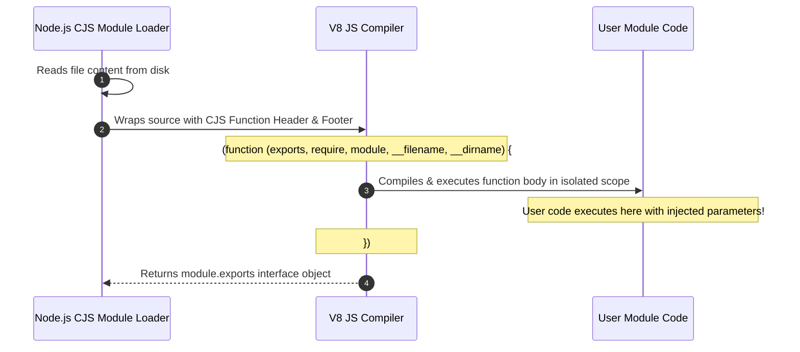
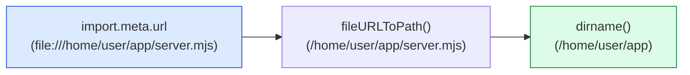

# Module 02: Node.js Globals, Scope Hierarchy, and Module Wrapping Architecture

## Overview

In Node.js, **Global Objects** are built-in primitives, object constructors, and utility functions accessible across all modules without explicit `require()` or `import` statements.

However, a fundamental source of architectural confusion in Node.js is distinguishing between **True Global Variables** (properties attached directly to `globalThis` / `global`) and **Module-Scoped Pseudo-Globals** (variables like `__dirname`, `__filename`, `require`, and `module` injected by the CommonJS module wrapper function).

Understanding **V8 Global Proxy Mechanics**, **The CommonJS Module Wrapper Assembly**, **ESM `import.meta` Path Derivation**, and **Native `structuredClone()` Algorithms** is essential.

---

## 1. Global Scope Hierarchy & Namespace Architecture

Unlike browser environments where top-level script declarations automatically pollute the global `window` object, Node.js encapsulates every file inside its own isolated module wrapper function.

```mermaid
flowchart TD
    subgraph Root Universal Namespace: globalThis / global
        ProcessObj["process (Process Control & Environment)"]
        BufferAPI["Buffer / ArrayBuffer (Binary Data Allocation)"]
        TimersAPI["Timers (setTimeout, setInterval, setImmediate, clearImmediate)"]
        ConsoleAPI["console (Buffered stdout & stderr Logger)"]
        WebAPIs["WHATWG Web Standards (fetch, Headers, Request, Response, URL, structuredClone)"]
        MicrotaskAPI["queueMicrotask() / clearInterval()"]
    end

    subgraph CommonJS Module Scope (Injected In-Memory Per File)
        DirName["__dirname (Absolute Directory Path)"]
        FileName["__filename (Absolute File Path)"]
        ExportsObj["exports / module.exports (Module Interface Object)"]
        RequireFn["require() (Module Dependency Loader)"]
        ModuleObj["module (Module Metadata Handle)"]
    end

    subgraph Local Execution Scope
        LocalVars["var / let / const declarations"]
        TopLevelVar["Top-level var declarations (Isolated to Wrapper Scope!)"]
    end

    Root Universal Namespace --> CommonJS Module Scope
    CommonJS Module Scope --> Local Execution Scope

    style Root Universal Namespace fill:#dbeafe,stroke:#1d4ed8
    style CommonJS Module Scope fill:#fef3c7,stroke:#b45309
```

---

## 2. CommonJS Module Wrapper Assembly & Execution

When Node.js loads a CommonJS file, it does **not** execute the JavaScript source directly. The Node.js module loader wraps the script contents inside an anonymous C++ wrapper function before passing it to the V8 compiler:



### The CommonJS Wrapper Assembly

```javascript
// Node.js internally wraps your file content in this wrapper function prior to compilation:
(function (exports, require, module, __filename, __dirname) {
  
  // YOUR MODULE FILE SOURCE CODE STARTS HERE
  const path = require("node:path");
  var internalConfig = { port: 8080 }; // Isolated to this wrapper scope!

  module.exports = { internalConfig };
  // YOUR MODULE FILE SOURCE CODE ENDS HERE

});
```

### Consequences of the Module Wrapper

1. **Top-Level Isolation**: Declaring `var x = 100` at the top level of a Node.js file does **NOT** attach `x` to `globalThis`. It remains private to the wrapper function.
2. **Pseudo-Globals Are Injected Arguments**: `__dirname`, `__filename`, `require`, `module`, and `exports` are arguments passed into the wrapper function at runtime—they are **not** global variables!

---

## 3. CommonJS vs. ES Modules (ESM) Scope Comparison Matrix

| Feature / Variable | CommonJS (CJS) | ES Modules (ESM) | ESM Replacement Equivalent |
| :--- | :--- | :--- | :--- |
| **`__dirname`** | Available (Injected argument) | **Undefined** | `dirname(fileURLToPath(import.meta.url))` |
| **`__filename`** | Available (Injected argument) | **Undefined** | `fileURLToPath(import.meta.url)` |
| **`require()`** | Synchronous dependency loader | **Undefined** | `import` statements or `createRequire(import.meta.url)` |
| **`module.exports`** | Available (Export object) | **Undefined** | `export default` / `export const` |
| **Top-Level `await`** | Not supported | **Supported natively** | Top-level `await` supported in ESM files |
| **`globalThis`** | Available | Available | Universal global reference across environments |

---

## 4. Path Resolution in ES Modules (ESM)

In ES Modules (`"type": "module"` in `package.json` or `.mjs` files), `__dirname` and `__filename` are omitted. You must derive them using `import.meta.url` and `node:url` utilities:



---

## 5. Production Code Showcase: Globals & Module Scope Isolation

```javascript
import { fileURLToPath } from "node:url";
import { dirname, join } from "node:path";

// ==========================================
// 1. ESM PSEUDO-GLOBAL REPLACEMENT POLYFILL
// ==========================================
const getModulePaths = (metaUrl) => {
  const filename = fileURLToPath(metaUrl);
  const dirname = dirname(filename);
  return { filename, dirname };
};

// ==========================================
// 2. DEMONSTRATING GLOBAL SCOPE VS ISOLATION
// ==========================================
console.log("=== EXECUTING NODE.JS GLOBALS & SCOPE DEMONSTRATION ===");

// 1. Universal Global Accessor
globalThis.appConfig = { env: "production", version: "2.4.0" };
console.log("Global Variable Access:", global.appConfig.env); // "production"

// 2. Scope Isolation Check
var topLevelVar = "Local to wrapper";
console.log("Is topLevelVar attached to globalThis?", globalThis.topLevelVar === undefined); // true

// 3. Deep Object Cloning via Native structuredClone (V8 Serialization)
const complexState = {
  service: "PaymentGateway",
  metadata: { retryCount: 3, timestamps: [Date.now()] },
  buffer: Buffer.from("Raw Bytes")
};

const clonedState = structuredClone(complexState);
clonedState.metadata.retryCount = 5;

console.log("\nOriginal Retry Count:", complexState.metadata.retryCount); // 3
console.log("Cloned Retry Count  :", clonedState.metadata.retryCount);   // 5
console.log("Cloned Buffer Value :", clonedState.buffer.toString());       // "Raw Bytes"
```

---

## Key Production Takeaways

1. **Never Pollute `globalThis`**: Modifying `globalThis` introduces hidden dependencies, creates race conditions across asynchronous execution flows, and undermines unit test isolation.
2. **Distinguish Pseudo-Globals from True Globals**: Remember that `__dirname`, `__filename`, `module`, and `exports` exist only inside CommonJS wrapper functions; they do not exist in ES Modules.
3. **Use `structuredClone()` Over `JSON.parse(JSON.stringify())`**: `structuredClone()` correctly handles `Buffer`, `ArrayBuffer`, `Map`, `Set`, `Date`, and circular object graphs without dropping data types.
4. **Use `node:` Prefix for Standard Core Imports**: Prefix core module imports (`import fs from 'node:fs'`) to make core dependencies explicit and avoid npm package namespace shadowing.


