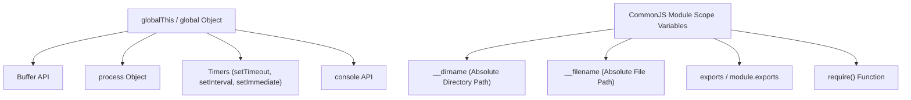

# File 02: Node.js Globals and Scope

## Overview
Node.js provides built-in **Global Objects** accessible anywhere in application code without explicit `require()` imports. Unlike web browser environments where `window` is global, Node.js uses **`global`** (or `globalThis`).

---

## 1. Node.js Global Scope Architecture



---

## 2. Globals vs Module-Scoped Variables Implementation

```javascript
// 1. Global Object Mutation
global.appName = "NodeEngineApp";
console.log("Global Variable Access:", globalThis.appName); // "NodeEngineApp"

// 2. Module-Scoped Variables (CommonJS Wrapper)
console.log("Current Directory (__dirname):", __dirname);
console.log("Current File (__filename):", __filename);

// 3. Structured Cloning via global structuredClone()
const originalObj = { id: 101, details: { role: "Admin" } };
const deepCopy = structuredClone(originalObj);
deepCopy.details.role = "User";

console.log("Original Unmutated:", originalObj.details.role); // "Admin"
```

---

## Key Takeaways
1. **`global`** and **`globalThis`** point to the global namespace root in Node.js.
2. **`__dirname`** and **`__filename`** are **module-scoped** (wrapped by CommonJS), NOT true global variables.
3. Use **`structuredClone()`** built-in global for true deep cloning of objects without lodash.
