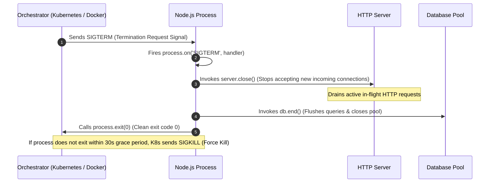

# Module 03: The `process` Object — Architecture, Memory Metrics, Signal Handling, and Graceful Shutdowns

## Overview

The global **`process`** object is an instance of `EventEmitter` that provides control, diagnostics, execution state, and system environment management for the running Node.js process.

It acts as the primary architectural bridge between the JavaScript application layer and the underlying operating system kernel, providing access to process identifier metadata (PID), Standard I/O streams (`stdin`, `stdout`, `stderr`), execution memory statistics, environment variables (`process.env`), POSIX operating system signals (`SIGTERM`, `SIGINT`), and process lifecycle events.

Understanding **Process Subsystem Topologies**, **V8 Memory Allocation Metrics (`rss`, `heapTotal`, `heapUsed`, `external`, `arrayBuffers`)**, **Graceful Shutdown Sequences**, and **POSIX Signal Mechanics** is essential.

---

## 1. Process Subsystem Architecture

```mermaid
flowchart TD
    subgraph process Global Object (EventEmitter Instance)
        ProcessState["Process Metadata (pid, ppid, arch, platform, uptime)"]
        Environment["process.env (Environment Variable Key-Value Pairs)"]
        CLIArgs["process.argv (Command Line Argument Array)"]
        MemoryStats["process.memoryUsage() / process.cpuUsage()"]
        StandardIO["Standard I/O Streams (process.stdin, stdout, stderr)"]
        MicrotaskControl["process.nextTick() (High-Priority Microtask Dispatcher)"]
        SignalEmitter["POSIX Signal Handlers (SIGINT, SIGTERM, SIGHUP, SIGUSR2)"]
        LifecycleEvents["Lifecycle Events (exit, beforeExit, uncaughtException, unhandledRejection)"]
    end

    OSKernel["Operating System Kernel (PID Table, Memory Manager, Signal Dispatcher)"] <--> process

    style process fill:#dbeafe,stroke:#1d4ed8
    style OSKernel fill:#dcfce7,stroke:#15803d
```

---

## 2. Process Memory Metrics Breakdown

Calling **`process.memoryUsage()`** returns an architectural snapshot of memory allocation across the V8 engine and native C++ memory boundaries:

```mermaid
flowchart TD
    subgraph Total OS Allocated Process RAM (rss - Resident Set Size)
        subgraph V8 Managed Memory Heap
            HeapUsed["heapUsed<br/>(Live JavaScript objects, closures, strings)"]
            HeapTotal["heapTotal<br/>(Total V8 allocated heap memory segment)"]
        end
        External["external<br/>(C++ objects bound to JS references)"]
        ArrayBuffers["arrayBuffers<br/>(Raw C++ memory for Buffers & ArrayBuffers)"]
    end

    style rss fill:#dbeafe,stroke:#1d4ed8
    style HeapUsed fill:#dcfce7,stroke:#15803d
```

### Memory Metrics Diagnostic Matrix

| Metric Property | Description | Diagnostic Significance |
| :--- | :--- | :--- |
| **`rss`** (Resident Set Size) | Total RAM allocated for the process in main memory (includes V8 heap, C++ bindings, code segment, and stack). | High `rss` without high `heapUsed` indicates native memory leaks (unclosed C++ bindings, Buffer leaks). |
| **`heapTotal`** | Total memory reserved by V8 for JavaScript object allocation. | Expands dynamically up to `--max-old-space-size` limit. |
| **`heapUsed`** | Actual RAM currently consumed by active JS objects, closures, and strings. | **Primary metric for detecting JavaScript memory leaks.** |
| **`external`** | Memory consumed by C++ objects bound to JavaScript objects managed by V8. | Monitors memory allocated by native C++ Node addons. |
| **`arrayBuffers`** | Memory allocated for `ArrayBuffer` and Node.js `Buffer` instances (included in `external`). | Monitors binary data allocation in streaming, network sockets, or crypto apps. |

---

## 3. POSIX Process Signals & Graceful Shutdown Sequence

In production environments (e.g. Kubernetes, Docker, AWS ECS), Node.js applications must handle termination signals gracefully to avoid truncating active client requests or corrupting database transactions.



### POSIX Signals Reference Matrix

| Signal | Origin | Default Action | Catchable in JS? | Usage Scenario |
| :--- | :--- | :--- | :--- | :--- |
| **`SIGINT`** | Terminal (`Ctrl+C`) | Immediate termination | **Yes** | Manual interruption during local development. |
| **`SIGTERM`** | Container / OS (`kill <pid>`) | Immediate termination | **Yes** | Standard graceful shutdown signal issued by Kubernetes/Docker. |
| **`SIGKILL`** | OS Kernel (`kill -9 <pid>`) | Immediate force kill | **No** | Kernel terminates process immediately; cleanup handlers **cannot** execute! |
| **`SIGHUP`** | Terminal disconnect | Immediate termination | **Yes** | Used by modern daemons to reload configuration without process restarts. |
| **`SIGUSR2`** | User-defined signal | Ignored by default | **Yes** | Used by Nodemon to trigger hot-reloading. |

---

## 4. Production Code Showcase: Graceful Shutdown & Uncaught Exception Engine

```javascript
const http = require("node:http");

// Target HTTP Application Server
const server = http.createServer((req, res) => {
  if (req.url === "/memory") {
    const memoryStats = process.memoryUsage();
    res.writeHead(200, { "Content-Type": "application/json" });
    return res.end(JSON.stringify(memoryStats, null, 2));
  }
  res.writeHead(200, { "Content-Type": "text/plain" });
  res.end("Server Operating Normally");
});

const PORT = process.env.PORT || 3000;
server.listen(PORT, () => {
  console.log(`[Process ID: ${process.pid}]: Server listening on port ${PORT}...`);
});

// ==========================================
// 1. GRACEFUL SHUTDOWN HANDLER
// ==========================================
let isShuttingDown = false;

function initiateGracefulShutdown(signalName) {
  if (isShuttingDown) return;
  isShuttingDown = true;

  console.log(`\n[${signalName}] Signal received. Initiating graceful shutdown...`);

  // Stop accepting new incoming network connections
  server.close(() => {
    console.log("  ✓ [HTTP Server]: Drained active client connections.");
    
    // Simulate flushing database connection pools
    console.log("  ✓ [Database Pool]: Flushed pending queries and closed sockets.");
    
    console.log("[Process]: Graceful shutdown completed cleanly. Exiting (0).");
    process.exit(0); // Clean exit code 0
  });

  // Force Exit Fallback Guard (Prevents hanging process if socket fails to drain)
  const forceExitTimer = setTimeout(() => {
    console.error("  !! [FORCE EXIT]: Cleanup exceeded timeout limit (10s)! Forcing termination.");
    process.exit(1); // Error exit code 1
  }, 10000);

  // Unref timer so it doesn't keep the event loop alive if server closes faster!
  forceExitTimer.unref();
}

process.on("SIGTERM", () => initiateGracefulShutdown("SIGTERM"));
process.on("SIGINT", () => initiateGracefulShutdown("SIGINT"));

// ==========================================
// 2. UNCAUGHT EXCEPTION & UNHANDLED REJECTION GUARDS
// ==========================================

// Synchronous Uncaught Exception Guard
process.on("uncaughtException", (error, origin) => {
  console.error(`CRITICAL: Uncaught Exception originating from '${origin}'`);
  console.error(error.stack);
  // ALWAYS exit after an uncaught exception! Application state is corrupted.
  process.exit(1);
});

// Unhandled Promise Rejection Guard
process.on("unhandledRejection", (reason, promise) => {
  console.error("WARNING: Unhandled Promise Rejection at:", promise, "reason:", reason);
  // In modern Node.js, unhandled rejections terminate the process by default.
});
```

---

## 5. Process Exit Codes Reference Matrix

| Exit Code | Name / Meaning | Cause |
| :--- | :--- | :--- |
| **`0`** | Clean Exit | Normal script completion or explicit `process.exit(0)` invocation. |
| **`1`** | Uncaught Fatal Exception | Unhandled error thrown in synchronous JS code without a catch block. |
| **`5`** | Fatal V8 Error | Memory allocation failure or V8 runtime engine crash. |
| **`9`** | Invalid Argument | Unrecognized CLI argument or flag passed to the Node.js binary. |
| **`128 + N`** | Signal Exit | Process terminated by POSIX signal `N` (e.g. Exit code `137` = `128 + 9` for `SIGKILL`). |

---

## Key Production Takeaways

1. **Always Exit on `uncaughtException`**: Never swallow uncaught exceptions or keep the server running after one fires; application memory state and object invariants are likely corrupted.
2. **Implement Graceful Shutdowns**: Always listen for `SIGTERM` and `SIGINT` to gracefully close database connection pools, flush log buffers, and drain active HTTP request queues.
3. **Use `.unref()` on Fallback Exit Timers**: When setting a fallback timeout inside a signal handler, invoke `.unref()` so it doesn't keep the event loop alive needlessly if cleanup finishes quickly.
4. **Monitor `heapUsed` and `rss` Metrics**: Integrate memory monitoring (`process.memoryUsage()`) into your APM tools (Prometheus / Datadog) to identify memory leaks early.


