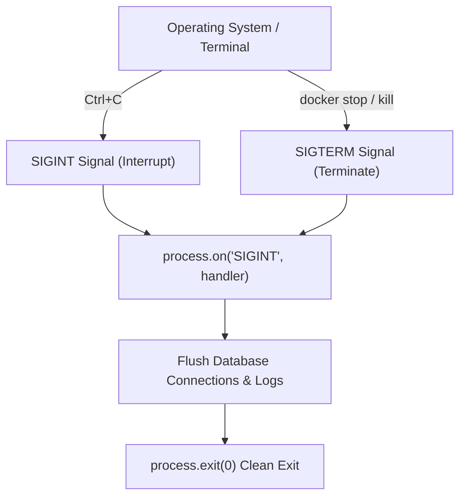

# File 03: The process Object and Environment Management

## Overview
The **`process`** global object provides information about, and control over, the current Node.js runtime process. It allows accessing environment variables (`process.env`), CLI arguments (`process.argv`), memory usage (`process.memoryUsage()`), and signal events (`SIGINT`, `SIGTERM`).

---

## 1. Process Signal & Life Cycle Architecture



---

## 2. Process Inspection Implementation

```javascript
// 1. Environment & CLI Arguments
console.log("Node Version:", process.version);
console.log("Current PID:", process.pid);
console.log("Command Line Args:", process.argv.slice(2));

// 2. Memory Usage Metrics
const mem = process.memoryUsage();
console.log(`Heap Used: ${(mem.heapUsed / 1024 / 1024).toFixed(2)} MB`);
console.log(`Heap Total: ${(mem.heapTotal / 1024 / 1024).toFixed(2)} MB`);

// 3. Graceful Shutdown Handler
process.on("SIGINT", () => {
    console.log("\n[SIGINT] Intercepted Ctrl+C. Cleaning up connections...");
    setTimeout(() => {
        console.log("Shutdown complete.");
        process.exit(0);
    }, 100);
});
```

---

## Key Takeaways
1. Read environment variables via **`process.env.VAR_NAME`**.
2. Parse CLI flags via **`process.argv`**.
3. Listen to **`SIGTERM`** and **`SIGINT`** signals to perform graceful web server shutdowns before process termination.
