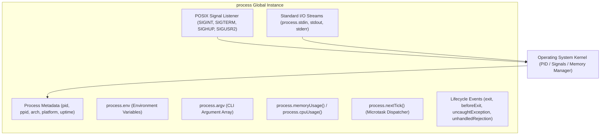
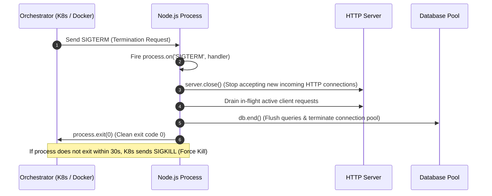

# Module 03: The `process` Object, Process State, and Signal Handling

## Overview

The global **`process`** object is an instance of `EventEmitter` that provides control, diagnostics, and environment management for the currently executing Node.js process. 

It acts as the primary interface between the JavaScript application layer and the underlying operating system kernel, granting access to process identifier metadata (PID), Standard I/O streams (`stdin`, `stdout`, `stderr`), execution memory statistics, environment variables, POSIX operating system signals, and lifecycle hooks.

---

## 1. Process Architecture & Subsystem Layout



---

## 2. Memory Usage Metrics Breakdown

Invoking **`process.memoryUsage()`** returns a snapshot of V8 engine memory allocation expressed in bytes:

```mermaid
flowchart LR
    subgraph Total OS Process RAM (rss)
        subgraph V8 Heap Allocation
            HeapUsed["heapUsed (Live objects & closures)"]
            HeapTotal["heapTotal (Allocated V8 heap segment)"]
        end
        External["external (C++ objects bound to JS handles)"]
        ArrayBuffers["arrayBuffers (Raw memory allocated for Buffers)"]
    end
```

| Metric Property | Description | Diagnostic Significance |
| :--- | :--- | :--- |
| **`rss`** (Resident Set Size) | Total memory allocated for the process in main RAM (includes V8 heap, C++ bindings, code segment, and call stack). | High `rss` without high `heapUsed` points to native memory leaks (e.g. unclosed C++ bindings or Buffer leaks). |
| **`heapTotal`** | Total memory reserved by V8 for JavaScript objects. | Expands dynamically as object allocation increases until `--max-old-space-size` limit is reached. |
| **`heapUsed`** | Actual RAM currently consumed by active JS objects, closures, and strings. | Primary metric for identifying JavaScript memory leaks. |
| **`external`** | Memory consumed by C++ objects bound to JavaScript objects managed by V8. | Useful for tracking native C++ addon memory usage. |
| **`arrayBuffers`** | Memory allocated for `ArrayBuffer` and Node.js `Buffer` instances (included within `external`). | Monitors binary data buffer allocation in streaming or image processing apps. |

---

## 3. POSIX Process Signals & Graceful Shutdown Sequence

When running inside production environments (such as Kubernetes or Docker containers), Node.js must gracefully terminate upon receiving termination signals.



### Essential POSIX Signals Reference

| Signal | Origin | Default Action | Catchable? | Usage Scenario |
| :--- | :--- | :--- | :--- | :--- |
| **`SIGINT`** | Terminal (`Ctrl+C`) | Immediate termination | **Yes** | Manual interruption during CLI development. |
| **`SIGTERM`** | Container / OS (`kill <pid>`) | Immediate termination | **Yes** | Standard graceful shutdown signal issued by Kubernetes/Docker. |
| **`SIGKILL`** | OS (`kill -9 <pid>`) | Immediate force kill | **No** | Kernel terminates process immediately; cannot run cleanup handlers! |
| **`SIGHUP`** | Terminal disconnect | Immediate termination | **Yes** | Used by modern daemons to reload configuration files without restarting. |
| **`SIGUSR2`** | User-defined signal | Ignored by default | **Yes** | Used by Nodemon to trigger process hot-reloading. |

---

## 4. Production Process Lifecycle Event Handlers

```javascript
const http = require("http");

const server = http.createServer((req, res) => {
  res.end("Server Active");
});

server.listen(3000, () => {
  console.log(`Process ID ${process.pid} listening on port 3000`);
});

// 1. Graceful Shutdown Handler for SIGTERM / SIGINT
function gracefulShutdown(signal) {
  console.log(`\n[${signal}] Received. Initiating graceful shutdown...`);
  
  // Stop receiving new connections
  server.close(() => {
    console.log("  [HTTP Server] All active client connections drained.");
    
    // Close database pools, flush log buffers, release resources here...
    console.log("  [Database] Connection pools successfully closed.");
    
    // Clean process exit with success status code 0
    process.exit(0);
  });

  // Force exit if cleanup takes too long (Prevent hanging process)
  setTimeout(() => {
    console.error("  [FORCE EXIT] Cleanup exceeded timeout of 10s!");
    process.exit(1);
  }, 10000).unref(); // unref permits event loop to exit naturally if server completes earlier
}

process.on("SIGTERM", () => gracefulShutdown("SIGTERM"));
process.on("SIGINT", () => gracefulShutdown("SIGINT"));

// 2. Uncaught Exception Guard (Last resort safety net)
process.on("uncaughtException", (error, origin) => {
  console.error(`CRITICAL: Uncaught Exception originating from ${origin}`);
  console.error(error.stack);
  // ALWAYS exit after an uncaught exception! The application state is corrupted.
  process.exit(1);
});

// 3. Unhandled Promise Rejection Guard
process.on("unhandledRejection", (reason, promise) => {
  console.error("WARNING: Unhandled Promise Rejection:", reason);
});
```

---

## 5. Process Exit Codes Reference

| Exit Code | Name / Meaning | Cause |
| :--- | :--- | :--- |
| **`0`** | Clean Exit | Normal completion or explicit call to `process.exit(0)`. |
| **`1`** | Uncaught Fatal Exception | Unhandled error thrown in synchronous code without a handler. |
| **`5`** | Fatal V8 Error | Memory allocation failure or V8 runtime engine crash. |
| **`9`** | Invalid Argument | Unrecognized command line option or flag passed to Node binary. |
| **`128 + N`** | Signal Exit | Process killed by signal `N` (e.g. Exit code `137` = `128 + 9` for `SIGKILL`). |

---

## Key Production Takeaways

1. **Always Exit on `uncaughtException`**: Never ignore uncaught exceptions or keep the server running after one fires; memory state and application invariants may be compromised.
2. **Implement Graceful Shutdowns**: Always listen for `SIGTERM` and `SIGINT` to gracefully drain database connections and HTTP request queues.
3. **Use `.unref()` on Force Exit Timers**: When setting a fallback cleanup timeout inside a signal handler, invoke `.unref()` so it doesn't keep the event loop alive needlessly.
4. **Monitor `heapUsed` and `rss`**: Integrate process memory monitoring metrics into your APM tools (e.g., Prometheus / Datadog) to catch memory leaks early.

