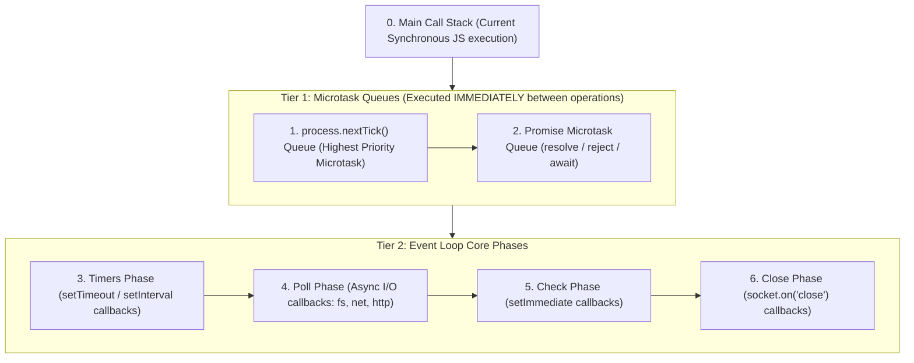
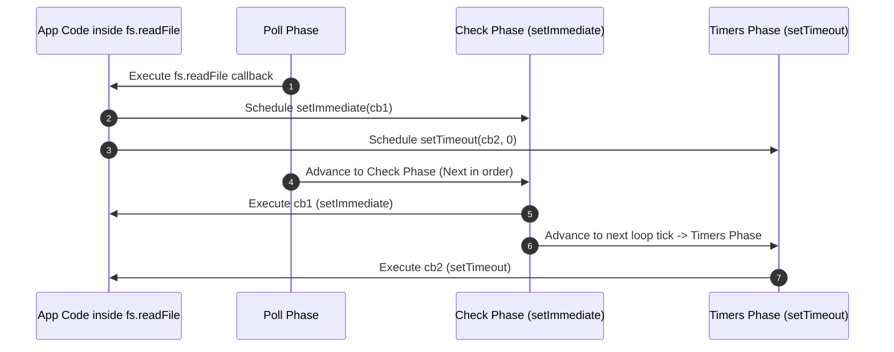

# Module 04: Timers and Microtask Execution Order in Node.js

## Overview

Timer functions in Node.js (`setTimeout`, `setInterval`, `setImmediate`) look syntax-identical to Web API timers in browsers, but their internal scheduling is managed entirely by the **Libuv Event Loop** and Node.js microtask queues (`process.nextTick` and `Promise`).

Understanding the exact priority order, timer threshold granularity, timer drift, and handle ref/unref behavior is essential for writing high-performance, non-blocking async Node.js applications.

---

## 1. Task Execution Priority Hierarchy

Whenever JavaScript code finishes executing the current tick of the Call Stack, Node.js processes queued tasks in strict priority tiers:



---

## 2. Timer Mechanics & Execution Rules

### `setImmediate()` vs. `setTimeout(fn, 0)`

1. **When Scheduled from the Main Thread**:
   - The execution order between `setTimeout(fn, 0)` and `setImmediate()` is **non-deterministic** because timer threshold checking depends on CPU performance and system clock resolution (which defaults to a minimum delay threshold of `1ms` in V8).
2. **When Scheduled Inside an I/O Cycle (e.g. `fs.readFile`)**:
   - `setImmediate()` **ALWAYS** runs before `setTimeout(fn, 0)`.
   - **Why?** After the Poll phase completes reading the file, the Event Loop advances directly to the **Check phase** (where `setImmediate` resides) *before* wrapping around to the Timers phase on the next loop tick.



---

## 3. Comprehensive Timers API Matrix

| API Method | Scheduling Target | Phase / Queue | Canceling Handle | Event Loop Block Impact |
| :--- | :--- | :--- | :--- | :--- |
| **`process.nextTick()`** | Immediately after current call stack tick | `nextTick` Microtask Queue | N/A | **High risk** (Recursive calls starve Event Loop) |
| **`Promise.then()`** | Microtask queue | Promise Microtask Queue | N/A | **Moderate risk** (Infinite chains block Event Loop) |
| **`setTimeout(fn, ms)`** | Minimum threshold elapsed | Timers Phase | `clearTimeout(timer)` | Low (Non-blocking async timer) |
| **`setInterval(fn, ms)`** | Recurring threshold elapsed | Timers Phase | `clearInterval(timer)` | Low (Must be manually cleared to prevent leaks) |
| **`setImmediate(fn)`** | End of current I/O cycle | Check Phase | `clearImmediate(timer)` | Low (Yields safely to event loop) |

---

## 4. Timer Lifecycle Management: `ref()` and `unref()`

Timer objects returned by `setTimeout` and `setInterval` in Node.js are **Active Handles** that keep the Node.js process alive even if no other code remains to be executed.

You can modify this behavior using `.unref()` and `.ref()`:

```javascript
const timer = setInterval(() => {
  console.log("Background telemetry metrics collection...");
}, 5000);

// .unref() tells Libuv: "Do NOT hold the Event Loop open solely for this timer!"
// If all other active handles/requests complete, the process exits naturally even if this timer is active.
timer.unref();

// Later in code, re-enable process retention if necessary:
timer.ref();
```

---

## 5. Practical Execution Benchmark Code

```javascript
const fs = require("fs");

console.log("1. Main Call Stack Start");

// 1. Timers Phase
setTimeout(() => console.log("6. setTimeout(0) Callback"), 0);

// 2. Check Phase
setImmediate(() => console.log("5. setImmediate Callback"));

// 3. Promise Microtask
Promise.resolve().then(() => console.log("4. Promise Microtask Callback"));

// 4. process.nextTick Microtask
process.nextTick(() => console.log("3. process.nextTick Microtask Callback"));

console.log("2. Main Call Stack End");

// Demonstrating I/O cycle execution determinism:
fs.readFile(__filename, () => {
  console.log("\n--- Inside I/O Callback Context ---");
  
  setTimeout(() => console.log("I/O Context: setTimeout(0)"), 0);
  setImmediate(() => console.log("I/O Context: setImmediate (ALWAYS FIRST IN I/O!)"));
});
```

### Execution Log Output

```text
1. Main Call Stack Start
2. Main Call Stack End
3. process.nextTick Microtask Callback
4. Promise Microtask Callback
5. setImmediate Callback
6. setTimeout(0) Callback

--- Inside I/O Callback Context ---
I/O Context: setImmediate (ALWAYS FIRST IN I/O!)
I/O Context: setTimeout(0)
```

---

## Key Production Takeaways

1. **Use `setImmediate()` to Break Long Operations**: To break down large iterative calculations without blocking incoming I/O requests, schedule iterations via `setImmediate()`.
2. **Use `.unref()` for Non-Critical Background Timers**: Metrics reporting, cache cleanup, or heartbeats should be marked `.unref()` so they do not prevent application shutdown.
3. **Beware of Timer Drift**: `setInterval` does **not** guarantee exact periodic execution; if callback execution takes `30ms` on a `50ms` interval, drift will accumulate over time. Use recursive `setTimeout` for precise interval scheduling.
4. **Avoid `process.nextTick()` in Infinite Recursion**: Prefer `setImmediate()` or native Promises to prevent microtask queue starvation.

