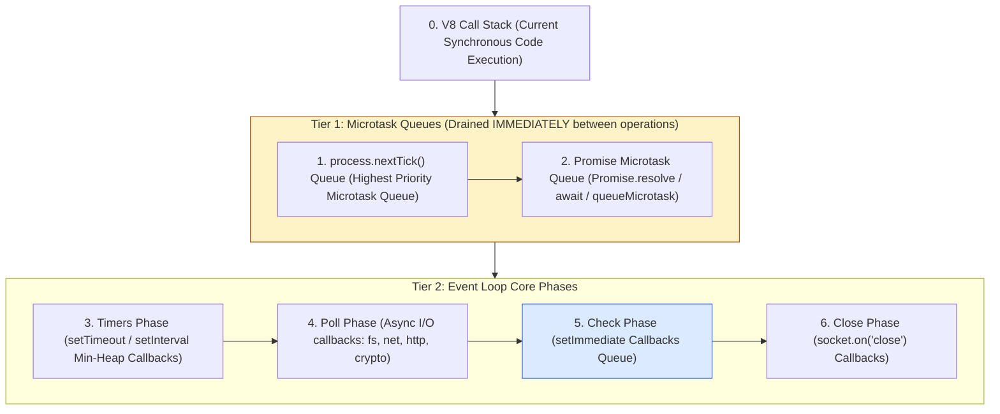
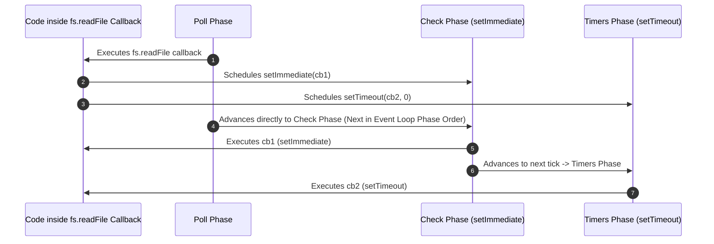
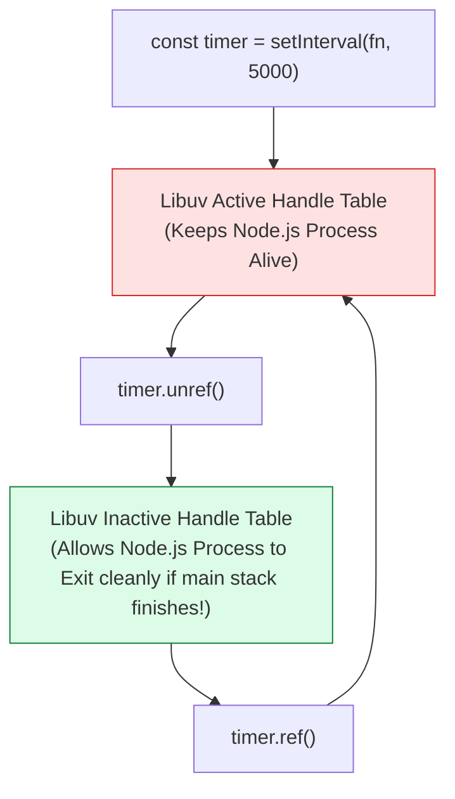

# Module 04: Timers, Microtasks, and Event Loop Scheduling Mechanics in Node.js

## Overview

Timer functions in Node.js (`setTimeout`, `setInterval`, `setImmediate`, `process.nextTick`) share syntax similarities with browser Web API timers, but their internal execution engines operate differently.

In Node.js, timer callbacks are managed by **Libuv Timer Min-Heaps**, Libuv handle queues, and Node.js microtask queues (`process.nextTick` and `Promise` microtask queues).

Understanding **Task Execution Priority Topologies**, **`setImmediate` vs. `setTimeout(fn, 0)` Determinism Rules**, **Timer Drift Mechanics**, and **`ref()` / `unref()` Event Loop Retention** is essential for high-performance Node.js engineering.

---

## 1. Task Execution Priority Hierarchy

Whenever JavaScript code finishes executing the current tick of the V8 Call Stack, Node.js processes queued tasks in strict, deterministic priority tiers:



---

## 2. Timer Scheduling Mechanics & Determinism Rules

### `setImmediate()` vs. `setTimeout(fn, 0)` Execution Determinism

1. **Scheduled from Top-Level Main Thread**:
   - The execution order between `setTimeout(fn, 0)` and `setImmediate()` is **non-deterministic** (variable).
   - **Why?** Node.js converts `setTimeout(fn, 0)` to `setTimeout(fn, 1)` (due to a 1ms minimum threshold in V8). Depending on CPU load and machine clock tick timing when entering the loop, the 1ms timer threshold may or may not have elapsed before the Timers phase evaluates.
2. **Scheduled Inside an I/O Cycle (e.g. `fs.readFile`)**:
   - `setImmediate()` **ALWAYS** executes before `setTimeout(fn, 0)`.
   - **Why?** After the Poll phase completes processing the I/O callback, the Event Loop advances directly to the **Check phase** (where `setImmediate` resides) *before* looping around to the Timers phase on the next tick.



---

## 3. Comprehensive Timers API Architectural Matrix

| API Method | Target Layer | Execution Queue / Phase | Canceling API | Event Loop Starvation Risk |
| :--- | :--- | :--- | :--- | :--- |
| **`process.nextTick(fn)`** | Node.js Runtime | `nextTick` Microtask Queue | N/A | **High Risk** (Infinite recursive calls completely starve Event Loop) |
| **`Promise.then(fn)`** | V8 Engine | Promise Microtask Queue | N/A | **Moderate Risk** (Infinite promise chains block Event Loop phases) |
| **`setTimeout(fn, ms)`** | Libuv Timer Min-Heap | Timers Phase | `clearTimeout(handle)` | Low (Non-blocking async timer) |
| **`setInterval(fn, ms)`**| Libuv Timer Min-Heap | Timers Phase | `clearInterval(handle)` | Low (Accumulates timer drift if callbacks run long) |
| **`setImmediate(fn)`** | Libuv Check Queue | Check Phase | `clearImmediate(handle)` | Low (Yields cleanly to Event Loop I/O polling) |

---

## 4. Event Loop Retention: `ref()` and `unref()` Mechanics

Timer handles returned by `setTimeout` and `setInterval` are **Active Handles** in Libuv. As long as an active handle exists in the Libuv handle table, the Node.js process will **not** terminate.

Using `.unref()` tells Libuv to ignore the handle when counting active event loop retainers:



---

## 5. Production Code Showcase: Timers & Microtask Execution Suite

```javascript
const fs = require("node:fs");
const path = require("node:path");

console.log("1. [MAIN THREAD] Synchronous Execution Start");

// 1. Timers Phase
setTimeout(() => console.log("6. [TIMERS PHASE] setTimeout(fn, 0) Executed"), 0);

// 2. Check Phase
setImmediate(() => console.log("5. [CHECK PHASE] setImmediate(fn) Executed"));

// 3. Promise Microtask
Promise.resolve().then(() => console.log("4. [PROMISE MICROTASK] Promise.resolve() Executed"));

// 4. process.nextTick Microtask
process.nextTick(() => console.log("3. [NEXT TICK] process.nextTick() Executed"));

console.log("2. [MAIN THREAD] Synchronous Execution End");

// Demonstrating Determinism inside I/O Context
const demoPath = path.join(__dirname, "timer_demo.txt");
fs.writeFileSync(demoPath, "Timer Test Content");

fs.readFile(demoPath, () => {
  console.log("\n=== INSIDE ASYNC I/O CALLBACK CONTEXT ===");
  
  setTimeout(() => console.log("I/O Context: setTimeout(fn, 0) Executed Second"), 0);
  setImmediate(() => console.log("I/O Context: setImmediate(fn) Executed FIRST (Guaranteed!)"));

  // Clean up demo file
  fs.unlinkSync(demoPath);
});
```

---

## Key Production Takeaways

1. **Use `setImmediate()` to Break Up Heavy Iterative Tasks**: If processing large array batches, yield control to the Event Loop between chunks using `setImmediate()` so the server can continue accepting network I/O.
2. **Use `.unref()` for Non-Critical Background Timers**: Metrics heartbeats, telemetry polling, or background cache cleanups should be marked `.unref()` so they do not prevent application shutdown.
3. **Prevent Timer Drift in `setInterval()`**: `setInterval()` does not guarantee exact interval timing; if callback execution time exceeds interval time, drift accumulates. Use recursive `setTimeout()` for exact interval scheduling.
4. **Never Use `process.nextTick()` for Recursion**: Avoid recursive `process.nextTick()` calls; prefer `setImmediate()` or Promises to prevent event loop microtask queue starvation.


