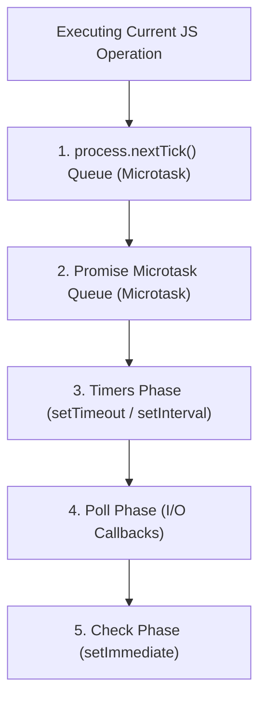

# File 04: Timers in Node.js (setTimeout, setInterval, setImmediate, process.nextTick)

## Overview
Node.js provides four distinct timer mechanisms: **`process.nextTick()`**, **`Promise` microtasks**, **`setTimeout()` / `setInterval()`**, and **`setImmediate()`**. Each executes at specific phases of the Libuv Event Loop.

---

## 1. Node.js Event Loop Task Priority Hierarchy



---

## 2. Timer Execution Comparison

```javascript
console.log("1. Start Synchronous");

setTimeout(() => {
    console.log("5. setTimeout (Timers Phase)");
}, 0);

setImmediate(() => {
    console.log("4. setImmediate (Check Phase)");
});

Promise.resolve().then(() => {
    console.log("3. Promise Microtask");
});

process.nextTick(() => {
    console.log("2. process.nextTick Microtask");
});

console.log("1b. End Synchronous");
```

---

## Key Takeaways
1. **`process.nextTick()`** runs immediately after current operation, **before any microtask or Event Loop phase**.
2. **`setImmediate()`** executes in the **Check Phase**, running after I/O callbacks complete.
3. Inside I/O callbacks (e.g. `fs.readFile`), **`setImmediate()` ALWAYS executes before `setTimeout(fn, 0)`**.
