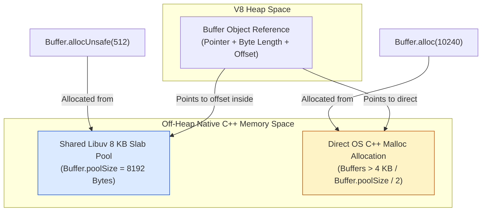
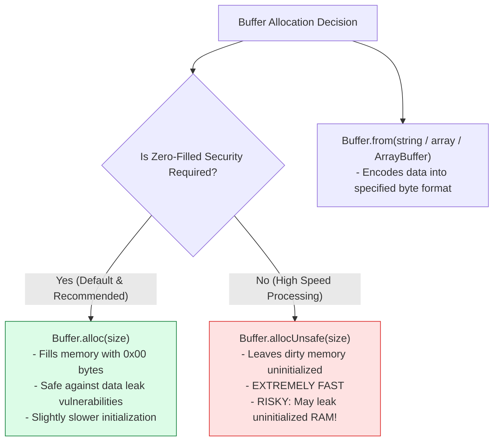
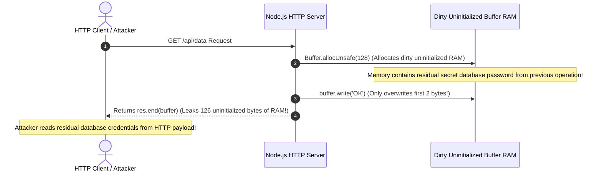

# Module 05: Buffers, TypedArrays, and Binary Memory Allocation Architecture

## Overview

A **`Buffer`** in Node.js is a fixed-length sequence of raw binary bytes allocated outside the V8 JavaScript engine heap in unmanaged C++ memory (`ArrayBuffer` backing store).

Because JavaScript originally lacked native binary data primitives, Node.js introduced the `Buffer` class to handle TCP network streams, file system I/O, cryptographic operations, and image/video binary pipelines without incurring V8 Garbage Collection pause overhead.

Understanding **Off-Heap Native Memory Allocation**, **The Libuv 8 KB Slab Allocation Pool**, **`Buffer.alloc` vs. `Buffer.allocUnsafe` Data Leak Risks**, **`Buffer.subarray()` Zero-Copy Views**, and **`StringDecoder` Split-Chunk Handling** is essential.

---

## 1. Buffer Memory Architecture & Slab Pool Allocation

To avoid expensive operating system kernel memory allocation syscalls (`malloc`) when creating small buffer instances, Node.js pre-allocates a shared **8 KB Slab Pool** (`Buffer.poolSize = 8192` bytes).



---

## 2. Allocation Strategies Comparison Matrix



| Allocation API | Allocation Source | Memory Initialization | Security Risk | Primary Use Case |
| :--- | :--- | :--- | :--- | :--- |
| **`Buffer.alloc(size)`** | Slab Pool or Direct OS | Zero-filled (`0x00`) | **Zero** | Default choice for all safe data pipelines |
| **`Buffer.allocUnsafe(size)`** | Shared Slab Pool | **Uninitialized (Dirty RAM)** | **High** (Exposes old heap data if unpopulated) | High-performance parsers where every byte is immediately overwritten |
| **`Buffer.from(string, enc)`** | Slab Pool or Direct OS | Encoded Byte Values | Low | Converting incoming strings or arrays to binary |
| **`Buffer.from(arrayBuffer)`** | Shared ArrayBuffer Pointer | Shares Memory View | Low | Zero-copy view sharing between WebAssembly & Node |

---

## 3. Character Encodings Reference Matrix

| Encoding Name | Bytes Per Character | Description | Example Hex Output (`"Node"`) |
| :--- | :--- | :--- | :--- |
| **`utf8`** (Default) | 1 to 4 Bytes | Variable-length Unicode encoding | `4e 6f 64 65` |
| **`hex`** | 2 Hex Chars / Byte | Encodes each byte into 2 hexadecimal characters | `'4e6f6465'` |
| **`base64`** / **`base64url`** | 4 Chars / 3 Bytes | Binary-to-text encoding for headers & URLs | `'Tm9kZQ=='` |
| **`ascii`** | 1 Byte | 7-bit ASCII text (High 8th bit stripped) | `4e 6f 64 65` |
| **`latin1`** / **`binary`** | 1 Byte | One-to-one byte mapping (ISO-8859-1) | `4e 6f 64 65` |
| **`utf16le`** / **`ucs2`** | 2 or 4 Bytes | 16-bit Little Endian Unicode encoding | `4e 00 6f 00 64 00 65 00` |

---

## 4. Code Showcase: Production Buffer Allocation & Zero-Copy Subarrays

```javascript
const { StringDecoder } = require("node:string_decoder");

console.log("=== EXECUTING NODE.JS BUFFER ALLOCATION SUITE ===");

// 1. Safe Allocation (Zero-Filled Memory)
const safeBuffer = Buffer.alloc(8);
console.log("Safe Buffer (Zero-Filled):", safeBuffer); // <Buffer 00 00 00 00 00 00 00 00>

// 2. Buffer Creation from UTF-8 String
const textBuffer = Buffer.from("Node.js Architecture 🚀", "utf-8");
console.log("\nText String         :", "Node.js Architecture 🚀");
console.log("String Length (.length):", "Node.js Architecture 🚀".length); // 23 characters (Emoji = 2 UTF-16 code units)
console.log("Buffer Byte Length    :", textBuffer.length);                 // 25 bytes (Rocket Emoji = 4 UTF-8 bytes!)
console.log("Hexadecimal Output    :", textBuffer.toString("hex"));

// 3. Demonstrating Zero-Copy Memory Sharing with .subarray()
console.log("\n--- DEMONSTRATING ZERO-COPY SUBARRAY MEMORY SHARING ---");
const originalBuffer = Buffer.from("HELLOPROTOCOL");
const subView = originalBuffer.subarray(0, 5); // Shares underlying memory pointer!

console.log("Original Before Mutation:", originalBuffer.toString()); // "HELLOPROTOCOL"
subView[0] = 0x6a; // 0x6a = 'j'
console.log("SubView Mutated Value   :", subView.toString());        // "jELLO"
console.log("Original After Mutation :", originalBuffer.toString()); // "jELLOPROTOCOL" (MUTATED!)

// 4. Safely Decoding Split-Chunk UTF-8 Streams using StringDecoder
console.log("\n--- DEMONSTRATING STRINGDECODER SPLIT CHUNK REASSEMBLY ---");
const decoder = new StringDecoder("utf-8");

// Emoji "🚀" is 4 bytes: 0xf0, 0x9f, 0x99, 0x80
const chunk1 = Buffer.from([0xf0, 0x9f]); // Incomplete UTF-8 sequence!
const chunk2 = Buffer.from([0x99, 0x80]); // Remaining UTF-8 sequence!

console.log("Direct toString() Chunk 1 (Corrupted!):", chunk1.toString("utf-8")); 
console.log("StringDecoder Chunk 1 (Buffered)      :", decoder.write(chunk1)); // "" (Wait for rest!)
console.log("StringDecoder Chunk 2 (Reassembled)   :", decoder.write(chunk2)); // "🚀" (Reassembled cleanly!)
```

---

## 5. Security Vulnerabilities: Uninitialized `allocUnsafe` Data Leaks



---

## Key Production Takeaways

1. **Prefer `Buffer.alloc()` by Default**: Never use `Buffer.allocUnsafe()` unless benchmark profiling explicitly justifies it and every single byte is guaranteed to be overwritten immediately.
2. **Remember `length` is Byte Length, NOT Character Length**: String length (`"🚀".length === 2`) differs from binary buffer byte length (`Buffer.from("🚀").length === 4`). Always use `Buffer.byteLength(str)` for HTTP `Content-Length` headers.
3. **`subarray()` Shares Memory**: Calling `.subarray()` or `.slice()` on a Buffer creates a new view sharing the exact same memory offset. Modifying the slice mutates the original Buffer.
4. **Use `StringDecoder` for Stream Decoding**: When decoding multi-byte UTF-8 strings split across stream chunks, use `node:string_decoder` to prevent character corruption.


