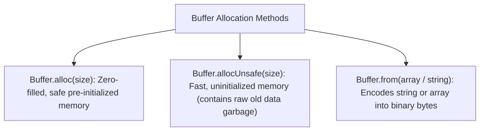

# File 05: Buffers and Binary Data Handling

## Overview
A **`Buffer`** is a fixed-length sequence of raw binary bytes allocated outside the V8 JavaScript heap in unmanaged C++ memory. Buffers are essential for handling TCP network streams, file system operations, and binary images.

---

## 1. Buffer Allocation & Memory Architecture



---

## 2. Buffer Manipulation Implementation

```javascript
// 1. Allocation & String Encoding
const buf1 = Buffer.from("Hello Node.js", "utf-8");
console.log("Hex Representation:", buf1.toString("hex"));
console.log("Base64 Representation:", buf1.toString("base64"));
console.log("Buffer Byte Length:", buf1.length); // 13 Bytes

// 2. Modifying Buffer In-Place
const buf2 = Buffer.alloc(10); // 10 zero-filled bytes
buf2.write("Node", 0, "utf-8");
console.log("Buffer Contents:", buf2.toString());

// 3. Concatenating Buffers
const part1 = Buffer.from("Tech ");
const part2 = Buffer.from("Playbook");
const combined = Buffer.concat([part1, part2]);
console.log("Combined Buffer String:", combined.toString()); // "Tech Playbook"
```

---

## Key Takeaways
1. Buffers represent **raw binary data** allocated outside V8 heap memory.
2. Use **`Buffer.alloc(size)`** for safe zero-filled memory allocation.
3. Use **`Buffer.allocUnsafe(size)`** for high performance when overwriting all bytes immediately.
4. Convert between encodings using **`toString('utf-8' | 'hex' | 'base64')`**.
