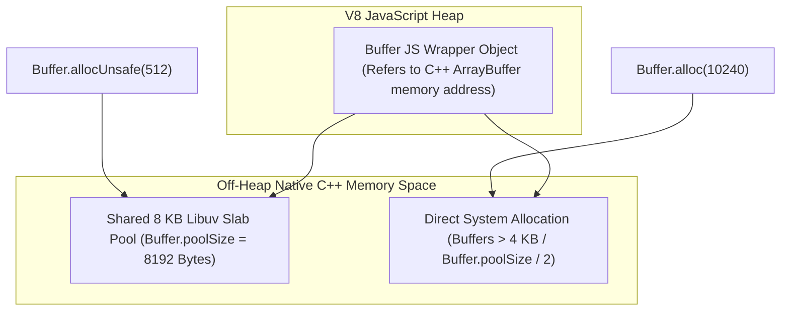
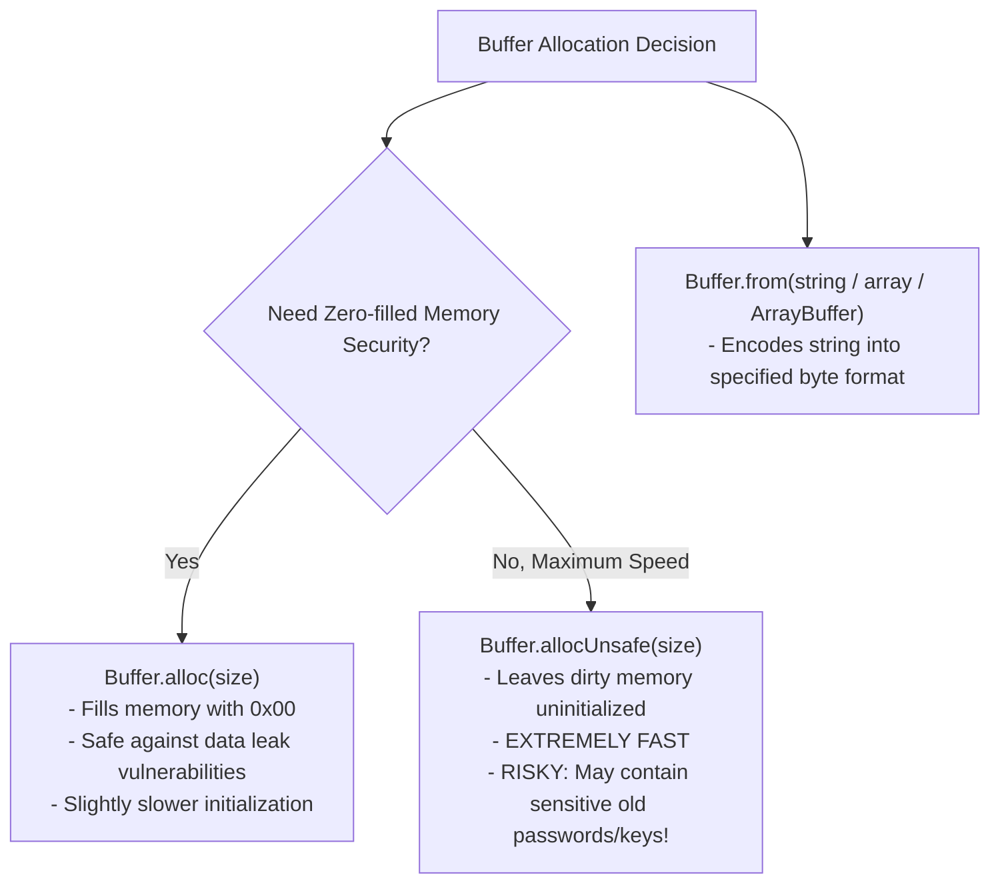

# Module 05: Buffers, TypedArrays, and Binary Memory Allocation

## Overview

A **`Buffer`** in Node.js is a fixed-length sequence of raw binary bytes allocated outside the V8 JavaScript heap in unmanaged C++ memory (`ArrayBuffer`). 

Because pure JavaScript traditionally lacked binary data types, Node.js introduced the `Buffer` class to handle TCP network sockets, file system reads/writes, cryptographic hashing, and compressed data streams efficiently without incurring V8 garbage collection overhead.

---

## 1. Buffer Memory Architecture & Slab Allocator

To minimize system call overhead when allocating small buffers, Node.js pre-allocates a shared **8 KB Slab Allocation Pool** (`Buffer.poolSize = 8192`).



### Allocation Methods Comparison



---

## 2. Character Encodings Breakdown

When converting between JavaScript strings and binary `Buffer` instances, specifying the correct character encoding is critical.

| Encoding Name | Bytes Per Character | Description |
| :--- | :--- | :--- |
| **`utf8`** (Default) | 1 to 4 Bytes | Standard multi-byte Unicode variable-length encoding. |
| **`hex`** | 2 Hex Chars / Byte | Encodes each byte as two hexadecimal characters (e.g., `'4e6f6465'` = `'Node'`). |
| **`base64`** / **`base64url`** | 4 Chars / 3 Bytes | Standard URL-safe or standard Base64 binary-to-text encoding. |
| **`ascii`** | 1 Byte | 7-bit ASCII text encoding (High bit is stripped). |
| **`latin1`** / **`binary`** | 1 Byte | One-to-one byte mapping (ISO-8859-1). |
| **`utf16le`** / **`ucs2`** | 2 or 4 Bytes | 16-bit Little Endian Unicode character encoding. |

---

## 3. Buffer Allocation & Mutation APIs Reference

### Creation & Allocation Methods

```javascript
// 1. Safe Allocation (Zero-Filled Bytes)
const safeBuf = Buffer.alloc(10); 
console.log(safeBuf); // <Buffer 00 00 00 00 00 00 00 00 00 00>

// 2. Unsafe Fast Allocation (Contains old memory garbage!)
const unsafeBuf = Buffer.allocUnsafe(10);
// MUST zero-fill or write over entire buffer immediately:
unsafeBuf.fill(0); 

// 3. Buffer from String or Array
const strBuf = Buffer.from("Node.js Protocol", "utf-8");
console.log("Byte Length:", strBuf.length);         // 16 bytes
console.log("Hex String :", strBuf.toString("hex")); // 4e6f64652e6a732050726f746f636f6c

// 4. Slicing & Modifying Buffers (Note: .subarray() shares underlying memory!)
const original = Buffer.from("ENGINEERING");
const sub = original.subarray(0, 5); // Shares memory pointer!
sub[0] = 0x65; // Modifying sub mutates original!

console.log("Original Mutated:", original.toString()); // "eNGINEERING"
```

---

## 4. Security Risks: `allocUnsafe` Data Leaks

> [!CAUTION]
> Using **`Buffer.allocUnsafe()`** without overwriting all bytes immediately can lead to severe security vulnerabilities (e.g., exposing raw database credentials, TLS keys, or session tokens left in uninitialized memory segments).

```javascript
// SECURITY VULNERABILITY DEMONSTRATION
// Never send unwritten Buffer.allocUnsafe memory over HTTP networks!
function dangerousResponseHandler(req, res) {
  const buf = Buffer.allocUnsafe(128); // May leak uninitialized RAM!
  buf.write("OK"); // Only overwrites first 2 bytes!
  
  // Responding with buf.toString() exposes remaining 126 dirty RAM bytes to the client!
  res.end(buf); 
}

// SECURE APPROACH:
function secureResponseHandler(req, res) {
  const buf = Buffer.alloc(128); // Guaranteed 100% zero-filled
  buf.write("OK");
  res.end(buf);
}
```

---

## Key Production Takeaways

1. **Prefer `Buffer.alloc()` by Default**: Never use `Buffer.allocUnsafe()` unless benchmark profiling explicitly justifies it and every single byte is guaranteed to be overwritten before inspection.
2. **Remember `length` is Byte Length, NOT Character Length**: String length (`"🚀".length === 2`) differs from binary buffer byte length (`Buffer.from("🚀").length === 4`). Always use `Buffer.byteLength(str)` for HTTP `Content-Length` headers.
3. **`subarray()` Shares Memory**: Unlike array `.slice()`, calling `.subarray()` or `.slice()` on a Buffer creates a new view sharing the exact same memory offset. Modifying the slice mutates the original Buffer.
4. **Use `Buffer.concat()` for Streams**: Concatenating strings directly during chunked stream reading can corrupt multi-byte UTF-8 characters split across chunk boundaries. Collect raw Buffer chunks in an array and run `Buffer.concat(chunks)` before converting to string.

