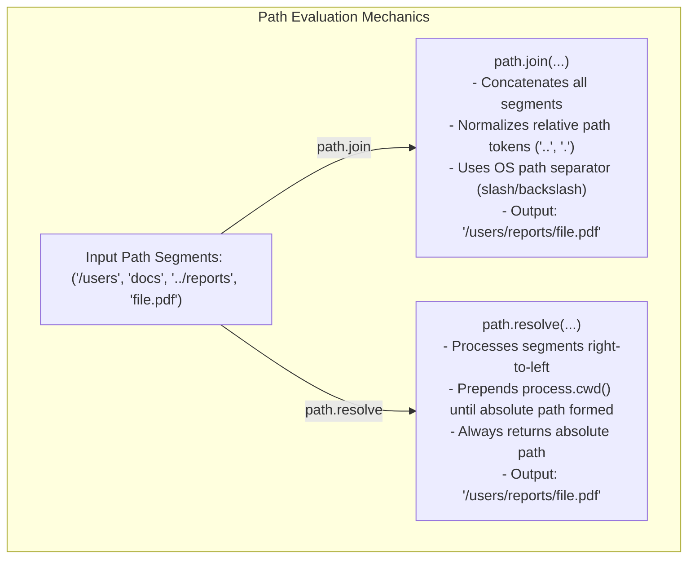

# Module 06: Cross-Platform File Path Resolution with `path`

## Overview

The built-in **`path`** module provides utilities for inspecting, joining, parsing, normalizing, and resolving file and directory paths across different operating systems.

Because Windows uses backslashes (`\`) while POSIX platforms (Linux, macOS, BSD) use forward slashes (`/`), hardcoding path string concatenations in Node.js leads to cross-platform runtime failures and severe **Path Traversal Security Vulnerabilities**.

---

## 1. Path Resolution Architecture: `path.join()` vs. `path.resolve()`

The two most frequently used path methods behave fundamentally differently:



### Key Differences Table

| Feature | `path.join(...paths)` | `path.resolve(...paths)` |
| :--- | :--- | :--- |
| **Output Type** | Can be relative OR absolute (depends on first segment). | **Always** returns an absolute root-anchored path. |
| **Root Context** | Does NOT prepend current working directory (`process.cwd()`). | Prepends **`process.cwd()`** if no root slash is encountered. |
| **Path Traversal (`..`)** | Collapses `..` segments sequentially. | Evaluates `..` relative to preceding absolute directory. |
| **Empty Argument** | Returns `'.'` (current directory). | Returns `process.cwd()`. |

---

## 2. Path Deconstruction & Reconstitution

```mermaid
graph LR
    subgraph path.parse('/var/www/index.html')
        Root["root: '/'"]
        Dir["dir: '/var/www'"]
        Base["base: 'index.html'"]
        Ext["ext: '.html'"]
        Name["name: 'index'"]
    end

    Dir --> PathObj[Parsed Path Object]
    Base --> PathObj
    PathObj -->|path.format| FormattedPath["Reconstituted String: '/var/www/index.html'"]
```

---

## 3. POSIX vs. Windows (`path.posix` vs `path.win32`)

By default, Node.js automatically detects the host operating system and exports `path` matching that OS (`path.win32` on Windows, `path.posix` on Linux/macOS).

If your application processes paths from remote client requests (e.g. validating Windows paths on a Linux server), you must explicitly use `path.posix` or `path.win32`:

```javascript
const path = require("path");

// Forced Windows Path Resolution (Runs identically on Linux)
const winPath = path.win32.join("C:\\Users\\Admin", "..", "Public\\docs.txt");
console.log("Windows Resolved:", winPath); // "C:\Users\Public\docs.txt"

// Forced POSIX Path Resolution (Runs identically on Windows)
const posixPath = path.posix.join("/var/www", "../log/app.log");
console.log("POSIX Resolved  :", posixPath); // "/var/log/app.log"
```

---

## 4. Security Risks: Preventing Path Traversal Attacks

A common security vulnerability occurs when user-supplied input is directly joined to a base directory without validation:

> [!WARNING]
> **Path Traversal Vulnerability**: An attacker passes `../../../../etc/passwd` to download arbitrary system files!

```javascript
const path = require("path");
const fs = require("fs");

const PUBLIC_DIR = path.resolve(__dirname, "public");

function serveFileSafely(userRequestedPath, res) {
  // 1. Resolve candidate file path
  const safePath = path.resolve(PUBLIC_DIR, userRequestedPath);

  // 2. Security Guard: Verify candidate path STILL begins inside PUBLIC_DIR!
  if (!safePath.startsWith(PUBLIC_DIR)) {
    res.statusCode = 403;
    return res.end("ACCESS DENIED: Path Traversal Attempt Detected!");
  }

  // Path verified safe: proceed to stream file
  fs.createReadStream(safePath).pipe(res);
}
```

---

## 5. Practical Method Reference Matrix

| API Method | Functionality Description | Example Call | Example Result |
| :--- | :--- | :--- | :--- |
| **`path.basename()`** | Returns filename component of a path | `path.basename('/src/app.js', '.js')` | `'app'` |
| **`path.dirname()`** | Returns directory component | `path.dirname('/src/controllers/user.js')` | `'/src/controllers'` |
| **`path.extname()`** | Returns extension starting from last `.` | `path.extname('archive.tar.gz')` | `'.gz'` |
| **`path.normalize()`** | Resolves `.` and `..` and redundant slashes | `path.normalize('/a//b/c/../d')` | `'/a/b/d'` |
| **`path.relative()`** | Computes relative path from `from` to `to` | `path.relative('/data/orga', '/data/orgb/file.txt')` | `'../orgb/file.txt'` |
| **`path.isAbsolute()`** | Checks if path is absolute | `path.isAbsolute('./config')` | `false` |

---

## Key Production Takeaways

1. **Never Concatenate Paths with String Operators (`+ "/" +`)**: Always use `path.join()` or `path.resolve()` for OS-safe path construction.
2. **Validate Path Bounds**: Use `path.resolve()` combined with `.startsWith(BASE_DIR)` to prevent Directory Traversal attacks when serving static files or reading user-specified filenames.
3. **Use `path.extname()` for File Types**: Avoid `filename.split('.').pop()`, which fails on hidden files like `.gitignore` (returns `""`) or multi-dot paths.

