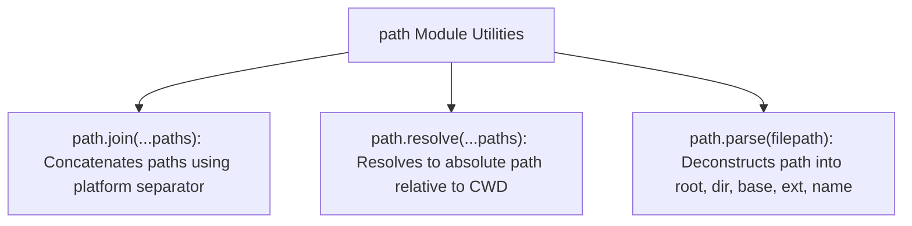

# File 06: Path Module and File Path Resolution

## Overview
The built-in **`path`** module provides utilities for joining, resolving, parsing, and normalizing file and directory paths cross-platform across Windows (`\`) and POSIX Linux/macOS (`/`).

---

## 1. Path Resolution Methods Architecture



---

## 2. Cross-Platform Path Handling Implementation

```javascript
const path = require("path");

const filename = "/var/www/project/src/index.js";

// 1. Deconstructing File Path
console.log("Directory Name:", path.dirname(filename)); // "/var/www/project/src"
console.log("Base Name:", path.basename(filename));     // "index.js"
console.log("Extension:", path.extname(filename));      // ".js"

// 2. Parsing into Structured Object
const parsed = path.parse(filename);
console.log("Parsed Object:", parsed);
// { root: '/', dir: '/var/www/project/src', base: 'index.js', ext: '.js', name: 'index' }

// 3. Joining vs Resolving
const joinedPath = path.join("/users", "admin", "../guest", "config.json");
console.log("Joined Normalized Path:", joinedPath); // "/users/guest/config.json"

const absolutePath = path.resolve("src", "config.json");
console.log("Absolute Resolved Path:", absolutePath);
```

---

## Key Takeaways
1. Always use **`path.join()`** or **`path.resolve()`** instead of string concatenation (`+ '/' +`) to support Windows and POSIX OS compatibility.
2. **`path.join()`** concatenates path segments; **`path.resolve()`** generates an absolute path starting from current working directory.
