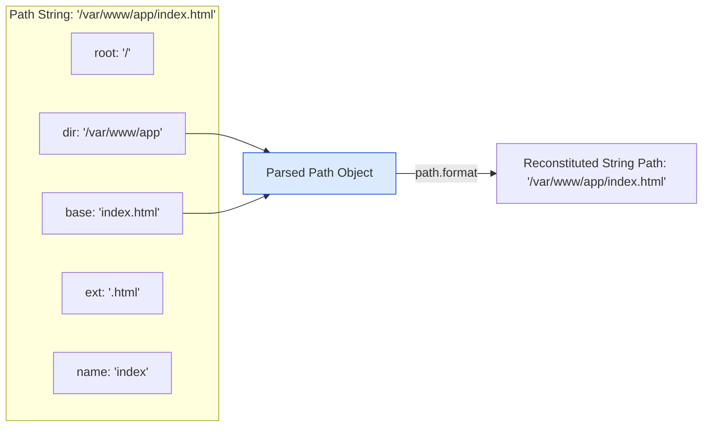
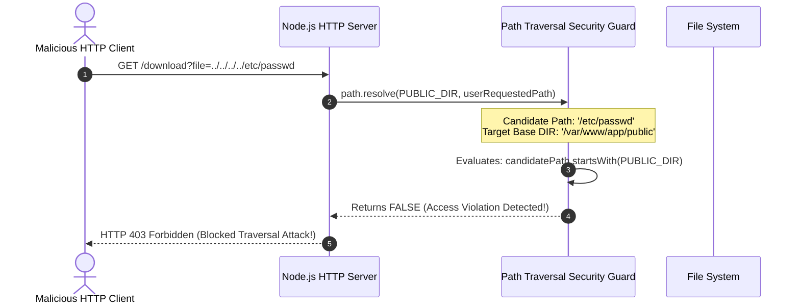

# Module 06: Cross-Platform File Path Resolution — `path` Module, Security Guards, and POSIX vs. Win32 Architecture

## Overview

The built-in **`path`** module provides utilities for inspecting, joining, parsing, normalizing, and resolving file and directory paths across different operating systems.

Because Windows uses backslashes (`\`) while POSIX platforms (Linux, macOS, BSD) use forward slashes (`/`), hardcoding path string concatenations (`dir + "/" + file`) leads to cross-platform runtime failures and severe **Path Traversal Security Vulnerabilities (CWE-22)**.

Understanding **`path.join()` vs. `path.resolve()` Mechanics**, **`path.posix` vs. `path.win32` Engines**, **`path.parse()` Decomposition**, and **Directory Traversal Defense** is essential.

---

## 1. Path Resolution Mechanics: `path.join()` vs. `path.resolve()`

The two primary path construction functions operate with fundamentally different evaluation semantics:

```mermaid
flowchart TD
    subgraph Input Segments: ('/var/www', 'reports', '../docs', 'file.pdf')
        JoinFlow["1. path.join(...)<br/>- Joins all segments sequentially<br/>- Normalizes relative '.' and '..' tokens<br/>- Retains relative/absolute nature of initial segment<br/>- Output: '/var/www/docs/file.pdf'"]
        
        ResolveFlow["2. path.resolve(...)<br/>- Processes segments RIGHT-TO-LEFT<br/>- Stops as soon as an absolute root path is formed<br/>- If no root found, prepends process.cwd()<br/>- ALWAYS returns a root-anchored absolute path!"]
    end

    style JoinFlow fill:#fef3c7,stroke:#b45309
    style ResolveFlow fill:#dcfce7,stroke:#15803d
```

### Architectural Comparison Matrix

| Feature Dimension | `path.join(...paths)` | `path.resolve(...paths)` |
| :--- | :--- | :--- |
| **Output Path Type** | Relative OR Absolute (Preserves initial segment context) | **Guaranteed Absolute Path** |
| **Evaluation Direction** | Left-to-right concatenation | **Right-to-left root seeking** |
| **Root Context Fallback** | Does NOT prepend `process.cwd()` | Prepends **`process.cwd()`** if no root slash is encountered |
| **Path Traversal (`..`)** | Normalizes `..` segments sequentially | Evaluates `..` relative to preceding directory |
| **Empty Argument (`''`)** | Returns `'.'` (current directory) | Returns `process.cwd()` |

---

## 2. Path Deconstruction Topology (`path.parse`)



---

## 3. POSIX vs. Windows (`path.posix` vs. `path.win32`)

By default, Node.js automatically detects the underlying host OS and exports `path` matching that system (`path.win32` on Windows, `path.posix` on Linux/macOS).

If your application processes file paths submitted from remote client platforms (e.g. validating Windows paths on a Linux cloud server), you must explicitly invoke `path.posix` or `path.win32`:

```javascript
const path = require("node:path");

// Forced Windows Path Resolution (Executes identically on Linux!)
const winPath = path.win32.join("C:\\Users\\Admin", "..", "Public\\documents.txt");
console.log("Windows Resolved Path:", winPath); // "C:\Users\Public\documents.txt"

// Forced POSIX Path Resolution (Executes identically on Windows!)
const posixPath = path.posix.join("/var/www", "../log/access.log");
console.log("POSIX Resolved Path  :", posixPath); // "/var/log/access.log"
```

---

## 4. Code Showcase: Path Traversal Vulnerability & Security Guard



```javascript
const path = require("node:path");

// Target Public Root Directory
const PUBLIC_ROOT_DIR = path.resolve(__dirname, "public_downloads");

// Path Security Verification Function
function validateAndResolvePath(userSubmittedPath) {
  // 1. Resolve absolute candidate path
  const candidatePath = path.resolve(PUBLIC_ROOT_DIR, userSubmittedPath);

  // 2. Security Guard: Enforce path boundary confinement
  if (!candidatePath.startsWith(PUBLIC_ROOT_DIR)) {
    throw new Error(`SECURITY ALERT: Path Traversal Violation Detected for '${userSubmittedPath}'!`);
  }

  return candidatePath;
}

// Execution Demonstration
console.log("=== EXECUTING PATH TRAVERSAL SECURITY VERIFICATION ===");
console.log("Root Directory:", PUBLIC_ROOT_DIR);

try {
  // Valid Request
  const validPath = validateAndResolvePath("documents/report.pdf");
  console.log("  ✓ PASS: Valid file path resolved safely:", validPath);

  // Malicious Traversal Attack Request
  console.log("\n-> Testing Traversal Attack (../../../../etc/passwd)...");
  validateAndResolvePath("../../../../etc/passwd");
} catch (err) {
  console.error("  ✓ PASS: Successfully blocked attack:", err.message);
}
```

---

## 5. Practical Method Reference Matrix

| API Method | Primary Functionality | Example Call | Result |
| :--- | :--- | :--- | :--- |
| **`path.basename()`** | Extracts filename portion of a path | `path.basename('/src/controllers/user.js', '.js')` | `'user'` |
| **`path.dirname()`** | Extracts directory portion of a path | `path.dirname('/src/controllers/user.js')` | `'/src/controllers'` |
| **`path.extname()`** | Extracts extension starting from last `.` | `path.extname('archive.tar.gz')` | `'.gz'` |
| **`path.normalize()`** | Resolves `.` and `..` and redundant slashes | `path.normalize('/var//www/site/../index.html')` | `'/var/www/index.html'` |
| **`path.relative()`** | Computes relative path from `from` to `to` | `path.relative('/var/www', '/var/log/app.log')` | `'../log/app.log'` |
| **`path.isAbsolute()`**| Verifies if path is root-anchored | `path.isAbsolute('./config')` | `false` |

---

## Key Production Takeaways

1. **Never Concatenate Paths with String Operators (`+ "/" +`)**: Always use `path.join()` or `path.resolve()` for OS-safe path separator handling.
2. **Always Enforce Boundary Validation**: Use `path.resolve()` combined with `.startsWith(BASE_DIR)` to prevent Directory Traversal attacks when serving files based on user input.
3. **Use `path.extname()` for Extensions**: Avoid `filename.split('.').pop()`, which fails on hidden files (`.env`, `.gitignore`) or multi-dot paths.
4. **Use `node:path` Prefix**: Always use the explicit `node:` prefix (`require('node:path')`) to prevent module shadowing.


