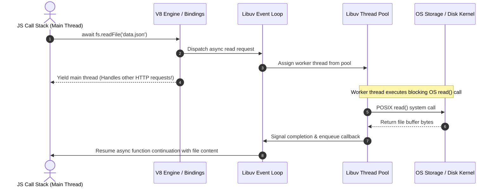
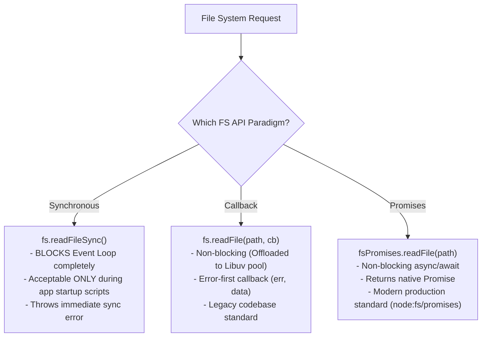

# Module 07: File System (`fs`) — Sync, Callbacks, and Promises

## Overview

The built-in **`fs`** (File System) module allows Node.js applications to perform file reads, writes, appends, renames, deletions, and metadata inspections.

Node.js exposes three distinct paradigms for interacting with the file system:
1. **Synchronous Blocking APIs** (`fs.readFileSync`) — Blocks the JavaScript Call Stack.
2. **Asynchronous Error-First Callback APIs** (`fs.readFile`) — Offloaded to the Libuv Thread Pool.
3. **Asynchronous Promise-Based APIs** (`require('node:fs/promises')`) — Non-blocking `async/await` standard for modern Node.js.

---

## 1. Under the Hood: Libuv Thread Pool File I/O

Because operating systems do not provide universal non-blocking file system call primitives across all platforms, Node.js offloads file system calls to background threads inside the **Libuv Thread Pool**.



---

## 2. API Paradigm Comparison



### Comparative Summary Table

| Feature | Synchronous (`fs.*Sync`) | Asynchronous Callback (`fs.*`) | Promises (`fs/promises`) |
| :--- | :--- | :--- | :--- |
| **Event Loop Blocking** | **Yes** (Freezes entire server) | **No** (Uses Libuv thread pool) | **No** (Uses Libuv thread pool) |
| **Syntax Style** | Return value directly | Error-first callback `(err, data)` | Clean `async / await` |
| **Error Handling** | Synchronous `try / catch` | Check `if (err)` in callback | `try / catch` inside async functions |
| **Memory Allocation** | Immediate buffer return | Buffer passed to callback | Buffer returned in resolved Promise |
| **Recommended Use** | CLI scripts / App startup config loading | Legacy libraries | **All modern server application logic** |

---

## 3. Handling POSIX File System Errors

File system errors in Node.js emit standard POSIX error codes. Always inspect `err.code` to handle specific file system failures gracefully:

```javascript
const fs = require("node:fs/promises");
const path = require("path");

async function safeReadFile(relativeFilePath) {
  const absolutePath = path.resolve(__dirname, relativeFilePath);

  try {
    const data = await fs.readFile(absolutePath, "utf-8");
    return JSON.parse(data);
  } catch (err) {
    switch (err.code) {
      case "ENOENT":
        console.error(`[ERROR ENOENT] File not found at path: ${absolutePath}`);
        return null;
      case "EACCES":
        console.error(`[ERROR EACCES] Permission denied reading: ${absolutePath}`);
        return null;
      case "EISDIR":
        console.error(`[ERROR EISDIR] Path is a directory, not a file: ${absolutePath}`);
        return null;
      default:
        console.error(`[UNEXPECTED FS ERROR] (${err.code}): ${err.message}`);
        throw err;
    }
  }
}
```

---

## 4. Complete Async/Await File CRUD Example

```javascript
const fs = require("node:fs/promises");
const path = require("node:path");

async function executeFileLifecycle() {
  const targetDir = path.join(__dirname, "temp_data");
  const filePath = path.join(targetDir, "app_config.json");

  try {
    // 1. Ensure target directory exists (recursive: true prevents error if already exists)
    await fs.mkdir(targetDir, { recursive: true });

    // 2. Create / Overwrite File (Write)
    const initialData = { version: "1.0.0", status: "active" };
    await fs.writeFile(filePath, JSON.stringify(initialData, null, 2), "utf-8");
    console.log("1. File created successfully.");

    // 3. Append Content to File
    const appendContent = "\n// Appended audit timestamp: " + new Date().toISOString();
    await fs.appendFile(filePath, appendContent, "utf-8");
    console.log("2. Content appended.");

    // 4. Read File Back
    const rawContent = await fs.readFile(filePath, "utf-8");
    console.log("3. File Contents Read:\n", rawContent);

    // 5. Inspect File Metadata (Stat)
    const stats = await fs.stat(filePath);
    console.log(`4. File Stats: Size=${stats.size} Bytes | Created=${stats.birthtime.toISOString()}`);

    // 6. Cleanup File and Directory
    await fs.unlink(filePath);
    await fs.rmdir(targetDir);
    console.log("5. Cleanup completed successfully.");

  } catch (error) {
    console.error("FS Operation Failed:", error.message);
  }
}

executeFileLifecycle();
```

---

## Key Production Takeaways

1. **NEVER Use Synchronous Methods (`readFileSync`) Inside Request Handlers**: A single `fs.readFileSync()` call blocks all incoming client traffic across the entire Node.js instance until the disk read finishes.
2. **Import `node:fs/promises` Directly**: Modern Node.js code should import `const fs = require('node:fs/promises')` or `import fs from 'node:fs/promises'`.
3. **Always Pass Character Encoding explicitly**: `fs.readFile(path)` returns a raw binary `Buffer`. Pass `'utf-8'` as the second parameter if string output is required.
4. **Use `recursive: true` for Directory Creation**: When creating nested directories via `fs.mkdir()`, setting `{ recursive: true }` mimics `mkdir -p` and avoids failing if directories already exist.

