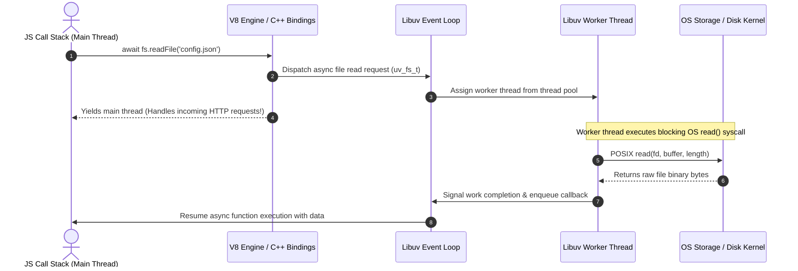
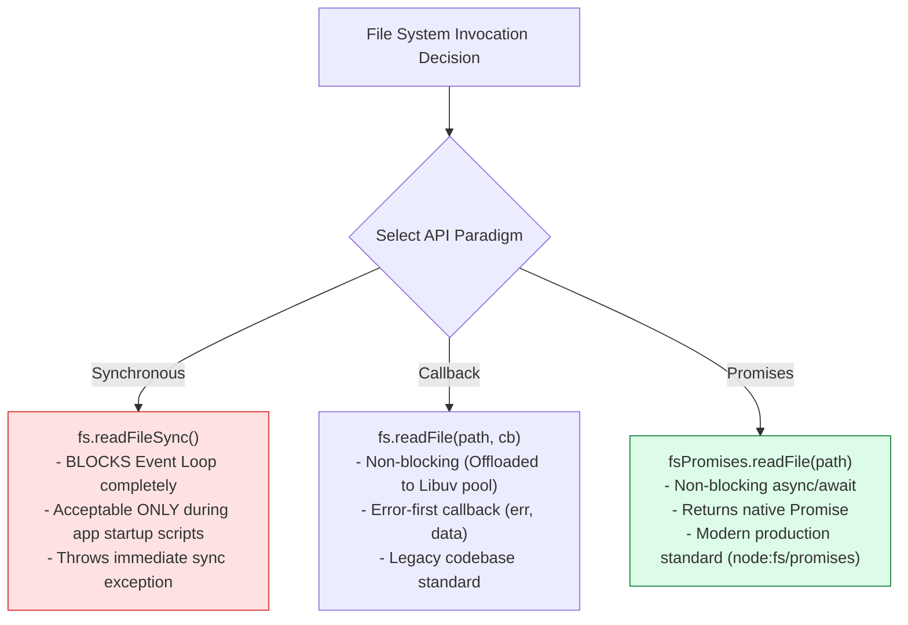
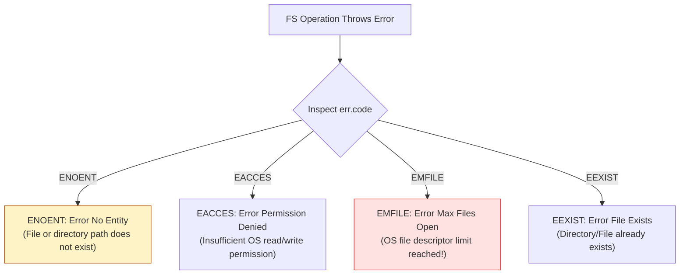

# Module 07: File System (`fs`) — Sync, Callbacks, Promises, and Libuv Thread Pool Offloading

## Overview

The built-in **`fs`** (File System) module allows Node.js applications to execute file reads, writes, appends, renames, deletions, and stat inspections against operating system storage drives.

Node.js exposes three distinct API paradigms for file operations:
1. **Synchronous Blocking APIs** (`fs.readFileSync`) — Blocks the V8 Call Stack completely until the disk system call returns.
2. **Asynchronous Error-First Callback APIs** (`fs.readFile`) — Offloaded to the **Libuv Thread Pool**.
3. **Asynchronous Promise-Based APIs** (`require('node:fs/promises')`) — Non-blocking `async/await` standard for modern Node.js engineering.

Understanding **Libuv Thread Pool File Offloading**, **POSIX File Descriptors**, **POSIX Error Codes (`ENOENT`, `EACCES`, `EMFILE`)**, and **Directory CRUD Lifecycle Operations** is essential.

---

## 1. Libuv Thread Pool File I/O Architecture

Because operating systems do not provide non-blocking asynchronous system calls for file system access across all OS platforms, Node.js delegates file system operations to worker threads inside the **Libuv Thread Pool**:



---

## 2. API Paradigm Decision Tree & Architectural Comparison Matrix



### Comparative Paradigm Matrix

| Metric Dimension | Synchronous (`fs.*Sync`) | Callback (`fs.*`) | Promises (`node:fs/promises`) |
| :--- | :--- | :--- | :--- |
| **Event Loop Blocking** | **Yes** (Freezes entire server process) | **No** (Uses Libuv thread pool) | **No** (Uses Libuv thread pool) |
| **Syntax Style** | Direct return value | Error-first callback `(err, data)` | Clean `async / await` |
| **Error Handling** | `try / catch` block | Check `if (err)` inside callback | `try / catch` inside async functions |
| **Memory Allocation** | Immediate buffer return | Buffer passed to callback | Buffer returned in resolved Promise |
| **Primary Use Case** | One-time CLI startup config loading | Legacy libraries | **All modern server application logic** |

---

## 3. Handling POSIX File System Errors

File system failures in Node.js emit standard POSIX system error codes. Always inspect `err.code` to handle failures gracefully:



---

## 4. Code Showcase: Production Async File CRUD Lifecycle

```javascript
const fs = require("node:fs/promises");
const path = require("node:path");

async function executeFileLifecycle() {
  const targetDir = path.join(__dirname, "temp_storage");
  const filePath = path.join(targetDir, "app_settings.json");

  console.log("=== EXECUTING FS ASYNC FILE LIFECYCLE ===");

  try {
    // 1. Ensure target directory exists (recursive: true prevents error if already exists)
    await fs.mkdir(targetDir, { recursive: true });
    console.log("  ✓ 1. Directory created safely.");

    // 2. Create / Overwrite File (Write)
    const initialConfig = { appName: "Enterprise Engine", version: "3.2.0", active: true };
    await fs.writeFile(filePath, JSON.stringify(initialConfig, null, 2), "utf-8");
    console.log("  ✓ 2. File written successfully.");

    // 3. Append Content to File
    const logTimestamp = `\n// Audit Entry: ${new Date().toISOString()}`;
    await fs.appendFile(filePath, logTimestamp, "utf-8");
    console.log("  ✓ 3. Content appended successfully.");

    // 4. Read File Back
    const rawContent = await fs.readFile(filePath, "utf-8");
    console.log("  ✓ 4. File Read Back:\n", rawContent);

    // 5. Inspect File Metadata (Stat)
    const stats = await fs.stat(filePath);
    console.log(`  ✓ 5. Metadata: Size=${stats.size} Bytes | Created=${stats.birthtime.toISOString()}`);

    // 6. Cleanup File and Directory
    await fs.unlink(filePath);
    await fs.rmdir(targetDir);
    console.log("  ✓ 6. Cleanup completed successfully.");

  } catch (err) {
    // POSIX Error Handler
    if (err.code === "ENOENT") {
      console.error("  !! Error ENOENT: File or path does not exist!");
    } else if (err.code === "EACCES") {
      console.error("  !! Error EACCES: Permission denied by OS!");
    } else {
      console.error("  !! Unexpected FS Failure:", err.message);
    }
  }
}

executeFileLifecycle();
```

---

## Key Production Takeaways

1. **NEVER Use Synchronous Methods (`readFileSync`) Inside Server Request Handlers**: A single `fs.readFileSync()` invocation freezes all incoming HTTP request processing across the entire Node.js process until the disk read finishes.
2. **Import `node:fs/promises` Directly**: Use `const fs = require('node:fs/promises')` or `import fs from 'node:fs/promises'` for clean `async/await` syntax.
3. **Specify Character Encodings Explicitly**: `fs.readFile(path)` returns a raw binary `Buffer` by default. Pass `'utf-8'` as the second parameter if string output is required.
4. **Use `{ recursive: true }` for Directory Creation**: When creating nested directories via `fs.mkdir()`, setting `{ recursive: true }` mimics `mkdir -p` and prevents exceptions if directories already exist.


